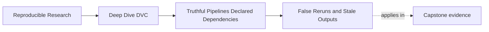

# False Reruns and Stale Outputs


<!-- page-maps:start -->
## Page Maps




<!-- page-maps:end -->

Not every pipeline surprise has the same severity.

Module 04 separates two failure classes:

- false reruns: DVC reruns more than the team expected
- stale outputs: DVC skips work even though the result should change

Both deserve attention. They do not deserve equal fear.

A false rerun wastes time and can make the workflow noisy. A stale output can make the
team trust a wrong result.

## False reruns

A false rerun happens when a stage reruns even though the meaningful result would not have
changed.

Common causes:

- a dependency declaration is too broad
- a whole directory is declared when only one file matters
- a generated log or timestamp file is declared as an output or dependency
- a parameter key is attached to a stage that does not actually use it
- code is organized so unrelated implementation changes touch a declared dependency

Example:

```yaml
stages:
  evaluate:
    cmd: python -m incident_escalation_capstone.evaluate
    deps:
      - data/
      - src/
    params:
      - fit.model_family
      - evaluate.threshold
    outs:
      - reports/evaluation.json
```

This stage might rerun whenever any file under `data/` or `src/` changes, even if
evaluation only reads `data/prepared/incidents.parquet` and
`src/incident_escalation_capstone/evaluate.py`.

The fix is not to remove safety. The fix is to declare the real boundary:

```yaml
deps:
  - data/prepared/incidents.parquet
  - models/escalation-model.json
  - src/incident_escalation_capstone/evaluate.py
params:
  - evaluate.threshold
```

That declaration gives DVC less noise and gives reviewers a clearer contract.

## Stale outputs

A stale output happens when a result should change but DVC has no declared reason to
rerun the stage.

Common causes:

- the command reads an undeclared file
- the command uses a hard-coded control value that belongs in `params.yaml`
- the command reads an environment variable that is not managed or recorded elsewhere
- the stage writes an output that DVC does not own
- a downstream stage reads a file produced by another stage but the file is not declared

Example:

```yaml
stages:
  inspect:
    cmd: python -m incident_escalation_capstone.inspect
    deps:
      - data/prepared/incidents.parquet
    outs:
      - reports/inspection.json
```

If `inspect` also reads `data/reference/escalation_policy.csv`, then a policy change may
not rerun inspection. The report can stay old while looking current.

The repair is direct:

```yaml
deps:
  - data/prepared/incidents.parquet
  - data/reference/escalation_policy.csv
```

Now the graph has a reason to react.

## A severity lens

Use this table when reviewing a pipeline surprise:

| Symptom | Likely class | Risk | First question |
| --- | --- | --- | --- |
| stage reruns after unrelated file change | false rerun | wasted time and review noise | is the dependency too broad? |
| stage skips after a real input change | stale output | wrong result | is a real read missing from `deps` or `params`? |
| downstream stage reruns after upstream output changed | usually correct propagation | expected recomputation | does the downstream stage depend on that output? |
| output exists but is not in `outs` | stale or orphan risk | untracked result boundary | who owns this artifact? |
| rerun happens after command text changes | usually correct | expected recomputation | did the command contract change? |

This lens keeps you from treating every rerun as bad. Sometimes the rerun is exactly the
proof that the graph is honest.

## Prefer safe noise over silent staleness

When uncertain, DVC workflows should usually prefer a visible rerun over a hidden stale
result.

That does not mean broad declarations are best. It means the review standard should be:

1. eliminate stale-output risk first
2. narrow false reruns where the boundary is understood
3. keep the declaration explainable

A pipeline that reruns too often is frustrating, but the team can observe the problem. A
pipeline that silently skips required work can corrupt downstream decisions without an
obvious warning.

## A practical diagnosis pattern

When a rerun surprises you, ask:

- Which declared dependency, parameter, output, or command text changed?
- Is that declared item truly part of this stage's result?
- If not, can the declaration be narrowed without hiding a real influence?

When a skipped rerun surprises you, ask:

- What real influence changed?
- Where should that influence be declared?
- Did the command read a path, parameter, or environment fact that the graph cannot see?
- Would the downstream result become stale if nobody noticed?

The first case is mostly contract cleanup. The second case is correctness repair.

## Review checkpoint

You understand this core when you can classify pipeline surprises without drama:

- false reruns are visible inefficiency
- stale outputs are hidden correctness risk
- downstream reruns can be correct propagation
- broad declarations should be narrowed only after the real read surface is understood
- missing declarations should be fixed before performance convenience

That distinction is one of the most important habits in Module 04.
