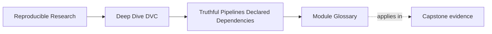
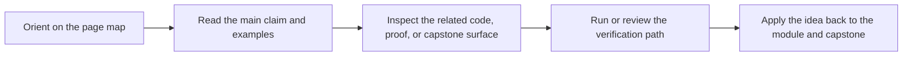

# Module Glossary

<!-- page-maps:start -->
## Page Maps

<!-- page-maps:end -->

This glossary belongs to **Module 04: Truthful Pipelines and Declared Dependencies** in
**Deep Dive DVC**.

Use it to keep the module language stable while you move between the core lessons, the
worked example, the exercises, and capstone review.

## How to use this glossary

Read the directory index first. Return here when a term starts to feel vague or when a
review discussion needs sharper language.

The goal is not extra theory. The goal is a shared vocabulary for explaining why a DVC
pipeline reruns, skips, records evidence, or becomes deceptive.

## Terms in this directory

| Term | Meaning in this directory |
| --- | --- |
| declared dependency | A file or directory listed in `deps` because the command reads it and its content can influence the result. |
| declared output | An artifact listed in `outs` because the stage owns it and DVC should record or restore its content identity. |
| declared parameter | A reviewed control value listed in `params`, usually from `params.yaml`, that should influence rerun decisions. |
| stage contract | The reviewable promise that a command uses declared inputs and controls to produce declared outputs. |
| truthful stage | A stage whose declaration matches the real reads, controls, writes, and ownership boundary of the command. |
| deceptive stage | A stage that looks organized but hides a real influence or artifact boundary from the declared graph. |
| DVC graph | The directed execution structure created from stage declarations and artifact edges. |
| DAG | A directed acyclic graph; in this module, the shape DVC uses to understand stage order and dependency flow. |
| staleness | The condition where current declared state no longer matches recorded lock evidence, so rerun is needed. |
| false rerun | A visible inefficiency where a stage reruns even though the meaningful result would not have changed. |
| stale output | A correctness risk where a result should change but DVC has no declared reason to rerun the producing stage. |
| hidden influence | Any real input, control, environment fact, or artifact dependency that affects a result without being declared or otherwise reviewed. |
| lock evidence | The recorded dependency hashes, parameter values, command text, and output identities in `dvc.lock`. |
| producer | The stage that owns and declares an output artifact. |
| consumer | A stage that reads another stage's output as a dependency. |
| shared intermediate | An artifact produced once and consumed by more than one downstream stage. |
| fan-out | A graph shape where one output feeds multiple consumers. |
| fan-in | A graph shape where one stage depends on multiple upstream artifacts. |
| output ownership | The rule that one stage should be responsible for a declared artifact boundary. |
| scratch artifact | A temporary file created during execution that should not become a declared output unless downstream review depends on it. |
| broad dependency | A dependency declaration, such as an entire directory, that may cause reruns for changes unrelated to the stage result. |
| narrow dependency | A dependency declaration that names the actual files or directories the command reads. |
| control surface | The set of parameter values that reviewers expect to change deliberately and compare across runs. |
| graph refactoring | A change to stage shape, names, boundaries, or artifact paths that should preserve the provenance story. |
| provenance story | The explanation of which declared inputs and controls produced which declared outputs. |

## Stable review questions

Use these questions when the module feels abstract:

- What does this stage promise?
- Which files does the command really read?
- Which control values should be reviewed as parameters?
- Which artifacts does the stage own?
- What would make this stage stale?
- What evidence should `dvc.lock` record after a rerun?
- Is this surprise a false rerun or a stale-output risk?
- Does this refactor make the provenance story clearer or harder to explain?
