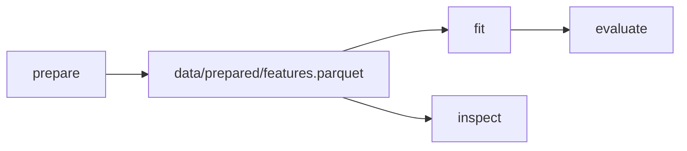

# Safe Pipeline Refactoring and Shared Outputs

Real DVC pipelines rarely stay as a perfect straight line.

They grow:

- one preparation stage feeds several analyses
- one model output feeds evaluation and publishing
- a single command produces a metric file and a plot
- an overloaded stage needs to be split into clearer boundaries
- directories move as the repository becomes more organized

These changes are normal. The risk is not change itself. The risk is changing graph shape
without preserving the provenance story.

## Shared intermediates need an owner

A shared intermediate is an artifact produced once and consumed by more than one later
stage.

Example:



The important question is not "can two later stages read the same file?" They can.

The important question is:

> Which stage owns the shared artifact, and do all consumers declare it?

The producer should list the artifact in `outs`:

```yaml
stages:
  prepare:
    cmd: python -m incident_escalation_capstone.prepare
    deps:
      - data/raw/service_incidents.csv
    outs:
      - data/prepared/features.parquet
```

Each consumer should list it in `deps`:

```yaml
stages:
  fit:
    cmd: python -m incident_escalation_capstone.fit
    deps:
      - data/prepared/features.parquet
    outs:
      - models/escalation-model.json
  inspect:
    cmd: python -m incident_escalation_capstone.inspect
    deps:
      - data/prepared/features.parquet
    outs:
      - reports/inspection.json
```

That gives DVC a clear fan-out story.

## Multi-output stages can be honest

A stage can own more than one output when the command truly produces a cohesive set.

Example:

```yaml
stages:
  evaluate:
    cmd: python -m incident_escalation_capstone.evaluate
    deps:
      - models/escalation-model.json
      - data/prepared/features.parquet
    params:
      - evaluate.threshold
    outs:
      - reports/evaluation.json
      - reports/error-slices.csv
      - reports/calibration.svg
```

This is reasonable if those artifacts are produced together from the same evaluation run.

It becomes weak if one output is used for release, one is a temporary debugging file, and
one belongs to a different command. Multi-output is not a problem by itself. Mixed
ownership is the problem.

Ask:

- do these outputs share the same inputs and controls?
- should they be refreshed together?
- would a reviewer understand why one command owns all of them?
- does any downstream stage depend on only one of them?

If the answers are clear, a multi-output stage is fine. If the answers are confused, split
the stage boundary.

## Refactoring without losing truth

Pipeline refactoring should preserve a readable before-and-after story.

Common safe moves include:

- renaming a stage while preserving its command, dependencies, parameters, and outputs
- moving an output path while keeping the producing stage and consumer dependencies clear
- splitting one large stage into two stages when an intermediate artifact has real meaning
- merging two stages when the intermediate has no independent review value
- narrowing a broad dependency after confirming the real read surface

The safe refactor question is:

> After this change, can I still explain which declared input caused which declared output?

If not, the change may be making the pipeline prettier while making it less truthful.

## A split example

Before:

```yaml
stages:
  train_and_evaluate:
    cmd: python -m incident_escalation_capstone.train_and_evaluate
    deps:
      - data/prepared/features.parquet
    params:
      - fit.model_family
      - evaluate.threshold
    outs:
      - models/escalation-model.json
      - reports/evaluation.json
```

This may be convenient, but it hides two different claims in one stage: fitting a model
and evaluating it.

After:

```yaml
stages:
  fit:
    cmd: python -m incident_escalation_capstone.fit
    deps:
      - data/prepared/features.parquet
    params:
      - fit.model_family
    outs:
      - models/escalation-model.json
  evaluate:
    cmd: python -m incident_escalation_capstone.evaluate
    deps:
      - models/escalation-model.json
      - data/prepared/features.parquet
    params:
      - evaluate.threshold
    outs:
      - reports/evaluation.json
```

Now a threshold change reruns evaluation without pretending model fitting changed. A model
control change reruns fitting and then propagates to evaluation. The graph becomes more
specific and more teachable.

## A merge example

Splitting is not always better.

If one stage writes `tmp/normalized.csv` and the next immediately reads it, and nobody
reviews or reuses that intermediate, the split may add ceremony without adding truth. In
that case, a single stage with one meaningful declared output may be clearer.

The question is not "more stages or fewer stages?" The question is "which boundaries make
the causal story visible?"

## Review checkpoint

You understand this core when you can:

- name the producer that owns a shared intermediate
- confirm every consumer declares the shared intermediate as a dependency
- decide when multiple outputs belong to one stage
- split an overloaded stage when the intermediate has review value
- merge stages when the split only exposes throwaway scratch
- preserve lock evidence and review clarity while changing graph shape

Pipeline structure is not sacred. Provenance is. Refactor the graph when it makes the
truth easier to see.
