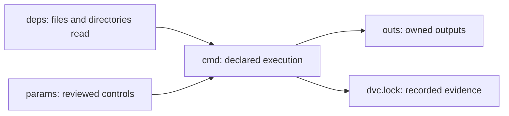

# Stage Contracts and Declared Truth

A DVC stage is not just a convenient command wrapper.

It is a claim:

> When these declared inputs and controls have these recorded values, this command produces
> these declared outputs.

That claim is the smallest unit of pipeline truth in this module. If the stage claim is
honest, a reviewer can explain why the output exists. If the stage claim is incomplete,
the rest of the pipeline may look organized while still hiding the real cause of a result.

## The stage as a promise

A minimal stage has four parts:

```yaml
stages:
  prepare:
    cmd: python -m incident_escalation_capstone.prepare
    deps:
      - data/raw/service_incidents.csv
      - src/incident_escalation_capstone/prepare.py
    params:
      - prepare.minimum_severity
      - prepare.include_weekends
    outs:
      - data/prepared/incidents.parquet
```

Read that as a sentence:

> Run this command, using these files and these parameter values, and expect this output.

That sentence is more useful than "run the prepare script." It tells a future reviewer
what should cause a rerun and what should not.



The diagram is deliberately small. Do not start Module 04 by admiring a whole DAG. Start
with one stage and ask whether the declared story matches reality.

## What DVC can and cannot infer

DVC is strict about declared state, but it is not psychic.

If the command reads `data/raw/service_incidents.csv` and that file is in `deps`, DVC can
hash it and compare it with `dvc.lock`.

If the command reads `data/reference/team_roster.csv` but that file is missing from
`deps`, DVC has no reason to know it matters.

If the command uses `prepare.minimum_severity` from `params.yaml` and the key is listed
under `params`, DVC can notice meaningful control changes.

If the command hard-codes `minimum_severity = 3` inside Python, the control value becomes
code review archaeology instead of a pipeline control surface.

A truthful stage is not one that eliminates all judgment. It is one that puts the
important judgment where reviewers can see it.

## A human reading method

When you inspect a stage, use this order:

1. Read the command out loud.
2. List what the command must read before it can succeed.
3. Check whether each real read appears in `deps` or `params`.
4. List what the command owns after it finishes.
5. Check whether each owned artifact appears in `outs`.
6. Compare the current declaration with `dvc.lock` when recorded evidence matters.

This is slower than scanning the stage name, but it catches the real failures.

For example, a stage named `train` may look obvious. But the name does not tell you
whether the command reads a prepared dataset, a feature schema, a model configuration, a
random seed, or a cached lookup table. The declaration must tell that story.

## Truthful does not mean enormous

One common overcorrection is to declare every nearby file as a dependency.

That makes the stage noisy:

```yaml
deps:
  - .
```

This usually creates needless reruns and hides the intended contract. The stage becomes
harder to review because the declared dependency says "anything here might matter."

Prefer a narrower claim when the command really has a narrower read surface:

```yaml
deps:
  - data/prepared/incidents.parquet
  - src/incident_escalation_capstone/fit.py
params:
  - fit.model_family
  - fit.regularization
  - fit.random_seed
outs:
  - models/escalation-model.json
```

That version gives the reviewer a better question:

> Are those the files and controls that actually influence model fitting?

If the answer is yes, the graph is stronger. If the answer is no, the missing influence
has a specific place to go.

## Stage names are labels, not proof

Names help learners navigate, but a stage name is not evidence.

A stage named `evaluate` can still lie if it reads a model that is not declared. A stage
named `publish` can still lie if it writes a release file that is not owned. A stage named
`prepare` can still lie if it silently depends on an environment variable or a local file
outside the repository.

The stage contract lives in the fields and in the lock evidence, not in the label.

## Review checkpoint

You understand this core when you can take one DVC stage and explain:

- what the command promises to do
- which declared files and parameter keys influence it
- which outputs it owns
- which important reads or writes would make the declaration deceptive if omitted
- why a reviewer should inspect `dvc.yaml` and `dvc.lock` together

That is the foundation for the rest of Module 04. The whole DAG is only trustworthy when
its individual stage contracts are honest enough to review.
