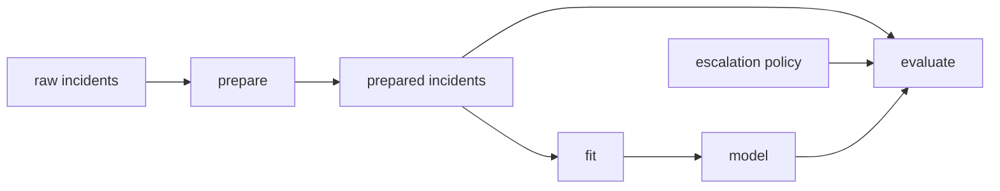

# Worked Example: Repairing a Deceptive Pipeline

This example shows how Module 04 fits together when a pipeline looks reasonable but the
graph is not telling the full truth.

The goal is not to make the YAML longer. The goal is to make the result explainable.

## The situation

A team has a small incident escalation pipeline:

```yaml
stages:
  prepare:
    cmd: python -m incident_escalation_capstone.prepare
    deps:
      - data/raw/service_incidents.csv
    outs:
      - data/prepared/incidents.parquet
  fit:
    cmd: python -m incident_escalation_capstone.fit
    deps:
      - data/prepared/incidents.parquet
    outs:
      - models/escalation-model.json
  evaluate:
    cmd: python -m incident_escalation_capstone.evaluate
    deps:
      - models/escalation-model.json
    outs:
      - reports/evaluation.json
```

The graph looks tidy: prepare, fit, evaluate.

But you notice something uncomfortable. The evaluation report changes between two manual
runs even though DVC does not see a reason to rerun evaluation.

That is the Module 04 alarm bell:

> A tidy graph can still be deceptive.

## Step 1: Read the command, not the stage name

The weak review says:

> The stage is named `evaluate`, so it probably evaluates the model.

The stronger review asks:

> What does the command actually read?

You inspect `evaluate.py` and find these reads:

- `models/escalation-model.json`
- `data/prepared/incidents.parquet`
- `data/reference/escalation_policy.csv`
- `params.yaml` key `evaluate.threshold`

Only one of those is declared. The stage can skip after a data or policy change because
DVC only knows about the model dependency.

## Step 2: Separate dependency from parameter

You do not dump everything into `deps`.

The prepared data and policy CSV are file reads, so they belong in `deps`.

The threshold is a reviewed control value, so it belongs in `params`.

The repaired evaluation stage becomes:

```yaml
stages:
  evaluate:
    cmd: python -m incident_escalation_capstone.evaluate
    deps:
      - models/escalation-model.json
      - data/prepared/incidents.parquet
      - data/reference/escalation_policy.csv
      - src/incident_escalation_capstone/evaluate.py
    params:
      - evaluate.threshold
    outs:
      - reports/evaluation.json
```

Now a reviewer can explain what should make evaluation stale.

## Step 3: Check the producer-consumer edge

You now ask whether `data/prepared/incidents.parquet` is owned correctly.

The `prepare` stage already lists it in `outs`, and `evaluate` now lists it in `deps`.
That creates a real edge:



The graph now says: evaluation depends on the model, prepared incidents, and policy.

That is a better causal story than "evaluation depends on the model."

## Step 4: Predict rerun behavior

Before running anything, you write predictions:

- if `evaluate.threshold` changes, only evaluation should rerun
- if `data/reference/escalation_policy.csv` changes, evaluation should rerun
- if `data/raw/service_incidents.csv` changes and preparation changes its output, fitting and evaluation should rerun downstream
- if `fit.model_family` changes, fitting should rerun and evaluation should rerun because the model output changed

This prediction is the learning moment. It turns `dvc repro` from a button into a check
against your mental graph.

## Step 5: Compare against lock evidence

After running `dvc repro`, you inspect `dvc.lock`.

The useful question is not "did a lock file change?"

The useful questions are:

- does `evaluate` now record the policy CSV dependency?
- does it record the threshold value?
- does it record the prepared dataset dependency?
- does the output hash update when the report really changes?

If yes, the repair is now visible in recorded evidence.

## Step 6: Narrow broad declarations only after safety

During review, someone proposes:

```yaml
deps:
  - data/
```

That would make policy changes visible, but it would also make the stage rerun for
unrelated files. The team rejects that as too broad because they now know the real read
surface.

The final declaration is narrower and safer:

```yaml
deps:
  - models/escalation-model.json
  - data/prepared/incidents.parquet
  - data/reference/escalation_policy.csv
  - src/incident_escalation_capstone/evaluate.py
params:
  - evaluate.threshold
```

This is the best Module 04 outcome: not maximum YAML, but honest YAML.

## The review note you would want

> Evaluation was previously deceptive because the command read prepared incidents, a
> policy CSV, and a threshold value that were not declared on the stage. That created stale
> output risk: DVC could skip evaluation after a meaningful input or control change. The
> repair adds the missing file reads to `deps`, adds the threshold to `params`, and keeps
> the output ownership unchanged. The graph now explains reruns from declared state, and
> `dvc.lock` can record the evidence needed for review.

That note is stronger than "fixed dvc.yaml" because it names the risk and the repair.

## Why this is a mastery example

This one story exercises the whole module:

- Core 1: the stage contract was read as a promise, not a label
- Core 2: dependencies and parameters were placed differently
- Core 3: rerun predictions were checked against lock evidence
- Core 4: stale-output risk was prioritized before false rerun cleanup
- Core 5: the producer-consumer edge for the prepared data was made explicit

The pipeline became more trustworthy because the declared graph became closer to the real
work.
