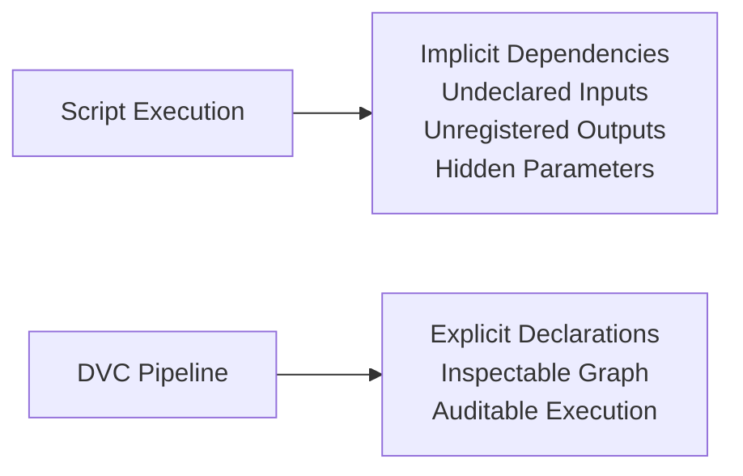

# Module 04 — Pipelines as Truthful DAGs

*From scripts that “usually work” to execution graphs that can be reasoned about*

---

## Purpose of this Module

Having solidified the principles of immutable data identity (Module 02) and environments as explicit inputs (Module 03), machine learning (ML) pipelines frequently exhibit erratic behavior: stages may rerun despite inconsequential alterations or fail to rerun amid critical modifications, prompting reliance on commands like `dvc repro` without assured outcomes.

This module delineates the root causes of such inconsistencies and prescribes methodologies for their resolution. Its pivotal assertion is: **A pipeline attains reproducibility solely when its execution graph is truthful**, wherein truthfulness entails comprehensive declaration of influential dependencies, meticulous recording of outputs, and eschewal of unstated assumptions. Adherence to this paradigm renders pipeline operations predictable, verifiable, and interpretable.

**Prerequisites**: Proficiency in Modules 01–03 is indispensable. Familiarity with directed acyclic graphs (DAGs), basic DVC commands (e.g., `dvc add`), and YAML syntax is advantageous; consult DVC documentation if required.

## At a Glance

| Focus | Learner question | Capstone timing |
| --- | --- | --- |
| truthful stages | "Why did this stage rerun, or why did it not?" | use the capstone heavily after the state model is already clear |
| dependency declaration | "Which inputs are strong enough to belong in the graph?" | compare `dvc.yaml` and `dvc.lock` carefully |
| operational trust | "When does `dvc repro` become predictable instead of mystical?" | inspect stage boundaries, not just stage names |

## Why this module matters in the course

This is where the course turns state identity into executable truth. Once a team can name
state correctly, the next question is whether its pipeline graph tells the truth about how
that state changes.

That matters because `dvc repro` is not magic. It can only make correct decisions from
the dependencies, parameters, commands, and outputs that the repository declares. If the
graph lies, DVC will behave consistently and still give the wrong operational result.

## Questions this module should answer

By the end of the module, you should be able to answer:

- What makes a stage truthful rather than merely convenient?
- Which inputs are strong enough to belong in `deps` or `params`?
- What kinds of hidden reads or writes make a pipeline deceptive?
- Why is `dvc.lock` evidence of a graph execution rather than just a generated file?

Those answers are the bridge between "the repository runs" and "the repository is reviewable."

This module should make pipeline behavior more explainable, not merely more automated.

## What to inspect in the capstone

Keep the capstone open while reading this module and inspect:

- `dvc.yaml` as the declared graph
- `params.yaml` as the control surface that should trigger meaningful change
- `dvc.lock` as the recorded consequence of the declared graph
- `publish/v1/` as the stable output boundary that downstream consumers should trust

Ask a hard question while you inspect them: if one declared edge disappeared, which wrong
result would become possible without an obvious crash?

---

## 4.1 The Core Issue: Implicit Dependencies in Scripts

ML pipelines typically originate as sequential scripts, such as:

```bash
python preprocess.py
python train.py
python evaluate.py
```

These constructs function adequately in isolation but harbor inherent deceptions through omissions: dependencies remain unspoken, inputs are accessed without formal acknowledgment, outputs are generated sans registration, and parameters are embedded within code or global variables. While the script internally comprehends its requisites, the overarching system lacks this awareness, fostering opacity and unreliability.

DVC pipelines mitigate this by rendering dependencies explicit and amenable to scrutiny, transforming ad-hoc executions into structured, auditable processes.

**Illustration**:



---

## 4.2 Formal Definition of a DVC Stage

A DVC stage embodies a pure functional declaration: **Given specified inputs, this command yields designated outputs.** Formally, it comprises:

- **deps**: Files or directories consumed during execution.
- **params**: Configuration values extracted from tracked sources (e.g., `params.yaml`).
- **cmd**: The command invoked for processing.
- **outs**: Files or directories produced.

No extraneous factors may impinge upon the outcome; undeclared influences constitute a violation, rendering the pipeline deceptive.

**Example Stage Definition** (from `dvc.yaml`):
```yaml
stages:
  preprocess:
    cmd: python preprocess.py
    deps:
      - data/raw.csv
    params:
      - batch_size: 32
    outs:
      - data/processed.csv
```

This structure enforces transparency, ensuring all elements are traceable.

---

## 4.3 The Directed Acyclic Graph as the Execution Contract

Interconnected stages form a DAG in DVC, with nodes representing stages, edges denoting declared dependencies, and directional flow indicating causality. This graph transcends mere visualization; it constitutes the binding execution contract, governing DVC's determinations on execution, omission, and staleness.

Discrepancies in the DAG precipitate erroneous yet consistent DVC behavior, underscoring the imperative for accuracy.

**Illustration**:


---

## 4.4 Categories of Pipeline Failures

Failures manifest in two primary forms, each with distinct etiologies and ramifications.

### False Positives (Excessive Rebuilds)
Stages execute redundantly despite unaltered pertinent elements. Contributors include overbroad dependency declarations, granular input specifications (e.g., whole directories), and superfluous parameter linkages. Consequences encompass computational inefficiency, protracted iterations, and operational frustration. While inefficient, these are benign, preserving result integrity.

### False Negatives (Stale Outputs)
Stages omit reruns amid relevant modifications, stemming from omitted dependencies, undeclared file accesses, concealed parameters, or environmental infiltrations. Ramifications are severe: erroneous outcomes, undetected data corruption, and flawed inferences. DVC's architecture deliberately favors false positives to avert these catastrophic lapses.

**Comparative Table**:
| Failure Type      | Causes                          | Costs                          |
|-------------------|---------------------------------|--------------------------------|
| False Positives   | Over-declaration, coarse inputs | Inefficiency, delays           |
| False Negatives   | Omissions, leaks                | Errors, corruption             |

---

## 4.5 Mechanics of `dvc repro` Decision-Making

Dispensing with ambiguity, `dvc repro` adheres to a rigorous protocol:

1. Traverse the DAG topologically.
2. For each stage: Compute hashes of declared dependencies, retrieve tracked parameters, and juxtapose against `dvc.lock` states.
3. Upon detection of any divergence: Designate the stage as stale and queue for execution.
4. Cascade staleness to downstream stages.

This process eschews speculation; reruns occur exclusively due to declared changes, while omissions reflect unaltered declarations.

**Example Command Execution** (Illustrative output):
```
$ dvc repro
Stage 'preprocess' didn't change, skipping
Stage 'train' changed, reproducing...
Running command: python train.py
Stage 'evaluate' is downstream of changed stages, reproducing...
```

---

## 4.6 Significance of `dvc.lock` as Evidentiary Artifact

Far from ancillary metadata, `dvc.lock` functions as a verifiable record, capturing precise dependency hashes, parameter values, and output artifacts. It resolves inquiries into executed content and inputs. Deletion or disregard impairs historical reasoning; versioning `dvc.yaml` sans `dvc.lock` documents aspirations, not realizations.

**Sample `dvc.lock` Excerpt**:
```yaml
stages:
  train:
    cmd: python train.py
    deps:
    - path: data/processed.csv
      md5: abcdef1234567890
    params:
      params.yaml:
        learning_rate: 0.01
    outs:
    - path: model.pkl
      md5: 0987654321fedcba
```

---

## 4.7 Handling Shared Intermediates and Multi-Output Configurations

Authentic pipelines exhibit non-linearity, featuring shared intermediates, multi-output stages, and fan-in/fan-out topologies—these represent standard rather than exceptional patterns. Truthful DAGs mandate explicit intermediate declarations, avoidance of concealed temporary files, and resistance to undeclared artifact repurposing. Incidental file presence signals a defect.

---

## 4.8 Safe Pipeline Refactoring with Preserved Provenance

Truthful DAGs facilitate refactoring—renaming stages, restructuring directories, or partitioning/merging steps—provided dependencies endure, outputs align, and hashes verify. Path alterations do not fracture identity; undeclared dependencies do. This leverages DVC's content-centric paradigm for robust evolution.

---

## 4.9 Failure Modes and Interpretations

| Symptom                         | Interpretation                  |
| ------------------------------- | ------------------------------- |
| Unexpected stage rerun          | Declared input modification     |
| Omitted rerun despite necessity | Dependency omission             |
| Downstream staleness            | Proper propagation              |
| Deletion-induced breakage       | Overreliance on workspace       |

Interpret these as diagnostic indicators, not adversities.

---

## 4.10 Predictive Exercise

Prior to execution:
1. Modify a single file or parameter.
2. Document anticipated reruns and omissions.
3. Invoke `dvc repro`.
4. Contrast predictions with observations.

Disparities implicate DAG inaccuracies or conceptual misunderstandings, yielding instructive insights.

**Guidance**: Employ a minimal pipeline for safety; annotate discrepancies to refine understanding.

---

## 4.11 Core Conceptual Framework

> **Pipelines transcend scripts; they embody executable assertions of causality.**

Inability to articulate a stage's execution rationale denotes systemic failure.

---

## Module 04 — Invariants Checklist

Affirm:
- [ ] Comprehensive declaration of stage influences.
- [ ] Eradication of false negatives.
- [ ] Comprehension and tolerance of false positives.
- [ ] Authoritativeness of `dvc.lock`.
- [ ] Predictable pipeline dynamics.

Resolve uncertainties by rectifying the DAG before progression.

---

## Transition to Module 05

Equipped to identify data, govern environments, and execute truthful pipelines, a profound challenge persists: **What do results signify?** Metrics fluctuate, parameters shift, and visualizations mislead. Module 05 introduces semantic contracts for equitable temporal comparisons.
