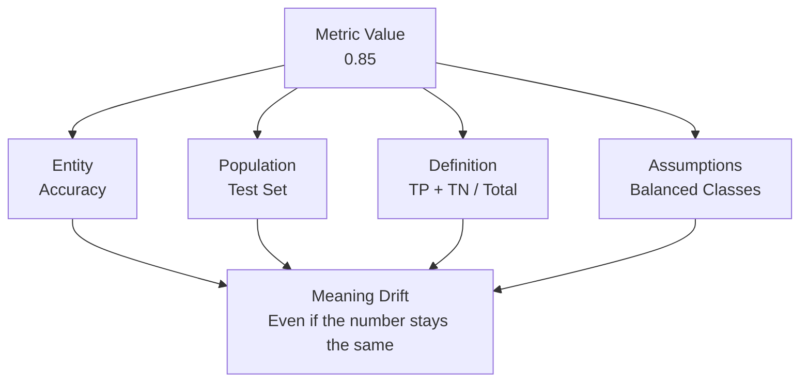
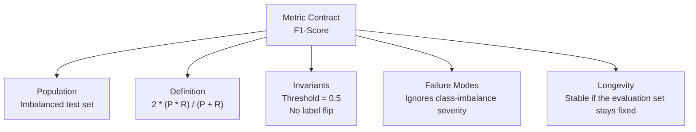

# Module 05 — Metrics, Parameters, and Meaning


<!-- page-maps:start -->
## Page Maps


<!-- page-maps:end -->

*Why numbers are not results, and comparisons are contracts*

---

## Purpose of this Module

This module addresses the failure that survives even after execution becomes repeatable:
two runs can be mechanically comparable while still meaning different things.

Use this module to learn how parameters and metrics become semantic contracts. The
question is no longer only "Did the pipeline run?" but "Are these numbers still
describing the same reality, under the same controls, in a way another reviewer can
trust?"

If that distinction stays fuzzy, experiment review and promotion will become theater.

---

## At a Glance

| Focus | Learner question | Capstone timing |
| --- | --- | --- |
| semantic metrics | "Are these numbers still measuring the same thing?" | inspect tracked metrics only after metric meaning is explicit |
| parameter contracts | "Which controls are part of the comparison surface?" | compare `params.yaml` to published params deliberately |
| reviewability | "What makes one run comparable to another?" | use the capstone to inspect params, metrics, and publish evidence together |

The main outcome of this module is not more measurement. It is better comparability.

---

## 5.1 The Perilous Misconception: Metrics as Mere Numerical Values

Workflows commonly reduce metrics to scalars, tables, or plots—logged, diffed, and compared algorithmically. This overlooks their essence: **metrics articulate assertions about reality**.

A metric encodes implicitly:

- The measured entity.
- The target population.
- The computational definition.
- Underlying assumptions.

Alterations in any dimension transform meaning, irrespective of numerical format. DVC performs diffs reliably on numbers, yet cannot validate semantic alignment—rendering comparisons potentially invalid.

**Example**: Accuracy on a binary classification task (0.85) appears stable across runs, but shifts from balanced to imbalanced test data invalidate comparability.

**Illustration**:



---

## 5.2 Parameters as Inputs, Not Arbitrary Controls

Parameters are frequently mishandled as transient adjustments: hardcoded literals, command-line arguments, or experimental YAML tweaks. This casual treatment is erroneous.

Parameters qualify as **inputs**, equivalent to data in influence. Undeclared parameters that affect execution preclude result attribution, undermine comparisons, and reduce experiments to unsubstantiated claims.

DVC's `params.yaml` enforces rigor: **If influential, it must be declared explicitly.**

**Example `params.yaml`**:
```yaml
train:
  learning_rate: 0.01
  batch_size: 32
  epochs: 100
evaluate:
  threshold: 0.5
```

Tracked via `dvc.yaml` under `params:`, changes trigger reruns and ensure traceability.

---

## 5.3 Parameter Scope and Leakage Risks

**Parameter leakage** emerges subtly:

- Scripts accessing unlisted config files.
- Evolving defaults across invocations.
- Environment variables dictating behavior.

DVC's viewpoint: Undeclared parameters are nonexistent; modifications evade rerun detection, yielding silent staleness. This constitutes a contract breach, not a limitation of the tool.

**Diagnostic Tip**: Use `dvc params diff` to expose discrepancies; audit scripts for external reads.

---

## 5.4 Prioritizing Metric Stability Over Precision

Counterintuitively, a metric that is modestly biased, imperfect, or approximate—yet **definitionally stable**—outweighs a "superior" metric prone to semantic evolution.

Reproducibility hinges on valid comparisons. Without honest yesterday-to-today alignment, advancement remains inscrutable.

---

## 5.5 Schemas as Semantic Foundations

Metrics persisted in JSON, CSV, or YAML carry implicit schemas, even undocumented. Modifications to column sequencing, field nomenclature, aggregation protocols, or null-value protocols alter semantics fundamentally.

DVC refrains from schema enforcement, presuming user diligence. Absent discipline, this assumption invites peril.

**Example Metric File** (JSON):
```json
{
  "accuracy": 0.85,
  "f1_score": 0.82,
  "population_size": 1000
}
```
Altering field order or adding unversioned keys breaks comparability.

---

## 5.6 `dvc metrics diff`: Veracity Without Intelligence

Executing `dvc metrics diff` addresses a constrained query: *Which metric files diverge, and by what magnitude?*

It omits:

- Semantic validity of the contrast.
- Population alterations.
- Definitional shifts.

Changing the evaluation set while retaining metric labels yields accurate diffs but erroneous human interpretation. This demarcation is intentional—a boundary, not a shortfall.

**Example Usage**:
```
$ dvc metrics diff
    metric   old     new     diff
    accuracy 0.85    0.87    +0.02
```

---

## 5.7 Plots as Deceptive Visuals (Absent Constraints)

Plots convey authority yet lack it. Instability arises from:

- Nondeterministic sorting.
- Implicit aggregations.
- Sampling artifacts.
- Floating-point perturbations.
- Default rendering behaviors.

Visually akin plots may derive from disparate populations or semantics. Generation must be deterministic, parameterized, and versioned to qualify as evidence, not ornament.

---

## 5.8 Metrics as Contracts: A Structured Design Framework

Prior to metric adoption, interrogate:

1. **Population**: Applicable data scope?
2. **Definition**: Precise computation?
3. **Invariants**: Constants for valid comparisons?
4. **Failure Modes**: Potential misdirections?
5. **Longevity**: Sustained meaning over time?

Unanswerable queries signal unreadiness for automation.

**Illustration**:



---

## 5.9 Failure Modes and Analyses

| Symptom                        | Interpretation                 |
| ------------------------------ | -------------------------------- |
| Unexpected metric shift        | Definitional or population drift |
| Stable metric, degraded model  | Metric oversight                 |
| Plot variance sans metric change | Rendering nondeterminism       |
| CI-local metric mismatch       | Environment/parameter variance   |

Remedy via semantic rectification, not diff suppression.

---

## 5.10 Semantic Exercise

Select a core metric. Document:

- Prose definition.
- Expected invariants.
- Invalidating conditions.

Query: Does your pipeline enforce these, or rely on convention?

Gaps are typically revelatory.

**Guidance**: Implement in a notebook or script for validation.

---

## 5.11 Essential Conceptual Framework

> **Pipelines generate artifacts; metrics generate meaning; meaning demands defense.**

DVC equips you with instruments for this defense—execution is yours.

---

## Module 05 — Invariants Checklist

Affirm:
- [ ] All consequential parameters tracked.
- [ ] Metric definitions stable and articulated.
- [ ] Comparisons semantically sound.
- [ ] Plots reproducible, not decorative.
- [ ] Metric drift identifiable, not opaque.

Rectify ambiguities before proceeding.

---

## Transition to Module 06

Immutable data, explicit environments, truthful pipelines, and meaningful metrics established. Exploration now poses a novel challenge: **How to iterate without historical corruption?** Module 06 delineates experiments as disciplined deviations from the core contract.
