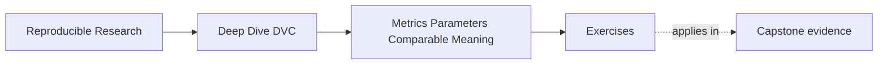

# Exercises


<!-- page-maps:start -->
## Page Maps




<!-- page-maps:end -->

Use these exercises to practice comparison judgment, not only metric vocabulary.

The strongest answers will explain what a number can prove, what it cannot prove, and
which nearby evidence changes its meaning.

## Exercise 1: Explain the metric claim

You see this metric file:

```json
{
  "incident_escalation": {
    "positive_class_f1_at_fixed_threshold": 0.82,
    "evaluation_population_size": 420
  }
}
```

Write a short explanation of:

- what the metric appears to claim
- what additional meaning a reviewer still needs
- why the population size is useful but not enough by itself

## Exercise 2: Classify parameter controls

A workflow has these values:

- `fit.model_family`
- `fit.random_seed`
- `evaluate.threshold`
- `evaluate.minimum_population_size`
- `plot.title`
- `tmp.file_suffix`

Decide which values probably belong in the comparison surface and which probably do not.

Explain your reasoning.

## Exercise 3: Diagnose schema drift

A previous release used:

```json
{
  "incident_escalation": {
    "positive_class_f1_at_fixed_threshold": 0.81
  }
}
```

A new run uses:

```json
{
  "incident_escalation": {
    "macro_f1_after_threshold_search": 0.84
  }
}
```

Write a review note that explains whether this is a simple improvement, an additive metric
change, or a meaning-changing schema change.

## Exercise 4: Interpret metric and parameter diffs

You see:

```text
dvc metrics diff
incident_escalation.positive_class_f1_at_fixed_threshold  0.81 -> 0.84

dvc params diff
evaluate.threshold  0.65 -> 0.50
```

Write the strongest defensible interpretation.

Avoid saying only "F1 improved."

## Exercise 5: Review a plot for release evidence

A calibration plot is included in a release review.

Describe what you would check before using the plot as evidence:

- population
- aggregation or binning
- sorting or rendering stability
- relationship to the metric movement
- relationship to the release decision

Then write one sentence that uses the plot responsibly in a release note.

## Mastery check

You have a strong grasp of this module if your answers consistently keep five ideas
visible:

- metrics are claims about a population, definition, and review decision
- parameters can change what a metric comparison means
- metric schemas must stay stable or announce meaning-changing changes
- `dvc metrics diff` shows numeric movement but not semantic validity
- plots and release metrics need the same comparison discipline as scalar values
