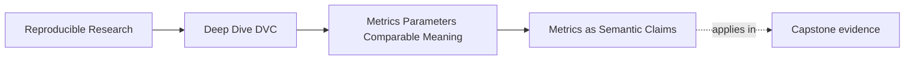
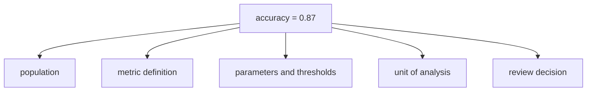

# Metrics as Semantic Claims


<!-- page-maps:start -->
## Page Maps




<!-- page-maps:end -->

A metric is not just a number in a file.

It is a claim about a system:

> On this population, using this definition, under these controls, the model behaved this
> way.

That sentence is longer than `accuracy: 0.87`, but it is the sentence reviewers actually
need. Without it, a metric value can look precise while saying something different from
what the team thinks it says.

## The four parts behind one number

Take a simple metric:

```json
{
  "accuracy": 0.87
}
```

The number hides several decisions:

- what examples were evaluated
- which labels counted as correct
- how missing or uncertain labels were handled
- whether the population was balanced or naturally imbalanced
- whether the threshold stayed fixed
- whether the metric was computed per incident, per customer, per day, or per alert

Changing any of those can change the meaning even when the field name stays the same.



The diagram is not asking you to write theory in every metric file. It is asking you to
stop treating a bare value as self-explanatory.

## A misleading comparison

Run A reports:

```json
{
  "accuracy": 0.87
}
```

Run B reports:

```json
{
  "accuracy": 0.89
}
```

Mechanically, B is higher by 0.02.

But suppose Run A used a stable holdout set of production-like incidents, while Run B used
a smaller evaluation set filtered to high-confidence labels only. The numeric comparison
is real, but the interpretation "the model improved" is not yet justified.

DVC can help track both files and show the numeric difference. It cannot decide whether
the population change invalidates the conclusion.

That judgment belongs to you and the review contract.

## Metric names are not enough

A metric name can be useful, but it is not a full definition.

`f1_score` may mean:

- binary F1 for the positive class
- macro F1 across several classes
- weighted F1 by support
- F1 after a threshold search
- F1 at a fixed threshold chosen before evaluation

Those are not interchangeable. A stable field name with a drifting definition is a hidden
semantic change.

Prefer names and documentation that make the claim harder to misread:

```json
{
  "incident_escalation": {
    "positive_class_f1_at_fixed_threshold": 0.81,
    "evaluation_population_size": 420
  }
}
```

This still does not prove everything, but it gives reviewers better handles than a lone
`f1_score`.

## What belongs beside a metric

Good metric review usually needs nearby evidence:

- the parameter values that controlled the run
- the evaluation population or dataset identity
- the metric definition or schema
- the output file where the metric was recorded
- the release or review note that says how the metric will be used

This is why Module 05 pairs `metrics.json`, `params.yaml`, `dvc.lock`, and published
release evidence. A metric should not float alone.

## Stability beats cleverness

A less glamorous metric with a stable meaning can be better than a clever metric whose
definition changes every few weeks.

For learning and release review, the first question is not:

> Is this the most advanced possible metric?

The better first question is:

> Can this metric support a fair comparison between the runs we are reviewing?

If the answer is no, the metric may still be useful for exploration, but it is not ready
to carry release authority.

## Review checkpoint

You understand this core when you can take one metric and explain:

- what population it describes
- what unit of analysis it uses
- what definition produced it
- which parameters or thresholds affect it
- what conclusion it can and cannot support
- what evidence a reviewer should inspect beside the metric file

The goal is not to distrust every number. It is to make each important number earn the
interpretation attached to it.
