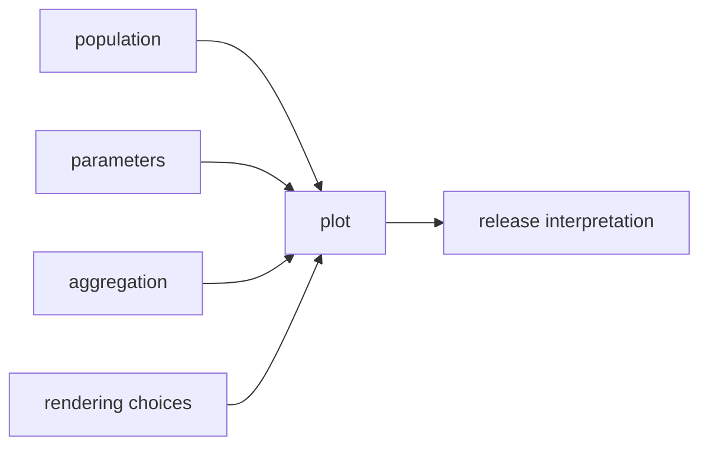

# Plots and Release Interpretation

Plots are powerful because humans trust them quickly.

That makes them risky.

A plot can look convincing while hiding a changed population, a changed aggregation, a
changed threshold, or a changed sorting rule. Module 05 treats plots as evidence only
when their meaning is as stable as the metrics they support.

## A plot is not self-validating

Suppose a release review includes a calibration plot.

The plot may depend on:

- which prediction file was used
- which population was selected
- how bins were built
- how missing labels were handled
- whether the threshold is fixed or searched
- how records were sorted
- which renderer version produced the output

If those choices drift silently, two plots can look comparable while answering different
questions.

The diagram has one lesson: visual evidence inherits the same comparison risks as numeric
evidence.

## Deterministic generation matters

Plot generation should avoid avoidable noise:

- sort rows before plotting when order affects output
- use stable binning rules
- use fixed random seeds for sampled visualizations
- keep units and axis labels stable
- avoid timestamped labels in tracked plot files
- avoid data-dependent metric names or legend labels that change unpredictably

The goal is not artistic uniformity. The goal is reviewable change. If a plot diff moves,
reviewers should be able to ask whether the model, population, or definition changed
instead of first debugging rendering noise.

## Plots should support, not replace, metric contracts

A plot is often best used as context:

- a calibration plot explains a metric movement
- a slice plot shows where an aggregate hides harm
- a trend plot shows whether a run is an outlier
- an error distribution plot shows which failures became more common

But the plot should not carry the entire release argument alone.

A weak review says:

> The plot looks better.

A stronger review says:

> The fixed-threshold F1 increased by 0.03 on the same evaluation population. The
> calibration plot supports the same direction of change, using the same binning rule and
> population.

That second review tells the reader what the plot is allowed to prove.

## Published metrics need a release boundary

Inside a workspace, metrics can be exploratory. Once metrics are promoted into a
published release boundary, they become evidence for downstream readers.

A release-facing metric bundle should make clear:

- which metric file was promoted
- which parameter values were promoted with it
- which model or artifact the metric describes
- which data identity or evaluation population was used
- which comparison baseline matters
- which known limitations apply

That is why the capstone has published surfaces such as `publish/v1/metrics.json` and
`publish/v1/params.yaml`. The release should not separate numbers from the controls that
make them interpretable.

## When a metric should not promote

Do not promote a metric as release evidence when:

- the population changed and the comparison note does not say so
- the metric definition changed but the name stayed similar
- a key parameter changed without review
- a plot changed because of nondeterministic rendering
- the output stage skipped despite a relevant input change
- the metric only supports exploration, not the release decision

This does not mean the run is useless. It means the run is not ready to carry that
particular authority.

## A release review note

A strong release note is short but explicit:

> Compared with release `v1`, fixed-threshold F1 increased from 0.81 to 0.84 on the same
> evaluation population and with unchanged evaluation threshold. Precision decreased
> slightly, so the promotion is acceptable only because recall improvement is the release
> priority for this model family. The calibration plot uses the same binning rule and does
> not contradict the metric movement.

That note is not verbose. It names the comparison, controls, tradeoff, and visual support.

## Review checkpoint

You understand this core when you can:

- explain why plots need stable population, aggregation, and rendering rules
- use plots as support instead of decoration
- keep release-facing metrics paired with their parameter evidence
- decide when a metric is not ready for promotion
- write a review note that separates numeric movement from release judgment

The learner goal is a release bundle that can be read later without guessing what the
numbers and plots were supposed to mean.
