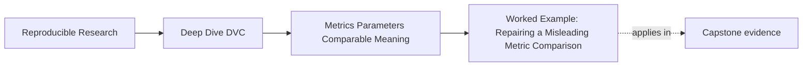

# Worked Example: Repairing a Misleading Metric Comparison


<!-- page-maps:start -->
## Page Maps




<!-- page-maps:end -->

This example shows how Module 05 fits together when a metric improves numerically but the
comparison is not yet safe.

The goal is not to reject the run. The goal is to say exactly what the run can support.

## The situation

Suppose you compare a current run against the last release.

The metric diff looks encouraging:

```text
incident_escalation.positive_class_f1_at_fixed_threshold  0.81 -> 0.84
```

The first reaction is:

> The model improved by three points.

Module 05 asks for a better question:

> What else changed that affects what this number means?

## Step 1: Inspect the parameter surface

You check the parameter diff:

```text
evaluate.threshold  0.65 -> 0.50
fit.model_family    logistic_regression -> logistic_regression
```

Now the story changes. The model family did not change, but the evaluation threshold did.

You write a more honest first note:

> F1 increased, but the evaluation threshold changed. This is not yet a same-control model
> improvement claim.

That note prevents a common review mistake: treating a policy-control change as if it
were pure model improvement.

## Step 2: Check population and schema

Next you inspect the metric file:

```json
{
  "incident_escalation": {
    "positive_class_f1_at_fixed_threshold": 0.84,
    "precision_at_fixed_threshold": 0.75,
    "recall_at_fixed_threshold": 0.95,
    "evaluation_population_size": 420
  }
}
```

The previous release used the same keys and the same population size.

That does not prove the comparison automatically, but it removes two major concerns:

- the metric schema appears stable
- the evaluation population size did not change

The threshold still changed, so the conclusion still needs a limit.

## Step 3: Read the direction of the tradeoff

You compare the supporting metrics:

```text
precision_at_fixed_threshold  0.78 -> 0.75
recall_at_fixed_threshold     0.84 -> 0.95
```

The higher F1 is not a free improvement. Precision went down while recall went up.

That may be exactly what the team wants for incident escalation, where missed escalations
are costly. But it must be stated as a release judgment, not hidden behind one aggregate
number.

You write:

> The threshold change improved recall substantially while reducing precision. Promotion
> would be a policy decision favoring recall, not a simple quality win.

## Step 4: Use the plot as supporting evidence

The release review includes a calibration plot.

You do not say:

> The plot looks fine.

Instead, you check:

- same evaluation population
- same binning rule
- same plotted probability field
- deterministic row ordering before plotting
- no timestamped output noise

Only then does the plot enter the review:

> The calibration plot uses the same binning rule and population. It does not contradict
> the metric movement, but the precision-recall tradeoff remains the main release
> decision.

The plot supports the review. It does not replace it.

## Step 5: Decide what can be promoted

You prepare a release-facing note:

> Compared with release `v1`, fixed-threshold F1 increased from 0.81 to 0.84 on the same
> metric schema and evaluation population size. The evaluation threshold changed from 0.65
> to 0.50, so this is not a same-threshold model improvement claim. The run shows a
> threshold-policy tradeoff: recall increased from 0.84 to 0.95 while precision decreased
> from 0.78 to 0.75. Promotion is defensible only if the release accepts lower precision in
> exchange for higher recall.

That note is much stronger than "F1 improved."

## The repaired comparison

The original comparison was:

> F1 improved from 0.81 to 0.84.

The repaired comparison is:

> Under the same metric schema and apparent population size, F1 improved while the
> evaluation threshold changed. The change should be reviewed as a threshold-policy
> tradeoff, not as isolated model improvement.

The number did not become useless. It became properly bounded.

## Why this is a mastery example

This one story exercises the whole module:

- Core 1: the metric was treated as a semantic claim
- Core 2: the threshold was recognized as a comparison control
- Core 3: schema and population evidence were checked before trusting the diff
- Core 4: metric diff was used as a starting point, not a conclusion
- Core 5: plot evidence and release judgment were kept inside a clear review note

The goal is not to make every comparison impossible. It is to make each comparison honest
enough to survive review.
