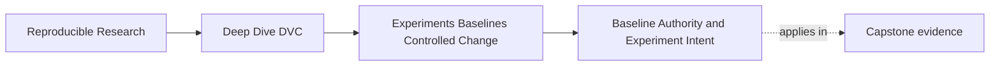
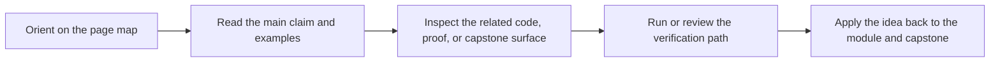
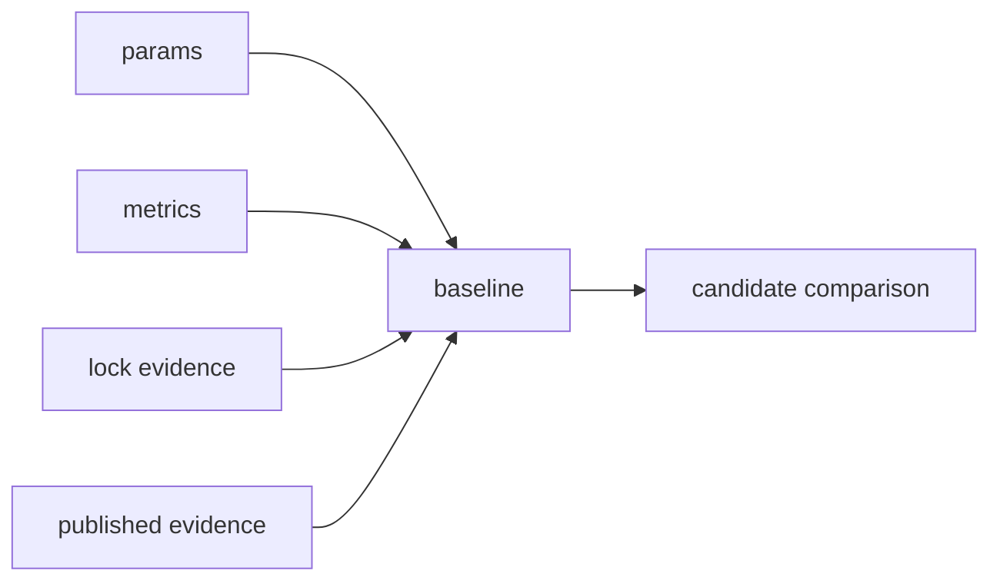

# Baseline Authority and Experiment Intent


<!-- page-maps:start -->
## Page Maps




<!-- page-maps:end -->

An experiment is only meaningful when it has something stable to compare against.

That stable reference is the baseline.

In this module, a baseline is not just "the current files." It is the recorded state that
the team is willing to use as the comparison anchor:

- declared data identity
- declared pipeline graph
- declared parameters
- recorded metrics
- known environment assumptions
- published or reviewable evidence

If the baseline is fuzzy, experiments become storytelling.

## What the baseline protects

A good baseline protects the question:

> Compared with what?

Without that answer, a candidate result can look better for the wrong reason.

Example:

```text
baseline:
  model_family: logistic_regression
  evaluate.threshold: 0.65
  positive_class_f1_at_fixed_threshold: 0.81

candidate:
  model_family: logistic_regression
  evaluate.threshold: 0.50
  positive_class_f1_at_fixed_threshold: 0.84
```

The candidate may be valuable, but the baseline immediately clarifies that the threshold
changed. The review should discuss a threshold-control change, not pretend the model
improved under identical controls.

## Intent comes before execution

Before running a candidate, write the intent in one sentence.

Weak:

> Try some stuff and see if the metric improves.

Stronger:

> Lower the escalation threshold from `0.65` to `0.50` to test whether recall improves
> enough to justify a precision tradeoff.

That sentence tells a reviewer:

- what changed
- why the change exists
- which metric movement would matter
- which tradeoff needs review

The intent does not need to be long. It needs to be specific enough that the experiment
does not become a pile of unrelated changes.

## Baseline evidence should be inspectable

The baseline should not live only in memory.

Useful evidence includes:

- `params.yaml` for current controls
- `metrics/metrics.json` for current results
- `dvc.lock` for recorded execution state
- `publish/v1/params.yaml` and `publish/v1/metrics.json` for promoted state
- review notes or guides that describe release meaning



The point is not to create paperwork. The point is to keep comparison from depending on
who remembers the run.

## Baseline authority can expire

A baseline is not permanent just because it exists.

It may stop being a fair comparison anchor when:

- the evaluation population changes
- the metric definition changes
- the pipeline graph changes meaningfully
- the environment strategy changes
- the release goal changes
- a data correction invalidates prior results

When that happens, do not hide the break inside an experiment. Name it as baseline
boundary work. The team may need a new baseline before candidate comparisons are fair
again.

## A baseline is not a prison

Baseline discipline does not mean "never change anything important."

It means important changes should be described honestly.

Changing a threshold can be a valid experiment. Changing the evaluation population may be
valid too, but it changes the comparison claim. Replacing the metric definition may be
necessary, but it should not be smuggled into a candidate run and compared as if nothing
else moved.

The baseline gives exploration a stable reference point. It does not forbid learning.

## Review checkpoint

You understand this core when you can explain:

- what state the baseline represents
- which files make the baseline inspectable
- what one candidate run intends to test
- why baseline authority can expire
- when a change should be treated as baseline boundary work rather than an ordinary experiment

Controlled change starts with a baseline that means something.
