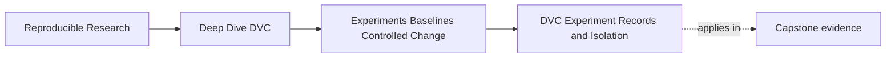
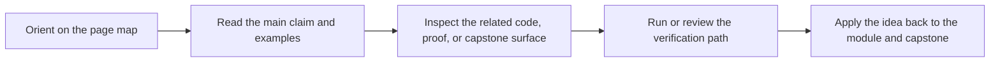
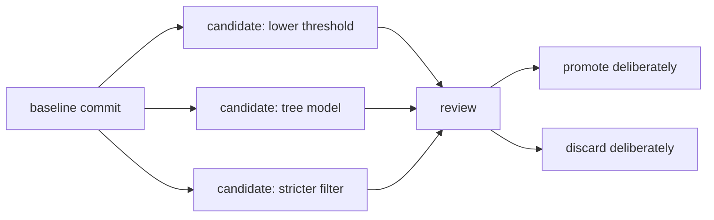

# DVC Experiment Records and Isolation


<!-- page-maps:start -->
## Page Maps




<!-- page-maps:end -->

DVC experiments help teams explore without turning every candidate into a permanent Git
commit.

That is useful, but it is easy to overstate.

DVC experiment commands help record and compare candidate runs. They do not make every
candidate scientifically valid, semantically comparable, or ready to promote.

## What an experiment record is for

An experiment record gives a candidate run a reviewable handle:

- which baseline commit it came from
- which declared parameters changed
- which metrics were produced
- which outputs were produced
- which command and pipeline state were involved

That means you can ask:

> What changed compared with the baseline, and what evidence did the run produce?

This is already stronger than "I ran a notebook last night."

## A small command sequence

A simple candidate run might look like:

```bash
dvc exp run --set-param evaluate.threshold=0.50
dvc exp show
dvc exp diff
```

Read that sequence as a review loop:

- run a candidate with a declared parameter change
- inspect the candidate beside other runs
- compare the candidate against its baseline

The commands are not magic. They are a disciplined way to preserve enough context for a
decision.

## Isolation from Git history

DVC experiments can keep exploratory runs separate from main Git history.

That matters because a candidate may be:

- promising but not verified
- useful for learning but not for release
- inferior to the baseline
- based on a control change that needs discussion
- a dead end that should not become a permanent commit



The separation gives exploration room without letting every trial rewrite the baseline
story.

## What isolation does not solve

DVC experiment isolation does not automatically solve:

- poor experiment design
- hidden environment drift
- incomparable metric definitions
- undeclared pipeline inputs
- data changes that invalidate the baseline
- a better metric that fails the release objective

Those are still engineering and review problems.

For example, if a candidate changes the evaluation population without saying so, DVC may
record the run cleanly. The comparison can still be misleading.

The tool preserves evidence. It does not replace judgment.

## Naming and notes matter

Experiment records become much easier to review when the candidate has a clear label or
note.

Weak:

```text
exp-a31c4
```

Better review language:

```text
lower-evaluation-threshold-for-recall
```

The exact mechanics for naming or annotating can vary by workflow, but the principle is
stable: the candidate should carry intent, not only an opaque identifier.

Two years later, the team should not need to remember why a candidate existed.

## Workspace discipline still matters

Experiments can touch the workspace. Learners should keep the workspace understandable:

- know which baseline commit the candidate came from
- avoid unrelated local edits while reviewing candidates
- inspect parameter and metric differences before applying anything
- avoid treating applied experiment state as promoted history until it is committed and reviewed

This discipline prevents the common failure where a candidate result quietly becomes the
new local truth without a promotion decision.

## Review checkpoint

You understand this core when you can explain:

- what a DVC experiment record helps preserve
- how experiment candidates stay separate from main Git history
- what `dvc exp show` and `dvc exp diff` help review
- which validity questions DVC does not answer by itself
- why clear candidate intent matters beside command output

DVC experiments are an evidence surface for exploration. They are not a substitute for a
clear experiment question.
