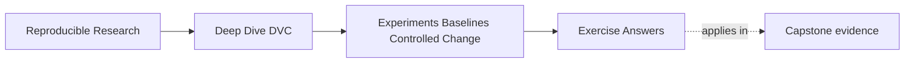
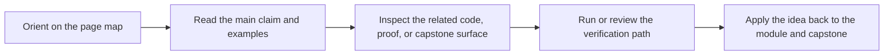

# Exercise Answers

<!-- page-maps:start -->
## Page Maps

<!-- page-maps:end -->

These answers are model explanations, not the only acceptable wording.

What matters is whether the reasoning keeps baseline authority, candidate scope, evidence,
and promotion decisions connected.

## Answer 1: Name the baseline

Strong baseline description:

> The baseline uses `evaluate.threshold: 0.65` and reports F1 `0.81`, precision `0.78`,
> and recall `0.84`. Candidate experiments should compare against the same declared
> parameter surface, metric definition, and evaluation population unless a baseline
> boundary change is explicitly reviewed.

Evidence to inspect:

- `params.yaml`
- `metrics/metrics.json`
- `dvc.lock`
- published baseline files such as `publish/v1/params.yaml` and `publish/v1/metrics.json`
- any release or prediction review guide that explains the metric meaning

The main lesson is that baseline is evidence, not memory.

## Answer 2: Scope a candidate

This should usually be separate candidate runs.

Reasoning:

- lowering `evaluate.threshold` tests a policy tradeoff
- switching `fit.model_family` tests model configuration
- removing weekends changes the evaluation population and may require baseline boundary review

Combining all three would make the result hard to interpret. If the metric improves, the
team would not know whether the cause was threshold, model family, population change, or
their interaction.

A defensible combined run is possible only if the intent is explicitly a full policy
proposal. It should not be reviewed as a clean threshold or model experiment.

## Answer 3: Interpret a candidate table

Strong review note:

> The candidate changes `evaluate.threshold` from `0.65` to `0.50`. F1 improves from
> `0.81` to `0.84`, and recall improves from `0.84` to `0.95`. Precision decreases from
> `0.78` to `0.75`. This candidate is promising only if the release objective prioritizes
> reducing missed escalations enough to accept the precision cost.

The main lesson is to describe the tradeoff instead of naming only the higher F1.

## Answer 4: Identify what DVC experiments do not prove

Strong response:

> DVC experiments help record candidate runs, parameter differences, metrics, and
> comparison evidence without immediately rewriting main Git history. They do not prove
> that the candidate is semantically comparable, scientifically valid, environmentally
> stable, or appropriate for release. We still need to inspect the baseline, parameter
> changes, metric definitions, evaluation population, and release objective before calling
> a candidate valid.

The main lesson is that DVC preserves evidence; people still review meaning.

## Answer 5: Decide promotion or discard

Before applying the candidate, inspect:

- parameter diff
- metric diff
- baseline identity
- evaluation population evidence
- metric schema stability
- whether the candidate has unrelated changes

After applying the candidate, check:

- `git diff`
- `git status`
- expected `params.yaml`, metric, lock, or output changes
- no unrelated workspace changes
- review route output if the course capstone provides one

Strong promotion note should include:

- threshold changed from `0.65` to `0.50`
- recall improved
- precision decreased
- population and metric meaning remained comparable, if verified
- release objective prioritizes missed-escalation reduction
- promotion is a recall-oriented threshold policy decision, not a pure model improvement claim

The main lesson is that applying is not promotion until the intended state is reviewed and
committed.

## Self-check

If your answers consistently explain:

- what baseline state anchors the comparison
- what each candidate is trying to learn
- what DVC experiment evidence can and cannot prove
- which tradeoffs matter for selection
- why promotion needs applying, inspecting, and committing a defensible state

then you are using Module 06 correctly.
