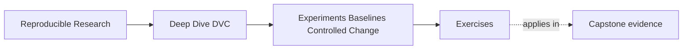
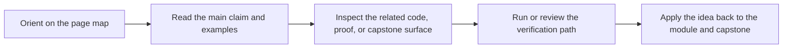

# Exercises


<!-- page-maps:start -->
## Page Maps




<!-- page-maps:end -->

Use these exercises to practice controlled exploration, not only DVC command vocabulary.

The strongest answers will explain the baseline, the candidate intent, the declared
change, the comparison evidence, and the promotion or discard decision.

## Exercise 1: Name the baseline

You have a published baseline with:

```yaml
evaluate:
  threshold: 0.65
```

and:

```json
{
  "f1": 0.81,
  "precision": 0.78,
  "recall": 0.84
}
```

Write a short baseline description that explains what state the candidate experiments
will compare against and which evidence files a reviewer should inspect.

## Exercise 2: Scope a candidate

Suppose you want to try:

- lower `evaluate.threshold` from `0.65` to `0.50`
- switch `fit.model_family` from logistic regression to tree boosting
- remove weekends from the evaluation data

Decide whether this should be one candidate run or separate candidate runs.

Explain your reasoning.

## Exercise 3: Interpret a candidate table

You see:

```text
candidate                   threshold    f1     precision    recall
baseline                    0.65         0.81   0.78         0.84
lower-threshold-for-recall  0.50         0.84   0.75         0.95
```

Write a review note that explains:

- what changed
- what improved
- what got worse
- what release objective would make the candidate promising

## Exercise 4: Identify what DVC experiments do not prove

A teammate says:

> We used `dvc exp run`, so the winning candidate is automatically valid.

Write a response that explains what DVC experiments help record and what still requires
human review.

## Exercise 5: Decide promotion or discard

A candidate changes `evaluate.threshold` from `0.65` to `0.50`.

It improves recall, reduces precision, keeps the same reported evaluation population size,
and matches the release objective of reducing missed escalations.

Describe:

- what you would inspect before applying the candidate
- what you would check after applying it
- what a strong promotion note should include

## Mastery check

You have a strong grasp of this module if your answers consistently keep five ideas
visible:

- a baseline anchors comparison
- a candidate should have a focused intent
- DVC experiments preserve candidate evidence without replacing review judgment
- selection should describe tradeoffs, not only best metrics
- promotion should happen only after applying, inspecting, and committing an intended state
