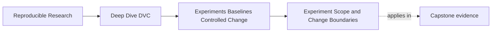
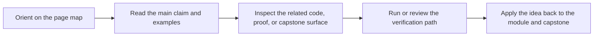

# Experiment Scope and Change Boundaries


<!-- page-maps:start -->
## Page Maps




<!-- page-maps:end -->

An experiment should be different enough to teach something and narrow enough to review.

That balance is the scope problem.

If a candidate run changes one threshold, the review can ask whether the threshold tradeoff
is worth it. If it changes threshold, model family, feature filtering, evaluation
population, and metric definition at once, the review may only know that "something
changed."

Module 06 treats scope as part of experiment quality.

## One question per candidate is a useful default

A good candidate often starts with one review question:

- What happens if the escalation threshold moves from `0.65` to `0.50`?
- Does a tree-based model improve recall compared with the baseline model?
- Does adding the incident age feature help the same evaluation population?
- Does a stricter minimum population size make the release metric more stable?

The question keeps the candidate from absorbing every interesting idea at once.

It also makes the result easier to reject. If the threshold change improves recall but
hurts precision too much, the team can discard that candidate without wondering whether
some unrelated model change caused the tradeoff.

## Controlled change belongs in declared surfaces

Controlled changes should appear where the course has already taught you to look:

- parameter changes in `params.yaml`
- pipeline changes in `dvc.yaml`
- metric changes in metric files and review notes
- data identity changes in DVC-tracked state
- environment changes in environment evidence

Example candidate:

```yaml
evaluate:
  threshold: 0.50
```

This is reviewable if the baseline had:

```yaml
evaluate:
  threshold: 0.65
```

The change is visible, comparable, and easy to explain.

Weak candidate:

```text
Changed the threshold in Python, tried a different split file, and copied a notebook
result into the report.
```

This is not controlled exploration. It is a lineage gap.

## Separate experiment change from baseline boundary work

Some changes are too structural to hide inside an ordinary candidate comparison.

Examples:

- changing the evaluation population definition
- replacing the metric definition
- changing the pipeline graph so outputs no longer mean the same thing
- fixing a data quality bug that invalidates earlier metrics
- changing the runtime strategy in a way that affects results

Those changes may be necessary. But they should be reviewed as boundary changes before
candidate ranking.

The safer order is:

1. repair or redefine the baseline boundary
2. record the new baseline evidence
3. run candidates against the new baseline

This avoids pretending that two incomparable states are ordinary experiment alternatives.

## Bundle related changes only when the story is explicit

Sometimes a candidate needs more than one changed value.

Example:

```yaml
fit:
  model_family: tree_boosting
  max_depth: 4
  random_seed: 20260411
```

Those values can belong together because `max_depth` is part of testing that model family.
The review note should say that the candidate evaluates a tree-boosting configuration, not
just "a parameter tweak."

The key is that the bundle has one story.

Weak bundle:

```yaml
fit:
  model_family: tree_boosting
evaluate:
  threshold: 0.50
data:
  include_weekends: false
```

This might be valid if the review question is a full policy proposal. It is not a clean
model-family comparison.

## A scope review table

| Change | Usually safe in one candidate? | Review concern |
| --- | --- | --- |
| one evaluation threshold | yes | compare precision-recall tradeoff |
| model family plus model-specific hyperparameters | yes, if named clearly | compare model configuration, not one isolated value |
| threshold plus evaluation population change | usually no | metric meaning may change |
| metric definition replacement | usually no | baseline may need redefinition |
| data correction that invalidates old metrics | no | new baseline evidence needed |
| plot styling only | usually not an experiment | may be documentation or report cleanup |

Use the table to slow down, not to avoid judgment.

## Review checkpoint

You understand this core when you can:

- state the review question for one candidate run
- name the declared surface where each change belongs
- distinguish ordinary candidate variation from baseline boundary work
- explain when a bundle of changes has one coherent story
- reject candidates that are too mixed to interpret

Experiment scope is what keeps exploration from becoming folklore with metric files.
