# Module 06: Experiments, Baselines, and Controlled Change

Module 06 turns reproducibility into a way to explore safely.

Earlier modules made the baseline more trustworthy: data has identity, runtime influence
is visible, pipeline edges are declared, and metric meaning is reviewable. That does not
mean the team should stop changing the workflow. It means change needs a clean boundary.

This module is about disciplined exploration:

- what makes a baseline authoritative
- what makes an experiment comparable to that baseline
- what DVC experiments help record
- where experiment isolation ends
- how a candidate result becomes a deliberate promotion instead of a lucky local run

The central learner question is:

> What changed, where was it declared, and can this result be compared or promoted without
> corrupting the baseline story?

If the answer is still "I tried a few things locally," the workflow has left the course's
evidence model.

The capstone corroboration surface for this module is the set of files and commands that
make experiment review visible: `capstone/params.yaml`, `capstone/metrics/metrics.json`,
`capstone/publish/v1/params.yaml`, `capstone/docs/EXPERIMENT_GUIDE.md`,
`capstone/docs/RELEASE_REVIEW_GUIDE.md`, `capstone/docs/PUBLISH_CONTRACT.md`, and
the `make -C capstone experiment-review` route.

## Why this module exists

Experimentation is where many reproducible workflows become informal again.

Common failure patterns look ordinary:

- changing a threshold locally and forgetting which run produced the better metric
- copying a script to try a new model family
- mixing data changes with parameter changes and calling the result one experiment
- keeping a strong result in the workspace without a promotion review
- promoting a result because it had the best metric, while ignoring comparability limits

Those are not just organization problems. They erase lineage. They make later release and
collaboration decisions depend on memory instead of evidence.

The point of Module 06 is not to make exploration slow. The point is to let exploration
happen without damaging the baseline that makes comparison possible.

## Study route

```mermaid
flowchart LR
  overview["Overview"] --> core1["Core 1: baseline authority"]
  core1 --> core2["Core 2: experiment scope"]
  core2 --> core3["Core 3: DVC experiment mechanics"]
  core3 --> core4["Core 4: comparison and selection"]
  core4 --> core5["Core 5: promotion and cleanup"]
  core5 --> example["Worked example"]
  example --> practice["Exercises and answers"]
  practice --> glossary["Glossary"]
```



Read the module in that order the first time.

If the problem is already partly clear, use this shortcut:

- open Core 1 when the main confusion is "what is the baseline protecting?"
- open Core 2 when the main confusion is "what belongs in one experiment?"
- open Core 3 when the main confusion is "what do DVC experiments record and isolate?"
- open Core 4 when the main confusion is "which candidate is actually comparable?"
- open Core 5 when the main confusion is "how does a candidate become history safely?"

## Module map

| Page | Purpose |
| --- | --- |
| `index.md` | explains the module promise and study route |
| `baseline-authority-and-experiment-intent.md` | teaches how a baseline anchors controlled exploration |
| `experiment-scope-and-change-boundaries.md` | teaches which changes belong in one experiment and which require stronger review |
| `dvc-experiment-records-and-isolation.md` | teaches what DVC experiments record, compare, and keep separate |
| `comparing-experiments-and-selecting-candidates.md` | teaches candidate comparison without metric cherry-picking |
| `promotion-cleanup-and-history-integrity.md` | teaches deliberate promotion, discard, and baseline protection |
| `worked-example-promoting-a-controlled-threshold-experiment.md` | walks through one realistic experiment review |
| `exercises.md` | gives five mastery exercises |
| `exercise-answers.md` | explains model answers and review logic |
| `glossary.md` | keeps the module vocabulary stable |

## What should be clear by the end

By the end of this module, you should be able to explain:

- what makes a baseline authoritative enough for experiment comparison
- how to keep one experiment focused on a reviewable change
- what DVC experiments add beyond ordinary Git branch history
- how to compare candidate runs without ignoring metric meaning
- why promotion requires evidence, not only a better number
- how cleanup protects learners from stale local folklore

## Commands to keep close

These commands form the evidence loop for Module 06:

```bash
make -C capstone experiment-review
make -C capstone prediction-review
dvc exp run
dvc exp show
dvc exp diff
dvc exp apply
```

Use the `make` routes for the course-provided capstone review. Use the `dvc exp` commands
inside a DVC workspace when you want to inspect candidate runs directly.

## Capstone route

Use the capstone after you can explain what the baseline promises.

Best corroboration surfaces for this module:

- `capstone/params.yaml`
- `capstone/metrics/metrics.json`
- `capstone/publish/v1/params.yaml`
- `capstone/publish/v1/metrics.json`
- `capstone/docs/EXPERIMENT_GUIDE.md`
- `capstone/docs/RELEASE_REVIEW_GUIDE.md`
- `capstone/docs/RELEASE_REVIEW_GUIDE.md`

Useful proof route:

```bash
make -C capstone experiment-review
make -C capstone release-audit
```

The point of that route is not to celebrate variation. It is to ask whether a candidate
run changed a declared control, stayed comparable to the baseline, and deserves any
promotion discussion at all.
