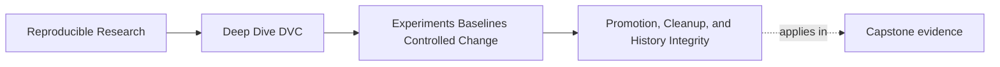
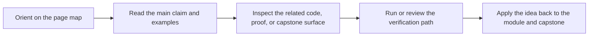

# Promotion, Cleanup, and History Integrity


<!-- page-maps:start -->
## Page Maps




<!-- page-maps:end -->

An experiment is not finished when it produces a metric.

It is finished when the team decides what to do with it:

- promote it
- keep it for a bounded review reason
- discard it

Leaving candidates in an undecided state creates local folklore. Someone remembers a good
run, someone else sees a stale artifact, and the baseline slowly stops being the authority.

## Promotion is a governance decision

Promotion means a candidate is allowed to become part of the main state story.

That requires more than a good number.

Before promotion, a reviewer should ask:

- did the candidate come from the intended baseline?
- are the parameter changes declared?
- are metric definitions and population comparable?
- is the tradeoff acceptable for the release objective?
- can the run be reproduced or at least defended with recorded evidence?
- will applying the candidate introduce unrelated workspace changes?

Only after those questions are answered should the candidate be applied and committed.

```bash
dvc exp show
dvc exp diff
dvc exp apply <candidate-id>
git diff
git status
```

The commands are not a ritual. They are the path from candidate evidence to main history.

## Applying is not the same as promoting

Applying an experiment changes the workspace. Promotion is the reviewed decision to make
that applied state part of history.

This distinction matters.

Weak workflow:

```text
Applied a promising experiment, kept working, and eventually forgot which files came from it.
```

Stronger workflow:

```text
Applied the candidate, inspected the diff, verified only intended changes were present,
ran the review route, then committed the promoted state with a clear message.
```

The workspace is a staging area for review. It is not proof by itself.

## Discarding is an honest outcome

A discarded candidate is not wasted work if it taught something.

Good reasons to discard:

- metric movement did not support the intent
- tradeoff was unacceptable
- candidate was incomparable to the baseline
- result could not be reproduced
- candidate mixed too many changes to interpret
- better evidence arrived from another candidate

The key is to avoid keeping undecided clutter just because it might be useful someday.

If a candidate matters, write why. If it does not, remove it from the active review
surface.

## Cleanup protects future maintainers

Cleanup is part of experiment discipline.

Reviewers should avoid:

- stale candidate outputs in the workspace
- unpublished local changes that look like baseline state
- ambiguous candidate names
- copied metric files outside the declared path
- old experiment notes that no longer match the current baseline

Cleanup does not erase learning. It keeps the repository from becoming a museum of
unreviewed alternatives.

## A promotion note

A strong promotion note says what changed and why it deserves history:

> Promote the lower-threshold candidate because it improves recall from `0.84` to `0.95`
> on the same evaluation population, with precision decreasing from `0.78` to `0.75`.
> The change is limited to `evaluate.threshold` and matches the release objective of
> reducing missed escalations. Metric schema and published parameter evidence were
> reviewed before applying the candidate.

That note is stronger than:

> Promote best experiment.

The first note can be challenged. The second note cannot be reviewed.

## Commit history should tell the decision

Commit history should not contain vague experiment promotion.

Prefer a message that says the durable intent:

```text
docs(dvc): explain threshold promotion rationale
```

or, in a project codebase:

```text
feat(model): promote recall-oriented escalation threshold
```

The exact type depends on the repository change. The point is that future readers should
understand the decision without reconstructing a local experiment session.

## Review checkpoint

You understand this core when you can:

- distinguish applying a candidate from promoting it
- list the evidence needed before promotion
- explain why discard is a valid outcome
- clean up undecided candidate clutter
- write a promotion note that names the control change, metric tradeoff, and review basis

Experiments are temporary. History should contain only the decisions the team can defend.
