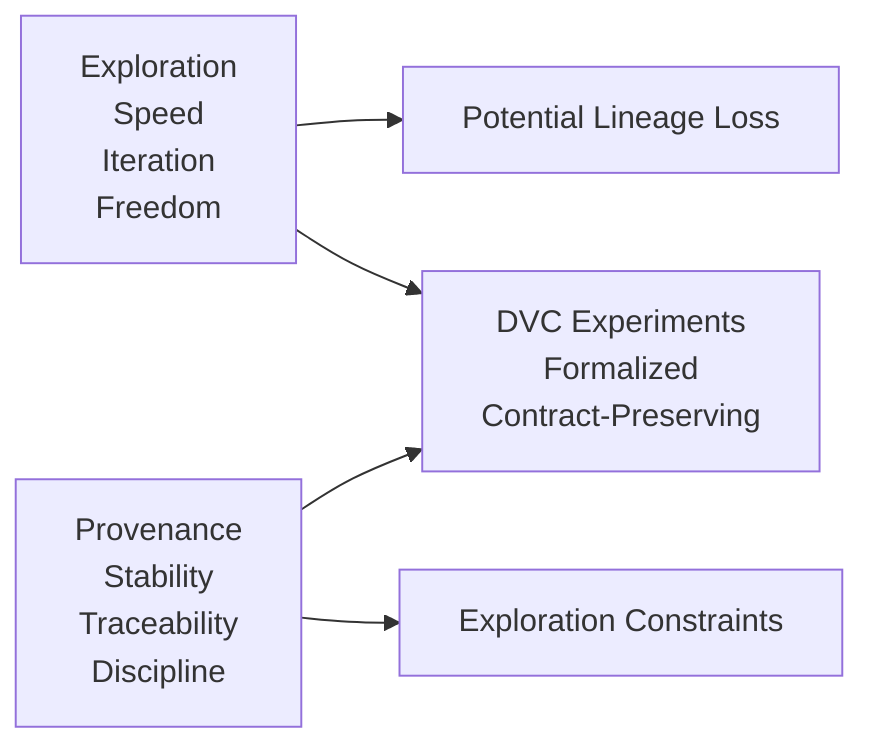
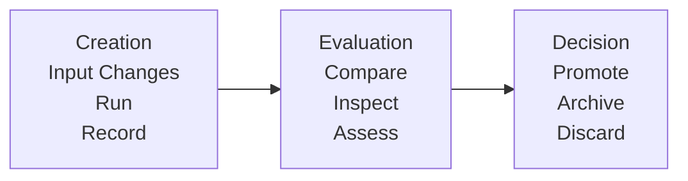

# Module 06 — Experiments Without Chaos

*Exploration as a first-class, auditable, and reversible process*

---

## Purpose of this Module

Upon concluding Module 05, a robust framework emerges: immutable data identity, explicit environmental inputs, truthful directed acyclic graphs (DAGs) for pipelines, and metrics with enduring significance.

The system is now fundamentally sound.

Yet, the subsequent challenge introduces inherent risks: **the imperative to introduce modifications**. This encompasses trials of novel parameters, evaluations of additional features, refinements to preprocessing, and investigations of hypotheses.

Exploration is indispensable for advancement; however, unmanaged exploration undermines integrity.

This module resolves a singular inquiry: **How can exploration proceed unencumbered while safeguarding reproducibility, historical fidelity, and institutional trust?**

**Prerequisites**: Thorough comprehension of Modules 01–05 is essential. Proficiency in DVC commands such as `dvc exp run`, `dvc exp diff`, and Git branching is recommended; consult DVC's experimentation documentation if clarification is required.

## At a Glance

| Focus | Learner question | Capstone timing |
| --- | --- | --- |
| comparable exploration | "What makes an experiment different but still comparable?" | use the capstone after baseline state already feels stable |
| reversible change | "How do I explore without corrupting the main state story?" | inspect params, metrics, and publish state together |
| declared variation | "Which experiment changes belong in the control surface?" | avoid treating local tweaks as legitimate lineage |

## Why this module matters in the course

This is where many teams destroy the discipline they built in earlier modules. Once the
baseline becomes trustworthy, the urge to explore returns: new thresholds, new features,
different preprocessing, maybe a changed split strategy. That pressure is normal.

The pedagogical point of this module is that experimentation is not an exception to
reproducibility. It is one of the places where reproducibility is most likely to fail.

## Questions this module should answer

By the end of the module, you should be able to answer:

- What makes an experiment comparable to the baseline instead of merely different?
- Which changes belong inside controlled experiment runs, and which require a new baseline?
- Why is "I tried a few things locally" not an acceptable lineage story?
- How do experiments stay reversible without cluttering or corrupting main history?

If those answers are still weak, later promotion and governance rules will feel arbitrary.

This module should make experimentation feel more disciplined, not less flexible.

## What to inspect in the capstone

Keep the capstone open while reading this module and inspect:

- `params.yaml` as the declared experiment surface
- `metrics/metrics.json` as the comparison output
- `publish/v1/params.yaml` as the promoted parameter contract
- the recovery and verification targets as a reminder that experiments do not exempt the repository from proof

The capstone is intentionally small, but it should still let you answer the question:
"What changed, where was it declared, and why is this run still comparable?"

---

## 6.1 The Fundamental Conflict: Exploration Versus Provenance

Exploration and provenance exert opposing forces: the former demands agility, iterative flexibility, and liberty, while the latter necessitates constancy, traceability, and rigor.

Many machine learning (ML) teams implicitly favor exploration through informal methods—notebook-based trials, script duplications, directory renamings, or reliance on recollection—yielding outcomes at the expense of lineage traceability.

DVC experiments formalize this process, preserving contractual obligations without compromise.

**Illustration**:



---

## 6.2 Formal Conception of an Experiment

An experiment does **not** equate to a Git branch, notebook, or ephemeral script.

Within DVC, it denotes: **A provisional pipeline execution with altered inputs, documented sans modification to primary history.**

Essential attributes include:

- Identical pipeline architecture.
- Variations in parameters, data, or code.
- Segregation from the principal branch.
- Comprehensive comparability and reproducibility.

Violations of these criteria reclassify the activity as technical debt, not a legitimate experiment.

---

## 6.3 Limitations of Git Branches in Isolation

Git branches effectively sequester code, maintain historical records, and enable concurrent development. However, they fall short in:

- Cleanly isolating data versions.
- Facilitating metric comparisons.
- Averting inadvertent promotions.
- Documenting execution origins.

Exclusive dependence on Git branches for ML trials precipitates branch proliferation, contextual erosion, and queries such as "Which branch yielded the optimal outcome?"

DVC experiments augment Git, operating at a higher abstraction level.

---

## 6.4 Conceptual Framework of DVC Experiments

DVC introduces a dual-axis execution paradigm:

- **Mainline History**: Governed by Git commits.
- **Experimental Domain**: Transient executions.

An experiment involves pipeline invocation, input/output/metric logging, and preservation of the current commit's integrity, with capabilities for listing, differencing, and comparison.

This structure supports rapid cycles, secure evaluations, and intentional elevations, precluding accidental integrations.

**Example Workflow**:
```
$ dvc exp run --set-param train.learning_rate=0.005
$ dvc exp list
$ dvc exp diff
```

---

## 6.5 Assurances of Isolation and Their Boundaries

DVC experiments provide:

- Detachment from Git chronology.
- Autonomous parameter configurations.
- Distinct metric repositories.

They exclude:

- Safeguards against environmental variances.
- Protections from semantic errors.
- Assurances of sound experimental methodology.

Thus, experiments uphold mechanical fidelity while deferring to human discernment.

---

## 6.6 The Imperative Experiment Lifecycle

Each experiment must culminate in one of three resolutions: promotion, archival, or discard. Deviations foster obsolescence.

### Creation Phase
- Modify inputs (parameters, data, code).
- Execute the experiment.
- Capture resultant artifacts.

### Evaluation Phase
- Contrast metrics.
- Examine differences.
- Validate semantic coherence.

### Decision Phase
- Intentionally promote or explicitly discard.

Undecided experiments accrue as liabilities.

**Illustration**:



---

## 6.7 Promotion as a Deliberate Governance Procedure

Promotion represents the most precarious juncture, conferring authority, historical integration, and downstream dependencies upon the experiment.

It mandates:

- Reproducibility confirmation.
- Metric substantiation.
- Peer scrutiny where pertinent.

Unverified promotions entrench suboptimal results.

**Example Promotion Command** (with verification):
```
$ dvc exp show  # Review metrics
$ dvc exp apply <exp-id>  # Promote to workspace
$ git commit -m "Promote verified experiment"
```

---

## 6.8 Defining a Reproducible Experiment

A reproducible experiment permits clean-machine re-execution, yields equivalent metrics, features declared inputs, and adheres to pipeline invariants.

Non-reproducible instances warrant rejection from promotion, with precedence given to pipeline or environmental rectification. This stringent criterion sustains systemic coherence.

---

## 6.9 Prevalent Anti-Patterns

### Persistent Experiments
Undecided lingering experiments devolve into ersatz branches, obfuscating history.

### Tacit Promotion
Retaining results sans formal assimilation erodes provenance.

### Selective Metric Emphasis
Prioritizing singular metrics absent semantic oversight engenders spurious assurance.

### Notebook-Centric Inquiry
Non-reproducible endeavors are nonexistent.

---

## 6.10 Failure Modes and Analyses

| Symptom                    | Interpretation                 |
| -------------------------- | ------------------------------ |
| Experiment Overabundance   | Decision-making laxity         |
| Irreproducible Optimal Run | Environmental/dependency infiltration |
| Incomparable Metrics       | Semantic divergence            |
| Mainline Contamination     | Unverified promotion           |

These signify governance deficiencies, not instrumental flaws.

---

## 6.11 Applied Exercise

Execute systematically:
1. Conduct three experiments: one superior, one inferior, one equivocal.
2. For each: Document inputs, compare metrics, determine disposition.
3. Promote solely one.

Inability to articulate promotion rationale in documentation signals unpreparedness for automation.

**Guidance**: Leverage `dvc exp run` with varied parameters; record in a structured log for traceability.

---

## 6.12 Essential Conceptual Paradigm

> **Experiments are ephemeral; history is inviolable.**

Equating all elements with significance undermines reliability.

---

## Module 06 — Invariants Checklist

Confirm:
- [ ] Experiments segregated from primary history.
- [ ] Defined resolutions for all experiments.
- [ ] Deliberate, verifiable promotions.
- [ ] Rejection of irreproducible experiments.
- [ ] Preservation of provenance amid exploration.

Resolve negotiability prior to advancement.

---

## Transition to Module 07

Individual operations are now viable. However, systemic failures arise from interpersonal dynamics: omitted data pushes, forceful branch overwrites, main-branch experimentations.

Module 07 addresses this reality: **Reproducibility constitutes a social challenge mitigated through technical mechanisms.**
