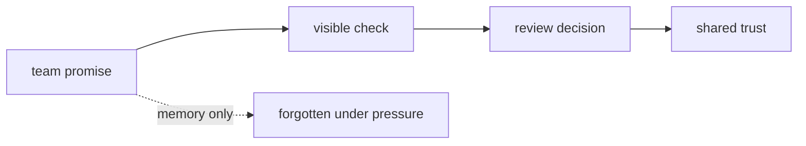

# Collaboration Failures and Social Contracts

Reproducibility failures often look technical after they happen.

Before they happen, they often look social:

- someone forgot to push data
- someone trusted a local result
- someone merged a lockfile change without checking remote state
- someone assumed a teammate knew which command to run
- someone promoted a report without the parameters that made it interpretable

Module 07 does not treat these as character flaws. It treats them as missing contracts.

## The problem with "careful people"

"We are careful" is not a reproducibility strategy.

Careful people still get interrupted. They still miss uploads under deadline pressure.
They still onboard new teammates who do not share private context. They still forget why a
local result was trusted three months later.

A stronger system asks:

> Which promises should the repository and CI enforce because humans will eventually
> forget them?

That question turns blame into design.

## Social contracts should become visible checks

A social contract is an agreement the team relies on.

Weak contract:

> Remember to push DVC data before merging.

Stronger contract:

> A pull request cannot merge unless CI can pull required DVC objects and run the
> verification route from a clean checkout.

The second version can be checked. It gives reviewers a shared standard instead of a
reminder.

The diagram is simple because the idea is simple: important promises need evidence.

## Common failure classes

| Failure | What it looks like | Missing contract |
| --- | --- | --- |
| missing data push | metadata merged, remote object absent | CI or review did not verify data availability |
| local-only success | author can run it, teammate cannot | clean executor was not authoritative |
| lockfile drift | pipeline declaration and lock evidence disagree | merge gate did not require consistent state |
| private review context | only the author understands the result | review notes and published evidence are incomplete |
| stale release bundle | metrics promoted without matching params | release boundary did not require paired evidence |

These are not rare edge cases. They are ordinary collaboration pressure points.

## Make the reviewer independent

A reviewer should not need to ask:

- which local file did you use?
- did you remember to push the data?
- which threshold produced this metric?
- did this run happen before or after the feature change?
- can you send me the missing artifact?

Some human discussion is always useful. But the core state story should be inspectable
from the repository and remote-backed evidence.

The review target is:

> Another maintainer can verify the result without private files, private memory, or local
> machine state.

## Good contracts are specific

Weak:

> Keep DVC up to date.

Specific:

> Pull requests that change `dvc.yaml`, `dvc.lock`, `params.yaml`, metric files, or DVC
> pointer files must pass a clean verification route and include any required remote data
> pushes.

Weak:

> Review metrics carefully.

Specific:

> Release review must include the metric file, matching parameters, baseline comparison,
> and any known comparability limits.

Specific contracts are easier to teach and easier to automate.

## Review checkpoint

You understand this core when you can:

- describe a reproducibility failure as a missing contract
- distinguish memory-based expectations from enforceable checks
- name what a reviewer should verify without private context
- explain why "careful team" is not enough
- rewrite vague collaboration advice into a specific review rule

The goal is not distrust. The goal is a system where trust has evidence.
