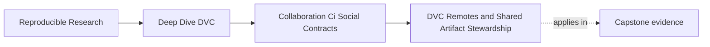
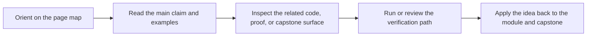

# DVC Remotes and Shared Artifact Stewardship


<!-- page-maps:start -->
## Page Maps




<!-- page-maps:end -->

DVC remotes are not just storage locations.

In a team workflow, they are part of the collaboration contract. They decide whether
another maintainer, CI, or a recovery drill can reconstruct the state that the repository
claims exists.

If the remote story is weak, the repository may look complete in Git while being
unusable to everyone except the original author.

## Remote availability is part of review

When DVC-tracked data or outputs change, Git may only carry metadata. The actual content
must be available through the shared remote when collaborators need it.

That means review should ask:

- did the author push required DVC objects?
- can CI pull them from a clean environment?
- does the remote configuration point to the intended shared location?
- are permissions sufficient for reviewers and automation?
- are release artifacts protected from accidental deletion?

The key point is that a merged pointer without shared content is a broken promise.

## Development and release remotes may need different rules

Small projects can start with one remote. Larger teams often need clearer boundaries.

Example model:

| Remote | Use | Policy |
| --- | --- | --- |
| development remote | candidate runs and collaborative work | writable by trusted contributors |
| release remote | promoted artifacts and release bundles | restricted, audited, often append-oriented |
| archive remote | older evidence kept for recovery | slower access, stronger retention |

This is not mandatory architecture for every course exercise. It is a way to name the
different trust levels that appear as a project grows.

## Push and pull are social operations

`dvc push` is not merely a sync command. It makes local evidence available to other
people.

`dvc pull` is not merely a download command. It tests whether the shared state can be
restored from the remote.

That is why a review route often needs both ideas:

```bash
dvc push
dvc pull
dvc status
```

The author may push before review. CI or another maintainer may pull during verification.
Together, those actions prove the remote-backed collaboration story.

## Permission failures should be designed

Remote permissions should match the risk.

Examples:

- contributors can push development candidate artifacts
- release artifact deletion is restricted
- CI can read the objects it needs
- release automation can write only to the intended boundary
- recovery roles have documented access

If everyone can delete everything, recovery depends on luck. If nobody can read the data,
CI cannot verify the repository. Stewardship means choosing permissions that support the
workflow instead of discovering gaps during an incident.

## Remote state needs ownership

Someone needs to know who owns:

- remote configuration changes
- credential rotation
- object retention rules
- release artifact protection
- cleanup of obsolete candidate artifacts
- recovery access validation

This ownership can be lightweight, but it cannot be imaginary. When nobody owns remote
stewardship, storage gradually becomes a mystery.

## Review checkpoint

You understand this core when you can:

- explain why DVC remotes are part of collaboration, not only storage
- identify when a merge depends on a missing `dvc push`
- distinguish development and release artifact policies
- explain how permissions affect CI and recovery
- name the ownership needed for remote stewardship

Shared artifacts are only shared when another maintainer can actually recover them.
