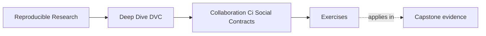
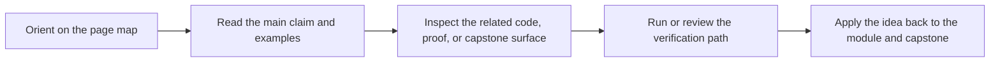

# Exercises

<!-- page-maps:start -->
## Page Maps

<!-- page-maps:end -->

Use these exercises to practice collaboration judgment, not only DVC command vocabulary.

The strongest answers will turn vague team expectations into visible checks, review rules,
and recovery evidence.

## Exercise 1: Rewrite a memory-based rule

A team says:

> Remember to push data before merging.

Rewrite this as a stronger collaboration contract.

Your answer should name:

- what CI or review should verify
- which files or state changes trigger the check
- why memory is not enough

## Exercise 2: Design a DVC-aware CI route

Write a short CI verification route for a DVC pull request.

It should cover:

- clean checkout assumptions
- remote object availability
- declared pipeline state
- metric or release evidence when relevant

You do not need platform-specific YAML. A command sequence and explanation are enough.

## Exercise 3: Review a merge blocker

A pull request changes `dvc.lock` and `metrics/metrics.json`.

CI passes formatting and unit tests, but nobody has checked whether DVC objects can be
pulled from the shared remote.

Write a review comment that explains why the merge should wait.

## Exercise 4: Define remote stewardship

A team has one remote that everyone can write to and delete from.

Write a short note that explains:

- what risks this creates
- which permissions or ownership rules you would consider
- why release artifacts may need stronger protection than development artifacts

## Exercise 5: Plan a recovery drill

Design a small recovery drill for the capstone or an equivalent DVC project.

Your answer should include:

- the starting condition
- the commands or checks to run
- what success means
- what kind of finding should become a repository fix

## Mastery check

You have a strong grasp of this module if your answers consistently keep five ideas
visible:

- collaboration failures are often missing contracts
- CI should verify shared state from less local context
- merges should block when DVC evidence is incomplete
- remotes are shared artifact infrastructure
- recovery drills turn restoration claims into evidence
