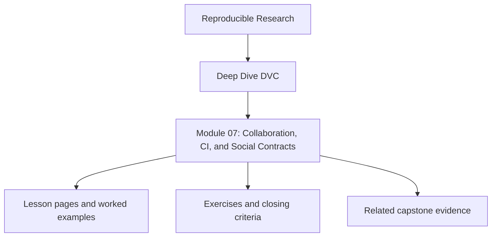
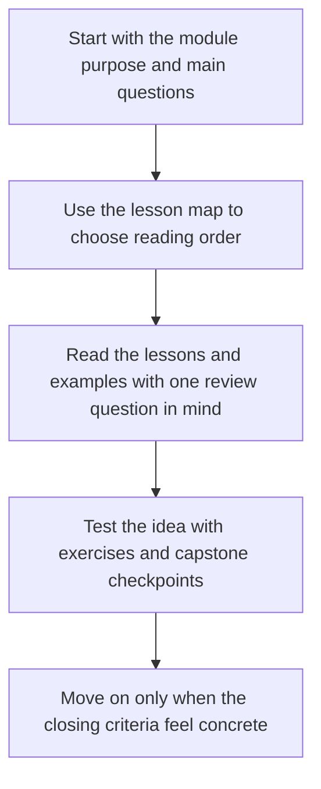
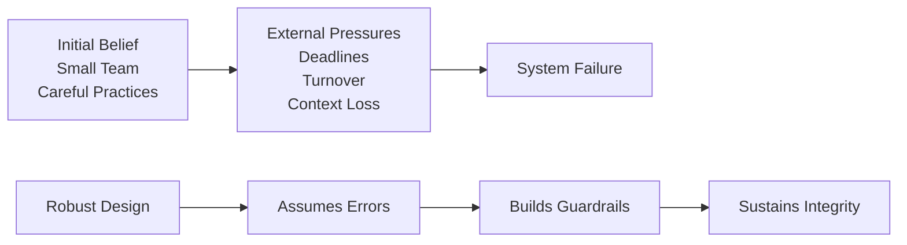

# Module 07: Collaboration, CI, and Social Contracts


<!-- page-maps:start -->
## Module Position




<!-- page-maps:end -->

Read the first diagram as a placement map: this page sits between the course promise, the lesson pages listed below, and the capstone surfaces that pressure-test the module. Read the second diagram as the study route for this page, so the diagrams point you toward the `Lesson map`, `Exercises`, and `Closing criteria` instead of acting like decoration.

*Why reproducibility fails when more than one human is involved*

---

## Purpose of this Module

This module makes the social side of reproducibility explicit. By now the learner knows
how the repository should behave technically. The next question is whether more than one
person can preserve those rules under review pressure, CI shortcuts, and ordinary team
turnover.

Use this module to see collaboration, CI, and remote discipline as part of the proof
surface rather than as optional process overhead. If a second maintainer cannot verify
the same state story without private context, the repository is still too fragile.

## At a Glance

| Focus | Learner question | Capstone timing |
| --- | --- | --- |
| social contracts | "Which failures are coordination failures in disguise?" | inspect the capstone once you can already name the technical contract |
| CI enforcement | "What should the system block instead of trusting memory?" | compare verification targets to human review expectations |
| remote discipline | "What must another person be able to verify without private context?" | use `confirm` and `recovery-drill` as shared proof surfaces |

## Learning outcomes

- identify which reproducibility failures are really collaboration failures with technical consequences
- decide what CI and review gates should enforce instead of relying on memory or goodwill
- explain what another maintainer must be able to verify without private context

## Verification route

- Run `make -C capstone confirm` to inspect the strongest shared proof route the capstone already exposes.
- Run `make -C capstone recovery-audit` when you want remote-backed evidence of repository restoration under shared stewardship.
- Use the module’s invariants checklist to decide whether the repository depends on disciplined people alone or on enforceable contracts.

## Why this module matters in the course

This is the moment where the course stops pretending that good tooling alone is enough.
By this point the learner has seen how to represent state correctly. Now the question is
whether a team will actually preserve those rules under deadline pressure, onboarding,
review shortcuts, and forgotten uploads.

That is why this module belongs late in the course. Governance without technical clarity
feels bureaucratic. Governance after technical clarity feels necessary.

## Questions this module should answer

By the end of the module, you should be able to answer:

- Which reproducibility failures are really human-coordination failures in disguise?
- What should CI enforce instead of trusting developers to remember?
- Which repository events should block promotion because the state contract is incomplete?
- How do remotes, reviews, and branch rules become part of the proof surface?

If those answers remain informal, the repository is still depending on optimism.

This module should make collaboration feel more explicit, not more ceremonial.

## What to inspect in the capstone

Keep the capstone open while reading this module and inspect:

- the `confirm` path in the capstone `Makefile`
- the `push` and `recovery-drill` targets as examples of social rules turned into commands
- `publish/v1/` as the review boundary that other people should be able to trust
- `dvc.lock` and tracked params or metrics as the evidence CI should care about

The capstone should make one point visible: a reproducible system is not complete until
another human can verify it without private context.

---

## 7.1 The Fallacy of the "Careful Team"

Numerous teams espouse: "Our compact, vigilant composition obviates the need for safeguards."

Such convictions prove ephemeral.

Escalating demands, temporal constraints, onboarding of novices, and contextual attrition inevitably intervene.

Frameworks predicated on recollection, benevolence, or informal protocols are destined for collapse.

Robust systems presuppose errors, anticipate circumventions, and accommodate informational voids, incorporating these contingencies into their architecture.

**Illustration**:



---

## 7.2 Principal Social Failure Modes

Collaborative breakdowns invariably trace to these archetypes, warranting memorization:

### 1. Omitted Data Uploads
- Code merges proceed.
- `.dvc` files reference absent remote data.
- CI or collaborators encounter reproduction impediments.

### 2. Force-Push Ramifications
- Historical revisions occur.
- Pointers become isolated.
- Cache linkages fracture.

### 3. Localized Efficacy
- Assertions of "It functions on my system."
- Concealed environmental disparities.
- CI relegated to secondary status.

### 4. Tacit Authority
- Outcomes endorsed based on originator identity.
- Absent reproducibility substantiation.

DVC possesses detection capabilities for these lapses, contingent upon enablement.

**Comparative Table**:
| Failure Mode              | Manifestations                  | Consequences                   |
|---------------------------|---------------------------------|--------------------------------|
| Omitted Uploads           | Merged code, missing remotes   | Reproduction barriers          |
| Force-Push Damage         | Rewritten history              | Orphaned artifacts             |
| Localized Success         | Environment concealment        | False assurances               |
| Tacit Authority           | Person-dependent trust         | Undermined verifiability       |

---

## 7.3 CI as an Indispensable Mandate

This principle is unequivocal: **Absence of CI reproducibility equates to nonexistence.**

CI must exhibit determinism, authority, and inescapability.

Local executions serve exploratory, tentative, and subordinate roles.

This trust inversion is pivotal for systemic resilience.

---

## 7.4 Essential CI Obligations

A compliant CI pipeline necessitates:

1. Repository cloning.
2. Retrieval of requisite remote data.
3. Pipeline reproduction via `dvc repro`.
4. Validation of metrics and outputs.
5. Conspicuous failure upon discrepancies.

Deviations—such as bypassed data retrievals, unverified cache dependencies, or incomplete executions—render the pipeline deceptive.

**Example CI Configuration** (GitHub Actions YAML excerpt):
```yaml
name: Reproduce Pipeline
on: [pull_request]
jobs:
  repro:
    runs-on: ubuntu-latest
    steps:
      - uses: actions/checkout@v3
      - name: Install DVC
        run: pip install dvc[all]
      - name: Pull Data
        run: dvc pull
      - name: Reproduce
        run: dvc repro
      - name: Verify Metrics
        run: dvc metrics diff --targets metrics.json
```

---

## 7.5 CI as the Arbiter of Reproducibility

CI delivers attributes unattainable by individuals: pristine environments, amnesic state management, and impartiality.

This positions CI as the sole equitable assessor of reproducibility.

Disparities between local and CI outcomes designate CI as normative, with local results serving diagnostic purposes.

Such orientation obviates broad dispute categories.

---

## 7.6 Branching Protocols Integrating Git and DVC

Branching must accommodate data's inertial properties.

Scalable directives include:

- Perpetual reproducibility of `main`.
- Prohibition of direct experiments on `main`.
- CI success as a merge prerequisite.
- interdiction of force-pushes on safeguarded branches.

Git imposes structural order; DVC enforces substantive integrity. Synergy is requisite.

**Example Protected Branch Rule** (GitHub settings pseudocode):
```
Branch: main
Require: CI pass, no force-push
```

---

## 7.7 Pre-Merge Imperatives

Merges demand:

- Presence of `.dvc` files.
- Updated `dvc.lock`.
- Comprehensive data uploads.
- Successful CI reproduction.

Noncompliance necessitates merge rejection, without exemptions.

Indulgences precipitate degradation.

---

## 7.8 Multi-Remote Configurations for Teams and Production

Team expansion renders singular remotes inadequate.

A prevalent schema involves:

- **Development Remote**: Mutable and collaborative.
- **Production Remote**: Immutable and secured.

Protocols stipulate experimental uploads to development, promotions to production, append-only production policies, and audited deletions.

This architecture averts inadvertent losses, experimental contamination, and restoration complexities.

**Example DVC Remote Configuration**:
```
$ dvc remote add dev s3://bucket/dev
$ dvc remote add prod s3://bucket/prod --read-only
$ dvc exp push dev
$ dvc push prod  # After promotion
```

---

## 7.9 Human Error as an Anticipated Variable

Frameworks viewing human fallibility as anomalous are untenable.

Conversely:

- Presume inaccuracies.
- Engineer restoration pathways.
- Amplify failure visibility.
- Normalize recovery procedures.

Superior systems render impropriety arduous and propriety effortless.

---

## 7.10 Exemplary Incident Analysis

Consider: A model advances, CI validates, yet three months hence, reproduction falters.

Typical etiologies encompass local data expungement, remote misalignments, environmental evolutions, or unrecorded manual interventions.

These are commonplace, yet avertable via stringent CI, mandated upload regimens, and restoration simulations.

---

## 7.11 Deliberate Failure Simulations

Resilient teams proactively:

- Emulate data attrition.
- Validate pristine recovery.
- Cycle stewardship roles.
- Codify restoration protocols.

Untested recovery equates to aspiration, not capability—aspiration insufficiently strategizes.

**Guidance**: Schedule quarterly drills; document discrepancies for iterative refinement.

---

## 7.12 Fundamental Conceptual Model

> **Human unreliability necessitates systemic countermeasures.**

This perspective is pragmatic, not pessimistic.

---

## Module 07: Invariants Checklist

Affirm readiness by substantiating:

- [ ] CI as the definitive executor.
- [ ] Merge prohibitions absent reproducibility validations.
- [ ] Pre-merge data uploads.
- [ ] Defined branch hierarchies.
- [ ] Empirical recovery testing.

Perceived stringency underscores the intent.

---

## Transition to Module 08

A framework now exists that accommodates individuals, withstands collectives, and mechanistically imposes accuracy.

The ultimate adversary emerges: **Time**.

Enduring systems degrade, storage expands, attrition occurs, incidents transpire.

Module 08 navigates production scalability and endurance, interfacing correctness with operational exigencies.

## Directory glossary

Use [Glossary](glossary.md) when you want the recurring language in this module kept stable while you move between lessons, exercises, and capstone checkpoints.
