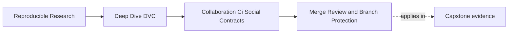
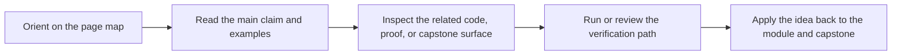

# Merge Review and Branch Protection

<!-- page-maps:start -->
## Page Maps

<!-- page-maps:end -->

In a DVC project, a merge is not only a code event.

It can change:

- data pointers
- pipeline declarations
- lock evidence
- parameters
- metrics
- published release bundles
- recovery expectations

Branch and review rules should reflect that reality.

## What should block a merge

A pull request should not merge when the shared state story is incomplete.

Common blockers:

- DVC metadata changed but required remote objects are missing
- `dvc.yaml` changed but `dvc.lock` evidence was not updated when it should be
- parameters changed without matching metric or review explanation
- metrics changed without baseline or comparability context
- release files changed without paired params, metrics, and manifest evidence
- CI cannot reconstruct the declared state from a clean checkout
- direct changes landed on the protected branch without review

These blockers are not punishment. They keep the main branch reproducible for the next
person.

## Review files as a set

Reviewers should avoid reading one file in isolation.

Useful pairings:

| Changed file | Review beside |
| --- | --- |
| `dvc.yaml` | `dvc.lock`, command code, expected outputs |
| `dvc.lock` | `dvc.yaml`, params, metrics, DVC output paths |
| `params.yaml` | metrics, experiment or release note |
| metric files | params, baseline, metric definition |
| `.dvc` pointer files | remote availability and data identity |
| `publish/v1/metrics.json` | `publish/v1/params.yaml` and release review |

The pattern is simple: every state claim needs its supporting evidence.

## Branch rules should protect shared history

Protected branches should usually require:

- CI success before merge
- review approval for DVC state changes
- no force-push on shared release branches
- required status checks for recovery or release routes when relevant
- clear ownership for remote and release-bundle changes

The exact platform settings vary, but the principle is stable:

> Shared history should not depend on one person's local state or unilateral rewrite.

Force-push risk is especially serious when people are coordinating Git history with DVC
state and remote artifacts. Rewriting the record can make it harder to know which
artifact evidence was intended to support which commit.

## Review comments should name the missing contract

Weak review comment:

> DVC looks wrong.

Stronger:

> This pull request changes `dvc.lock`, but CI has not shown that the new output objects
> can be pulled from the shared remote. Please push the missing objects or explain why no
> remote-backed artifact change is required.

Weak:

> Metrics changed. Please check.

Stronger:

> `metrics/metrics.json` changed while `params.yaml` also changed. Please add the
> comparison note that explains whether this is a same-control metric change or a
> parameter-driven tradeoff.

Specific comments teach the contract.

## Merge readiness checklist

Before merge, the reviewer should be able to answer:

- can CI restore and verify the state?
- are DVC-tracked objects available to collaborators?
- do declarations and lock evidence agree?
- are parameter and metric changes explained together?
- are release-boundary changes complete?
- is the branch history protected from accidental rewrite?

If the answer is no, the merge should wait.

## Review checkpoint

You understand this core when you can:

- identify DVC-specific merge blockers
- review DVC files as related evidence instead of isolated diffs
- explain why protected branches matter for artifact lineage
- write a review comment that names the missing contract
- define merge readiness without relying on the author's local context

Merge discipline is where the social contract becomes repository policy.
