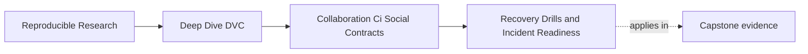
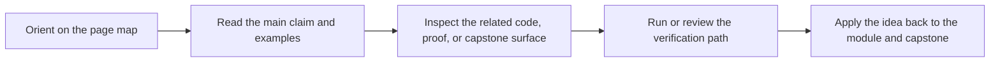
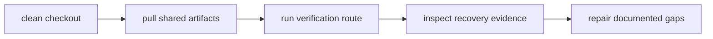

# Recovery Drills and Incident Readiness


<!-- page-maps:start -->
## Page Maps




<!-- page-maps:end -->

"We can recover it" is not evidence.

A recovery drill is evidence.

Module 07 treats recovery as a collaboration surface because incidents rarely happen when
the original author is available, calm, and holding all context. Another maintainer should
be able to restore the repository from documented sources and shared remotes.

## Recovery needs rehearsal

A DVC project can look healthy until someone tries to rebuild it from scratch.

A meaningful recovery route asks:

- can a clean checkout restore the required DVC objects?
- are credentials and remote permissions usable by the right roles?
- do published bundles contain the evidence they promise?
- can the verification route run after restore?
- are recovery instructions current enough for someone other than the author?

If nobody has tried the route, the team has a hope, not a capability.

## Drill from a clean state

A good drill starts from less local context, not more.

Examples:

```bash
git clone <repo-url>
dvc pull
make -C capstone confirm
make -C capstone recovery-review
```

The exact commands vary. The important constraint is that the person running the drill
does not rely on private workspace files or remembered manual steps.



The drill is successful only if it teaches the team what works and what needs repair.

## Incidents reveal unclear ownership

Common incident questions:

- who can read the remote?
- who can restore release artifacts?
- who can rotate credentials?
- who decides whether an artifact can be deleted?
- where is the release evidence stored?
- which commit and DVC state are authoritative?

If the answers are not known before the incident, the team will invent them under stress.

That is why remote stewardship, branch protection, and recovery documentation belong in
the same module. They are all parts of shared state survival.

## Drill findings should become fixes

A drill that finds a gap should produce a concrete repair:

- update recovery instructions
- add a missing verification command
- fix remote permissions
- push missing artifacts
- protect release objects from deletion
- clarify which bundle is authoritative
- add CI coverage for a state check

Do not let drill notes become another archive of ignored warnings. The value is in turning
surprises into contracts.

## Recovery is not only disaster response

Recovery drills also help onboarding and review.

A new maintainer who can restore the project from shared evidence learns the system faster
than one who receives private instructions. A reviewer who can run a clean verification
route can challenge results without depending on the author.

Recovery is the strongest version of the collaboration question:

> Does the repository carry enough evidence for someone else to continue?

## Review checkpoint

You understand this core when you can:

- explain why recovery claims need rehearsal
- design a clean-state recovery route
- identify ownership questions before an incident
- turn drill findings into repository or process fixes
- connect recovery readiness to collaboration and onboarding

Untested recovery is an assumption. A drill turns it into evidence.
