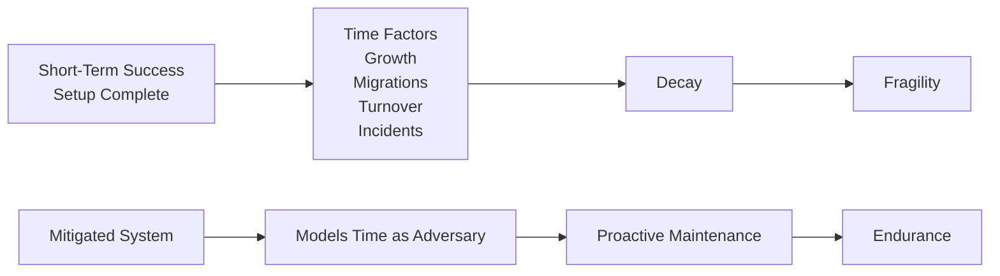

# Module 08 — Production, Scale, and Incident Survival


<!-- page-maps:start -->
## Page Maps


<!-- page-maps:end -->

*How reproducible systems decay over time — and how to keep them alive*

---

## Purpose of this Module

This module treats time as part of the system design. A repository can be disciplined
today and still become untrustworthy through retention mistakes, remote migration, cache
loss, maintainer turnover, or slow policy drift.

Use this module to learn what long-lived trust requires: durability boundaries, recovery
rehearsal, retention choices, and cleanup rules that preserve the state you still need to
defend. If those choices are implicit, the repository is only temporarily reproducible.

## At a Glance

| Focus | Learner question | Capstone timing |
| --- | --- | --- |
| durability | "Which state must survive local loss?" | inspect the capstone remote and recovery drill directly |
| retention | "Which history is worth keeping reproducible, and for how long?" | compare policy ideas to the repository's promoted surfaces |
| maintenance discipline | "When is cleanup safe, and when is it destructive?" | use recovery evidence before trusting garbage collection |

## Why this module matters in the course

This is the module that forces the learner to stop treating reproducibility as a setup
achievement. A repository can be perfectly disciplined today and still become untrustworthy
through normal time pressure: remote migration, retention mistakes, cache eviction, CI
image drift, or simple maintainer turnover.

The point here is not to scare the reader. It is to make time visible as part of the
system design.

## Questions this module should answer

By the end of the module, you should be able to answer:

- Which historical states are worth keeping reproducible, and for how long?
- What must survive local cache loss for the system to remain trustworthy?
- Which recovery drills are important enough to automate and rehearse?
- When does garbage collection become safe maintenance instead of silent history damage?

If those answers are missing, the repository may be tidy but it is not durable.

This module should make the learner more deliberate about time, not simply more cautious.

## What to inspect in the capstone

Keep the capstone open while reading this module and inspect:

- the configured DVC remote as the durability boundary beyond the local cache
- the `recovery-drill` target as a rehearsal of cache loss and restoration
- `publish/v1/` as the state that downstream consumers should recover intact
- `manifest.json`, metrics, and params as the evidence that a restored workspace is the same state, not just a similar one

The capstone should make the final course claim concrete: recovery is only real when it
is practiced and checked, not when it is assumed.

---

## 8.1 The Unaddressed Adversary: Time

Temporal progression engenders failure modalities absent in ephemeral initiatives: storage saturation, remote transitions, credential renewals, CI image evolutions, dependency obsolescence, and maintainer attrition.

These phenomena are normative, not anomalous, and inexorable.

Systems disregarding temporal dynamics are inherently vulnerable.

**Illustration**:



---

## 8.2 Storage Expansion as an Inherent Outcome

Adhering to immutability principles precludes data overwrites, accruing novel versions and monotonically expanding caches. This represents a deliberate attribute, not an aberration.

Unmitigated accumulation, however, accrues operational liabilities.

### Inescapable Realities
Perfection in historical reproducibility, boundless retention, and negligible expenditure are mutually exclusive; deliberate compromises are requisite.

---

## 8.3 Formulation of Retention Policies

Retention frameworks resolve: **Which historical states demand enduring reproducibility, and for what duration?**

Standard classifications include:

- **Regulatory**: Indefinite preservation.
- **Scientific**: Essential for publications or audits.
- **Operational**: Pertinent to contemporary models and pipelines.
- **Exploratory**: Transient experiments and prototypes.

Each warrants a temporal horizon, expungement protocol, and escalation mechanism.

Policy-absent deletions equate to sabotage; perpetual retention borders on delusion.

**Example Policy Structure** (YAML-like):
```yaml
regulatory:
  retention: infinite
  deletion: prohibited
exploratory:
  retention: 30 days
  deletion: automated
  escalation: team lead approval
```

---

## 8.4 Garbage Collection as a Perilous Instrument

`dvc gc` transcends mere tidying—it effects **eradication**, excising unreferenced cache entities, archival data iterations, and restoration avenues.

Secure implementation demands comprehensive remotes, immobilized references, and scoped directives (e.g., `--workspace`, `--all-branches`).

**Adoptive Directive**: **Prohibit execution absent precise delineation of deletions.**

**Example Scoped Command**:
```
$ dvc gc --all-branches --dry-run  # Preview deletions
$ dvc gc --all-branches  # Execute if verified
```

---

## 8.5 Disaster Recovery as a Cultivated Proficiency

Robust systems anticipate inadvertent erasures, storage corruptions, credential forfeitures, and CI disruptions.

The salient query: **Is recovery feasible sans conjecture?**

### Authentic Recovery Simulation
Encompasses fresh cloning, cache depletion, novel machinery, minimal authorizations, and exclusively documented procedures.

Dependence on esoteric knowledge signifies preexisting reproducibility compromise.

**Guidance**: Execute drills biannually; chronicle variances for protocol enhancement.

---

## 8.6 Remote Transitions as Insidious Threats

Inevitably, backends evolve, providers shift, or economics compel migrations.

These fracture systems via persistent hashes amid locational flux and presuppositional seepages.

Prudent transitions necessitate exhaustive referenced object inventories, phased duplications, pre-transition validations, and contingency reversions.

Ad-hoc approaches splinter historical continuity.

**Example Migration Steps**:
```
$ dvc remote list  # Inventory current
$ dvc remote add new-remote s3://new-bucket
$ dvc push new-remote --all-commits  # Replicate
$ dvc remote default new-remote  # Cutover after verification
```

---

## 8.7 Temporal Drift in CI Environments

CI infrastructures are dynamic: foundational images refresh, execution hardware alters, and default utilities advance.

Such evolutions undermine determinism, performance presumptions, and reproducibility assurances.

Enduring systems mandate CI image pinning, configuration versioning, and infrastructural equivalence to production.

CI transcends scripting—it qualifies as a dependency.

**Example Pinned CI Config** (YAML excerpt):
```yaml
jobs:
  repro:
    container: python:3.10-slim  # Pinned image
```

---

## 8.8 Personnel Transitions and Informational Erosion

Departures erode context.

Sustainable systems endure originator absences, verbal elucidations, and conversational archives through explicit codification, reproducibility inventories, and mechanized confirmations.

Memory-dependent operations presage failure.

---

## 8.9 Criteria for Historical Revisions

Rewrites are predominantly erroneous.

Valid justifications: juridical mandates, security infringements, privacy infractions.

Invalid: obsolescence assertions, perceptual complexity, or fiscal pressures.

Rewrites erode trust, audit capacity, and evidential rigor—reserve as exigency measures.

---

## 8.10 Incident Mitigation Framework

Disruptions engender panic; reproducible systems demand methodical responses:

1. Halt modifications.
2. Ascertain prior viable state.
3. Replicate in isolated environments.
4. Delineate fault boundaries.
5. Effect restoration or reversion.
6. Chronicle etiologies and remediations.

Improvisational tactics indicate systemic inadequacies.

**Example Playbook Snippet**:
- Freeze: `git lock main`
- Identify: `dvc checkout <last-good-commit>`
- Document: Post-incident review template

---

## 8.11 Simulated Degradation Exercises

Vigorous teams rehearse cache depletions, remote inaccessibilities, CI malfunctions, and steward absences—not for adversity, but for familiarity.

Acquaintance with failure enhances survivability.

**Guidance**: Integrate into routine operations; evaluate efficacy quantitatively.

---

## 8.12 Concluding Conceptual Framework

> **Reproducibility eschews idealism; it prioritizes resilience amid duress.**

Recovery-capable systems surpass those merely evasive of errors.

---

## Module 08 — Final Invariants Checklist

Course completion should enable affirmations of:

- [ ] Policy-driven historical recoverability.
- [ ] Articulated retention determinations.
- [ ] Regulated garbage collection.
- [ ] Empirical recovery validations.
- [ ] Temporal CI stability.
- [ ] Knowledge persistence beyond individuals.
- [ ] Routine incident handling.

Aspirational sentiments necessitate module reevaluation.

---

## Course Conclusion

Honest traversal of Modules 01–08 imparts comprehension of:

- Default reproducibility lapses.
- DVC's mechanical contract enforcement.
- DVC's intentional boundaries.
- Human-induced systemic disruptions.
- Temporal erosion of simplistic architectures.

Beyond mere DVC utilization, one attains systemic reasoning on reproducibility—the paramount course yield.
