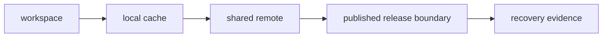

# Durability Boundaries and Recovery Goals

Recovery starts with a blunt question:

> What must still be restorable when the local workspace is gone?

Not everything deserves the same durability. A temporary candidate run, a published
release bundle, and a regulatory dataset should not have the same retention rule. But the
team must know which state belongs in which category.

## Local cache is not durable authority

The DVC cache on one machine is useful. It is not enough for long-lived trust.

Local cache can disappear because:

- a laptop is replaced
- a cleanup script removes old objects
- a developer leaves
- disk pressure forces cache eviction
- a workspace is rebuilt for onboarding

If the only copy of an important artifact lives there, the repository is not recoverable.

Durable state needs a shared authority: a remote, release bundle, archive, or other
documented recovery surface.

## Name the durability boundary

A durability boundary is the place where the team says:

> This state must survive beyond one workspace.

Examples:

- DVC remote objects for tracked data and outputs
- published release bundles under `publish/v1/`
- release manifests that list expected artifacts
- committed `dvc.lock` and parameter evidence
- recovery documentation and verification routes

The diagram is not a storage hierarchy for every project. It is a reminder that local
state must connect to shared recovery evidence.

## Recovery goals differ by state type

Ask what must be restorable:

| State | Recovery goal |
| --- | --- |
| current mainline data | collaborators and CI can restore it |
| published release bundle | downstream readers can audit it later |
| active candidate artifacts | reviewers can inspect them during the review window |
| old exploratory outputs | may expire after a clear retention period |
| regulatory or audit evidence | preserved under stronger policy |

The goal is not infinite storage. The goal is explicit value.

## A practical recovery statement

Weak:

> The data is in DVC.

Stronger:

> The promoted release artifacts, metrics, parameters, manifest, and DVC objects required
> for current mainline recovery are stored in the shared remote and can be restored by
> running the documented recovery route from a clean checkout.

The stronger statement names what matters, where it lives, and how recovery is checked.

## Review checkpoint

You understand this core when you can:

- distinguish local cache from durable authority
- name the recovery surface for important state
- explain which states deserve stronger durability
- write a recovery goal that another maintainer can test
- identify when a result exists only as local memory or local cache

Durability is not a feeling. It is a named boundary plus a testable recovery route.
