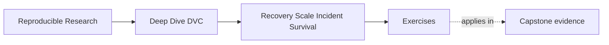

# Exercises


<!-- page-maps:start -->
## Page Maps




<!-- page-maps:end -->

Use these exercises to practice long-lived recovery judgment, not only DVC command
vocabulary.

The strongest answers will name what must survive, where it is stored, how it is checked,
and what can safely expire.

## Exercise 1: Name the durability boundary

A release has:

- `publish/v1/manifest.json`
- `publish/v1/metrics.json`
- `publish/v1/params.yaml`
- DVC-tracked model output referenced in `dvc.lock`

Write a short recovery goal that explains what must survive local cache loss and what a
maintainer should run to verify it.

## Exercise 2: Classify retention value

Classify these states as protected, bounded-retention, or safe-to-discard after review:

- promoted release artifact
- current mainline training data
- abandoned exploratory candidate output
- published analysis dataset
- temporary local debug report

Explain one sentence for each classification.

## Exercise 3: Review a cleanup request

A teammate wants to run:

```bash
dvc gc --all-branches
```

because storage is getting expensive.

Write a review response that explains what evidence you need before approving cleanup.

## Exercise 4: Plan a remote migration check

A team is moving from an old DVC remote to a new one.

Describe a migration check that covers:

- inventory of important states
- copying or pushing required objects
- clean checkout verification
- rollback or cutover decision

## Exercise 5: Write an incident note

CI started producing different metrics after a base image update.

Write an incident note that explains:

- what changed
- why the executor is part of the evidence story
- what should be checked before accepting or rejecting the new results
- what documentation or policy should be updated

## Mastery check

You have a strong grasp of this module if your answers consistently keep five ideas
visible:

- local cache is not durable authority
- retention follows value, not age alone
- cleanup needs reference scope and dry-run review
- remote migration and CI drift can break recovery
- incident response should preserve evidence before repair
