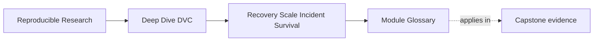
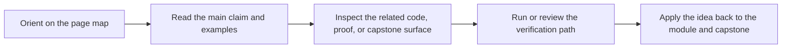

# Module Glossary

<!-- page-maps:start -->
## Page Maps

<!-- page-maps:end -->

This glossary belongs to **Module 08: Recovery, Scale, and Incident Survival** in
**Deep Dive DVC**.

Use it to keep the module language stable while you move between the core lessons, the
worked example, the exercises, and capstone review.

## How to use this glossary

Read the directory index first. Return here when a retention, cleanup, migration,
recovery, or incident discussion starts to feel vague.

The goal is not extra theory. The goal is shared language for keeping reproducibility
durable over time.

## Terms in this directory

| Term | Meaning in this directory |
| --- | --- |
| durability boundary | The shared surface where important state must survive beyond one local workspace. |
| recovery goal | A testable statement of what state must be restorable and how it will be checked. |
| local cache | Machine-local DVC object storage that is useful but not durable authority by itself. |
| shared remote | Remote-backed DVC storage used to restore objects across collaborators, CI, and recovery routes. |
| release boundary | The promoted bundle of params, metrics, manifests, and artifacts downstream readers should trust. |
| retention policy | A rule describing which states remain recoverable, for how long, and with what deletion approval. |
| protected state | Data, outputs, or evidence that must not be removed casually because review, audit, or rollback depends on it. |
| bounded-retention state | State kept for a defined review window or operational period, then eligible for cleanup. |
| exploratory state | Candidate or debug output whose value may expire after review. |
| garbage collection | DVC cleanup that removes unprotected objects according to a chosen reference scope. |
| reference scope | The set of commits, branches, tags, or workspace references used to decide which objects are protected. |
| dry run | A preview of cleanup effects used as review evidence before deletion. |
| remote migration | Moving recoverable DVC objects and configuration from one storage boundary to another. |
| CI drift | Change in the shared executor environment that can affect reproducibility evidence. |
| last known good state | The most recent state known to restore and verify correctly. |
| incident note | A written record of failure, evidence, repair, and verification after a recovery event. |
| maintainer handoff | Transfer of recovery knowledge, ownership, credentials, and policy context to another steward. |
| recovery route | The documented command sequence used to restore and verify important state. |
| continuity | The property that historical states still recover and mean what the team promised they mean. |

## Stable review questions

Use these questions when the module feels abstract:

- What must survive local cache loss?
- Which remote or release boundary holds the durable copy?
- Which historical states still carry obligations?
- What would `dvc gc --dry-run` remove?
- Does retention policy allow that cleanup?
- Can the new remote restore protected states?
- Did CI drift change the executor evidence?
- What is the last known good state?
- What repair and verification should the incident note record?
