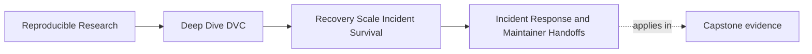
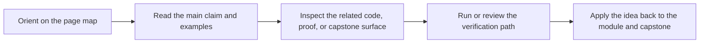

# Incident Response and Maintainer Handoffs

<!-- page-maps:start -->
## Page Maps

<!-- page-maps:end -->

Incidents compress time.

When data disappears, a remote breaks, CI starts drifting, or a release artifact cannot be
restored, people are tempted to fix first and reason later. That is dangerous in a
reproducible system because repair can destroy evidence.

Module 08 asks for a slower first move:

> Preserve the state story before changing it.

## A basic incident response route

A useful response route starts with containment:

1. Stop unrelated changes.
2. Identify the last known good state.
3. Preserve logs, diffs, and command output.
4. Test restore in an isolated workspace.
5. Name the missing boundary: data, remote, CI, credentials, documentation, or history.
6. Repair the boundary.
7. Record what changed and what check now proves recovery.

This route is not bureaucracy. It prevents the team from turning one incident into an
unreviewable rewrite.

## Last known good state matters

Do not begin by guessing which files to edit.

Ask:

- which commit last passed recovery checks?
- which release bundle was last verified?
- which remote still contains the required objects?
- which CI image or configuration last produced accepted evidence?
- which maintainer can confirm ownership without relying on private memory?

The last known good state gives repair a reference point.

## Handoffs are part of recovery

Maintainer turnover is a recovery event in slow motion.

A handoff should preserve:

- remote access responsibilities
- credential rotation knowledge
- release artifact ownership
- recovery route commands
- retention policy decisions
- known gaps and accepted risks
- where incident notes live

If a new maintainer cannot run the recovery route, the handoff is incomplete even if the
repository still builds today.

## Write incident notes for future repair

A useful incident note says:

- what failed
- what evidence showed the failure
- which state was protected
- which repair was made
- which verification route now passes
- what policy or automation should change

Weak:

> Fixed DVC remote issue.

Stronger:

> Recovery failed because release `v1` objects were missing from the archive remote after
> storage migration. The missing objects were copied from the old remote, `dvc pull -r
> archive` now succeeds from a clean checkout, and the migration checklist now requires a
> release manifest restore check before cutover.

That note teaches the next maintainer.

## Review checkpoint

You understand this core when you can:

- respond to an incident without destroying evidence
- identify the last known good state
- treat maintainer handoff as part of recovery design
- write an incident note that explains failure, repair, and verification
- turn recovery surprises into durable checks or documentation

Incident survival depends on preserving meaning while repairing the mechanism.
