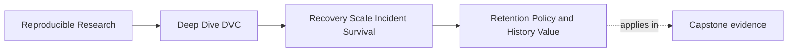
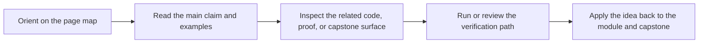

# Retention Policy and History Value


<!-- page-maps:start -->
## Page Maps




<!-- page-maps:end -->

Retention policy answers a hard question:

> Which historical states are worth keeping recoverable, and for how long?

Without that answer, teams usually drift into one of two bad habits:

- keep everything forever until cost or clutter becomes intolerable
- delete aggressively and discover later that important evidence is gone

Module 08 asks for a more deliberate middle path.

## History does not all have the same value

Different states deserve different treatment.

| State | Typical value | Possible retention |
| --- | --- | --- |
| promoted release | audit, downstream trust, rollback | long-lived or protected |
| current mainline | collaboration and CI | must stay restorable |
| published analysis | scientific or stakeholder evidence | policy-driven retention |
| active experiment candidate | short-term review | bounded review window |
| abandoned exploratory output | learning only | short retention or discard |

The table is not universal. It is a way to make the decision explicit.

## A retention rule needs three parts

A useful retention rule says:

- what state it covers
- how long it should remain recoverable
- who can approve deletion or archive movement

Example:

```yaml
release_artifacts:
  recoverability: protected
  deletion: requires release owner approval
  evidence: manifest, params, metrics, dvc lock

experiment_candidates:
  recoverability: review window
  deletion: allowed after review decision
  evidence: experiment note and comparison table
```

The syntax is illustrative. The important part is the decision shape.

## Cost is real, but so is audit loss

Storage cost is a legitimate pressure. Pretending otherwise produces policies nobody will
follow.

But cost alone is not a safe deletion criterion. The question should be:

> What decision, audit, rollback, or downstream use would break if this state disappeared?

If the answer is "nothing," deletion may be safe. If the answer is "we could not explain
the promoted result anymore," the state needs stronger retention.

## Retention policy should match published promises

If a project publishes `publish/v1/metrics.json`, `publish/v1/params.yaml`, and a manifest,
the supporting artifacts should remain recoverable for as long as that release matters.

A release bundle without recoverable backing becomes a fragile report.

Ask:

- can we restore the data or outputs behind the release?
- can we explain the parameters and metrics later?
- can we identify which DVC state supports the bundle?
- can a downstream reader audit the release without private context?

Retention is how those promises survive time.

## Review checkpoint

You understand this core when you can:

- classify historical states by value
- write a retention rule with scope, duration, and approval
- explain why cost alone is not enough for deletion
- connect retention to published release promises
- identify which old states can safely expire

Retention policy is not hoarding. It is deciding which history still carries obligations.
