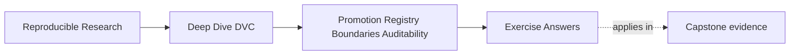
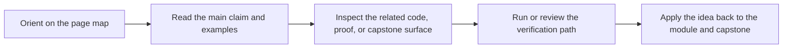

# Exercise Answers


<!-- page-maps:start -->
## Page Maps




<!-- page-maps:end -->

These answers are model explanations, not the only acceptable wording.

What matters is whether the reasoning connects promotion, consumer trust, and audit
evidence.

## Answer 1: Write a promotion contract

Strong promotion statement:

> Promote `incident-escalation/v1` for downstream incident escalation review. Consumers may
> use the model and report files listed in the manifest. The promoted params and metrics
> travel with the bundle and show the threshold and recall-oriented review basis. Candidate
> outputs, debug plots, and internal pipeline paths remain unsupported.

The main lesson is that promotion names what is trusted and what is not.

## Answer 2: Design a release surface

Reasonable bundle:

```text
publish/v1/
  manifest.json
  model.json
  metrics.json
  params.yaml
  review.md
```

Why:

- `manifest.json` names the supported files
- `model.json` is the promoted artifact
- `metrics.json` records release evidence
- `params.yaml` records promoted controls
- `review.md` explains the promotion rationale and limits

Internal path to exclude:

- an intermediate feature directory or candidate output directory, because consumers should
  not depend on internal pipeline structure

## Answer 3: Find the audit gap

Strong review note:

> This bundle is not ready for promotion. It has no manifest, so consumers cannot tell
> which files are supported, and the metrics were produced before the promoted parameter
> change. Regenerate or replace the metrics from the intended promoted state, add a
> manifest that lists the supported files, and rerun the release audit route before
> accepting the bundle.

The main lesson is that complete-looking files can still describe inconsistent evidence.

## Answer 4: Define a registry boundary

Stronger contract:

> Consumers should use registry entry `incident-escalation/v1` or `publish/v1/` only. The
> supported files are the model, metrics, params, manifest, and review note listed in the
> manifest. Consumers should not depend on `outputs/latest/`, intermediate pipeline paths,
> debug reports, or candidate artifacts.

The main lesson is that a registry boundary should be versioned and consumer-facing, not a
pointer to a moving internal location.

## Answer 5: Reject or repair a promotion

Strong answer:

> Reject the promotion until the bundle is repaired. The current release surface mixes
> debug plots, ambiguous model files, old metrics, and no review rationale. Require a
> manifest, one promoted model or a clearly explained multi-artifact bundle, matching
> promoted params and metrics, removal or explicit exclusion of debug files, and a review
> note that explains the promotion basis.

If the evidence can be regenerated and matched to recorded DVC state, repair is possible.
If the team cannot establish which state produced the files, the promotion should not be
accepted.

## Self-check

If your answers consistently explain:

- what is being promoted
- who may consume it
- which evidence travels with it
- which internal files are unsupported
- why a neat bundle can still fail audit review

then you are using Module 09 correctly.
