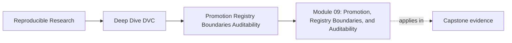
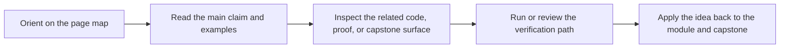

# Module 09: Promotion, Registry Boundaries, and Auditability


<!-- page-maps:start -->
## Page Maps




<!-- page-maps:end -->

Module 09 turns recoverable state into trusted release state.

By now, you know how to recover important artifacts and protect them over time. That does
not mean every recoverable result should be trusted downstream. Promotion is a smaller,
stronger promise: this specific bundle is approved for someone else to consume, review, or
audit.

This module is about release boundaries:

- what is being promoted
- what evidence must travel with it
- what stays internal to the pipeline
- how a registry or published directory becomes a contract
- how another reviewer can defend the released state later

The central question is:

> If a downstream user trusts this promoted result, what exactly are they trusting, and
> what evidence lets us defend it?

If the answer is "the latest files," the promotion boundary is not strong enough.

The capstone corroboration surface for this module is the promoted bundle and its review
evidence: `capstone/publish/v1/`, `capstone/publish/v1/manifest.json`,
`capstone/publish/v1/metrics.json`, `capstone/publish/v1/params.yaml`,
`capstone/docs/publish-contract.md`, `capstone/docs/release-review-guide.md`, and the
`make -C capstone release-audit` route.

## Why this module exists

Promotion failures often look neat from the outside.

The directory exists. The report renders. A model file is present. A metric file has
numbers. But the bundle may still be indefensible if:

- promoted metrics do not match promoted parameters
- a model is copied without a manifest
- internal pipeline paths leak into downstream usage
- a release bundle mixes exploratory and approved files
- the registry entry has no audit trail back to DVC state
- a future maintainer cannot tell which result was actually promoted

The point of Module 09 is not to copy artifacts into a prettier directory. The point is to
define the trust boundary that downstream readers are allowed to depend on.

## Study route


Read the module in that order the first time.

If the problem is already partly clear, use this shortcut:

- open Core 1 when the main confusion is "what makes promotion different from copying?"
- open Core 2 when the main confusion is "what belongs in the release surface?"
- open Core 3 when the main confusion is "what evidence must travel with the release?"
- open Core 4 when the main confusion is "what does a registry boundary promise?"
- open Core 5 when the main confusion is "how do promotion failures hide in neat bundles?"

## Module map

| Page | Purpose |
| --- | --- |
| [Overview](index.md) | explains the module promise and study route |
| [Promotion Contracts and Downstream Trust](promotion-contracts-and-downstream-trust.md) | teaches promotion as a downstream trust contract |
| [Release Surfaces and Bundle Shape](release-surfaces-and-bundle-shape.md) | teaches small, stable release surfaces and manifests |
| [Audit Evidence: Params, Metrics, Locks, and Manifests](audit-evidence-params-metrics-locks-manifests.md) | teaches the evidence needed to defend promoted state |
| [Registry Boundaries and Consumer Contracts](registry-boundaries-and-consumer-contracts.md) | teaches registry or publish boundaries as consumer contracts |
| [Promotion Failures and Review Repairs](promotion-failures-and-review-repairs.md) | teaches common promotion failures and how to repair them |
| [Worked Example: Repairing an Incomplete Release Bundle](worked-example-repairing-an-incomplete-release-bundle.md) | walks through one realistic promotion repair |
| [Exercises](exercises.md) | gives five mastery exercises |
| [Exercise Answers](exercise-answers.md) | explains model answers and review logic |
| [Glossary](glossary.md) | keeps the module vocabulary stable |

## What should be clear by the end

By the end of this module, you should be able to explain:

- why promotion is a trust contract, not a file copy
- how promoted state differs from baseline or exploratory state
- which files belong in a release bundle
- why params, metrics, locks, manifests, and review notes need to agree
- how registry boundaries protect downstream consumers from internal churn
- how to reject or repair a promotion that cannot be audited

## Commands to keep close

These commands form the evidence loop for Module 09:

```bash
make -C capstone release-audit
make -C capstone manifest-summary
make -C capstone verify
dvc status
dvc metrics diff
```

Use the `make` routes for the course-provided capstone review. Use the DVC commands to
inspect whether the promoted state has a defensible link back to the recorded pipeline
state.

## Capstone route

Use the capstone after you can distinguish internal pipeline state from promoted state.

Best corroboration surfaces for this module:

- `capstone/publish/v1/`
- `capstone/publish/v1/manifest.json`
- `capstone/publish/v1/metrics.json`
- `capstone/publish/v1/params.yaml`
- `capstone/docs/publish-contract.md`
- `capstone/docs/release-review-guide.md`
- `capstone/dvc.lock`

Useful proof route:

```bash
make -C capstone manifest-summary
make -C capstone release-audit
```

The point of that route is not to prove that a bundle exists. It is to prove that the
bundle carries enough evidence for another maintainer or downstream consumer to understand
what was promoted and why it deserves trust.
