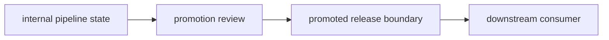

# Promotion Contracts and Downstream Trust

Promotion is the moment a result becomes someone else's dependency.

That is why promotion is not a copy operation. It is a contract:

> This specific result is approved for downstream use, and the evidence needed to explain
> it travels with it.

If the release boundary only says "latest model" or "latest report," downstream consumers
are being asked to trust a moving target.

## Promotion changes authority

Before promotion, a result may be:

- exploratory
- useful for comparison
- promising but unreviewed
- local to a candidate run
- part of internal pipeline state

After promotion, the result is allowed to support downstream work:

- reporting
- deployment
- stakeholder review
- audit
- recovery
- rollback

That authority change is why promotion needs review.

## A promoted result needs a sentence

A strong promotion statement is concrete:

> Promote model bundle `v1` for incident escalation review. It uses
> `evaluate.threshold: 0.50`, improves recall under the accepted release objective, and is
> published with matching metrics, parameters, manifest, and lock evidence.

Weak:

> Copy latest model to publish.

The first sentence can be checked. The second only describes movement.

## Keep internal and promoted state separate

Internal pipeline state can be rich and messy:

- intermediate datasets
- cached features
- candidate outputs
- debug reports
- multiple metrics
- temporary comparison files

Promoted state should be smaller and clearer:

- the artifact consumers need
- the parameters that define it
- the metrics that justify it
- a manifest of what is included
- a review note or contract explaining downstream use

The review boundary protects consumers from internal churn.

## Promotion should answer who can trust what

Before promoting, ask:

- who is the downstream consumer?
- what file or bundle are they allowed to use?
- what assumptions travel with it?
- what evidence explains why it was promoted?
- what should they not depend on?

If the answer includes "they can just look around the repository," the release surface is
too vague.

## Review checkpoint

You understand this core when you can:

- explain why promotion changes result authority
- write a promotion statement that can be checked
- distinguish internal pipeline state from promoted state
- name the downstream consumer and what they may trust
- reject "copy latest" as an insufficient release contract

Promotion is where trust becomes explicit.
