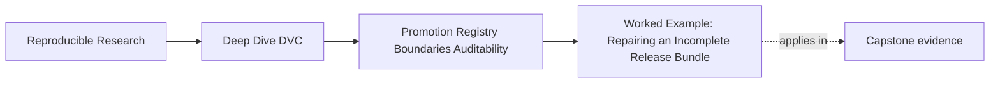

# Worked Example: Repairing an Incomplete Release Bundle


<!-- page-maps:start -->
## Page Maps




<!-- page-maps:end -->

This example shows how Module 09 fits together when a release bundle looks tidy but cannot
yet be defended.

The goal is not to make the directory prettier. The goal is to make the promoted state
auditable.

## The situation

A release directory contains:

```text
publish/v1/
  model.json
  metrics.json
  params.yaml
```

At first glance, this looks reasonable.

But the reviewer compares the files and finds:

```yaml
# publish/v1/params.yaml
evaluate:
  threshold: 0.50
```

while the metric file came from an older run with threshold `0.65`.

The bundle is now deceptive. It contains the right kinds of files, but they do not describe
the same promoted state.

## Step 1: Name the failure

Weak review:

> The release files need cleanup.

Stronger review:

> The promoted metrics do not match the promoted parameters, so downstream consumers would
> trust a result story that never existed as one run.

That names the audit failure directly.

## Step 2: Return to recorded state

The reviewer does not edit `metrics.json` by hand.

Instead, the maintainer identifies the intended promoted state:

- baseline or candidate comparison that justified the release
- `params.yaml` values used for that state
- `dvc.lock` evidence for the pipeline run
- metric output produced by that run

Then the maintainer regenerates or recopies the release files from the correct state.

## Step 3: Add the missing manifest

The reviewer also notices there is no manifest.

The repaired release becomes:

```text
publish/v1/
  manifest.json
  model.json
  metrics.json
  params.yaml
  review.md
```

The manifest explains what is included:

```json
{
  "release": "v1",
  "artifacts": [
    {"path": "model.json", "role": "promoted model"},
    {"path": "metrics.json", "role": "release metrics"},
    {"path": "params.yaml", "role": "promoted parameters"},
    {"path": "review.md", "role": "promotion rationale"}
  ]
}
```

Now a downstream consumer knows which files form the release surface.

## Step 4: Run the audit route

The maintainer runs:

```bash
make -C capstone manifest-summary
make -C capstone release-audit
```

The point is not only that the commands pass. The point is that the review route checks
the bundle as a contract.

## The review note you would want

> Release `v1` originally paired metrics from a threshold `0.65` run with promoted params
> showing threshold `0.50`. That made the bundle unauditable. The release files were
> regenerated from the intended promoted state, a manifest was added to define the bundle
> surface, and the release audit route now passes. Consumers should use only the files
> listed in `publish/v1/manifest.json`.

That note tells a future maintainer what failed, what changed, and what contract consumers
should follow.

## Why this is a mastery example

This one story exercises the whole module:

- Core 1: promotion was treated as a downstream trust contract
- Core 2: the release surface gained a manifest and clear shape
- Core 3: params and metrics were required to describe the same state
- Core 4: consumers were directed to the release boundary, not internal paths
- Core 5: repair preserved auditability instead of editing files cosmetically

The bundle became trustworthy because its evidence now agrees.
