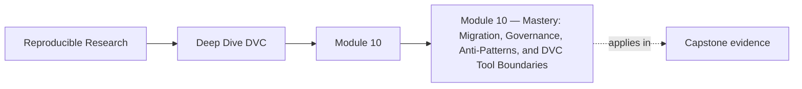

<a id="top"></a>

# Module 10 — Mastery: Migration, Governance, Anti-Patterns, and DVC Tool Boundaries


<!-- page-maps:start -->
## Page Maps




<!-- page-maps:end -->

## Purpose of this Module

The last step in learning DVC is judgment. This module is about reviewing a repository
without wishful thinking, migrating state boundaries without breaking trust, and knowing
where DVC should remain authoritative versus where another system should take over.

Use this module to answer the stewardship questions the earlier modules prepare for:

* Which state contracts are broken or underspecified today?
* How do you change boundaries without losing recoverability or auditability?
* Which problems should stay inside DVC, and which belong to a different tool or layer?

## At a Glance

| Focus | Learner question | Capstone timing |
| --- | --- | --- |
| repository review | "Which state contracts are broken today?" | use the capstone as a stewardship specimen once the rubric is clear |
| migration safety | "How do I move boundaries without damaging trust?" | compare migration ideas to the capstone's current contracts |
| tool boundaries | "What should DVC keep owning, and what belongs elsewhere?" | inspect the repository as part of a larger reproducibility system |

Proof loop for this module:

```bash
dvc status
dvc repro -n
make -C capstone confirm
```

Capstone corroboration:

* inspect `capstone/dvc.yaml`
* inspect `capstone/dvc.lock`
* inspect `capstone/publish/v1/`
* inspect `capstone/Makefile`

The course ends well only if the learner leaves with a repeatable review method, not just
with a list of warnings.

---

<a id="toc"></a>
## 1) Table of Contents

1. [Table of Contents](#toc)
2. [Learning Outcomes](#outcomes)
3. [How to Use This Module](#usage)
4. [Core 1 — Reviewing a DVC Repository Without Wishful Thinking](#core1)
5. [Core 2 — Safe Migration Plans for State Systems](#core2)
6. [Core 3 — Governance for Long-Lived Reproducibility Repositories](#core3)
7. [Core 4 — Recurring DVC Anti-Patterns](#core4)
8. [Core 5 — Deciding What DVC Should and Should Not Own](#core5)
9. [Capstone Sidebar](#capstone)
10. [Exercises](#exercises)
11. [Closing Criteria](#closing)

---

<a id="outcomes"></a>
## 2) Learning Outcomes

By the end of this module, you can:

* review a real DVC repository for identity, pipeline, promotion, and recovery risks
* design a migration that preserves reproducibility guarantees instead of merely moving files
* define lightweight governance rules for future state changes
* identify anti-patterns before they harden into the repository’s culture
* explain where DVC remains the right authority and where another layer should take over

[Back to top](#top)

---

<a id="usage"></a>
## 3) How to Use This Module

Take one real DVC repository and write a short review with five sections:

1. identity and state-layer risks
2. pipeline and experiment risks
3. publish and promotion risks
4. retention and recovery risks
5. tool-boundary recommendation

The goal is not to rewrite the system immediately. The goal is to make the current state
legible enough that deliberate change becomes possible.

[Back to top](#top)

---

<a id="core1"></a>
## 4) Core 1 — Reviewing a DVC Repository Without Wishful Thinking

A strong review should answer:

* what state is authoritative?
* what state is merely convenient or local?
* which boundaries are stable for consumers?
* which recovery story has actually been rehearsed?
* which comparisons are still semantically trustworthy?

Good review starts with evidence:

* `dvc.yaml`
* `dvc.lock`
* params and metrics
* publish artifacts
* recovery or verification commands

Do not begin with style or syntax preferences. Begin with whether the repository can still
explain and restore its own state honestly.

[Back to top](#top)

---

<a id="core2"></a>
## 5) Core 2 — Safe Migration Plans for State Systems

State migrations are dangerous because they often look harmless:

* moving to a new remote
* changing the cache strategy
* renaming a publish surface
* splitting one pipeline into several
* changing how experiments are promoted

Safe migration means moving one boundary at a time and preserving proof surfaces such as:

* comparable metrics
* reproducible lock state
* recovery drills
* stable publish artifacts

If a migration plan cannot say which trust boundary is being moved, it is not ready.

[Back to top](#top)

---

<a id="core3"></a>
## 6) Core 3 — Governance for Long-Lived Reproducibility Repositories

Good governance is small but durable. Typical rules:

* every new promoted artifact needs a contract story
* every new parameter with semantic impact must be declared and reviewed
* every remote or retention change must preserve the recovery story
* every major experiment surface must remain comparable to a named baseline

Without governance, state systems degrade quietly:

* a useful experiment becomes an undocumented fork
* a convenience remote becomes the only real source of truth
* promotion happens without stable evidence
* recovery drills stop happening because everyone assumes they still work

[Back to top](#top)

---

<a id="core4"></a>
## 7) Core 4 — Recurring DVC Anti-Patterns

Anti-patterns worth rejecting early:

* treating paths as identity instead of content and recorded state
* changing params or environments without admitting the semantic change
* promoting outputs without the lock and comparison evidence needed to defend them
* assuming remotes are durable without rehearsal
* using experiments as informal branches with no lineage story
* letting publish surfaces depend on internal cache or workspace accidents

Mastery is often the discipline to stop a shortcut before it becomes the team’s normal way
of working.

[Back to top](#top)

---

<a id="core5"></a>
## 8) Core 5 — Deciding What DVC Should and Should Not Own

DVC is strong when the problem is:

* content-addressed data identity
* pipeline state and reproducible stage transitions
* experiment comparison with declared params and metrics
* remote-backed durability and recovery for tracked artifacts

Another layer may need to own the concern when:

* governance depends more on registry or deployment policy than on artifact lineage
* execution control is dominated by workflow scheduling rather than state
* publishing becomes a product or platform contract larger than the repository itself
* audit requirements exceed what repository-native evidence can carry alone

The mature answer is often hybrid: let DVC own the artifact and experiment state it
explains well, and hand other concerns to the systems built for them.

[Back to top](#top)

---

<a id="capstone"></a>
## 9) Capstone Sidebar

Use the capstone as a review specimen:

* `dvc.yaml` and `dvc.lock` for pipeline truth
* `publish/v1/` for promoted contract review
* `Makefile` targets such as `push`, `recovery-drill`, and `confirm` for governance and rehearsal
* the remote-backed recovery flow as a boundary between local convenience and durable trust

[Back to top](#top)

---

<a id="exercises"></a>
## 10) Exercises

1. Review one DVC repository and list its top five risks in state-contract language.
2. Write a migration plan that changes one remote, publish, or pipeline boundary while preserving trust.
3. Draft a short governance note for params, promotion, retention, and recovery changes.
4. Pick one reproducibility concern and argue clearly whether DVC should continue to own it.

[Back to top](#top)

---

<a id="closing"></a>
## 11) Closing Criteria

You pass this module only if you can demonstrate:

* an evidence-based review of a real DVC repository
* a migration plan that preserves trust while changing one boundary
* explicit governance rules for future state changes
* a clear recommendation for where DVC remains the right authority and where it should stop

[Back to top](#top)
