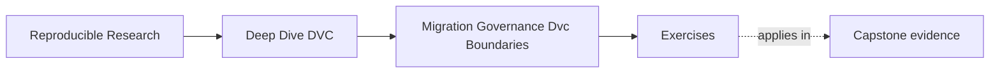

# Exercises

<!-- page-maps:start -->
## Page Maps

<!-- page-maps:end -->

Use these exercises to practice final stewardship judgment.

The strongest answers will name evidence, risk, repair, and ownership.

## Exercise 1: Review a repository by evidence

Write a five-section review outline for a DVC repository:

- identity and state layers
- pipeline and experiment truth
- metrics, promotion, and release surfaces
- remote, retention, and recovery
- tool-boundary recommendations

For each section, name one file or command you would inspect.

## Exercise 2: Plan one safe migration

A team wants to move promoted artifacts from `publish/v1/` to
`registry/incident-escalation/v1/`.

Write a migration plan that preserves trust and rollback.

## Exercise 3: Write a governance rule

Write one durable governance rule for future changes to `params.yaml`, `dvc.lock`, or
`publish/`.

Explain which state contract your rule protects.

## Exercise 4: Intervene on an anti-pattern

A reviewer sees this comment:

> We copied the best model to `outputs/latest/`; consumers can use that.

Write a better review intervention with a repair path.

## Exercise 5: Decide tool ownership

A team wants DVC to handle artifact lineage, deployment approval, model registry lifecycle,
and alerting.

Explain which concerns DVC should own and which should probably belong to another layer.

## Mastery check

You have a strong grasp of this module if your answers consistently keep five ideas
visible:

- review starts from evidence surfaces
- migration should move one boundary with proof
- governance should be small and enforceable
- anti-patterns are shortcuts that damage state contracts
- DVC should own artifact lineage, not every production concern
