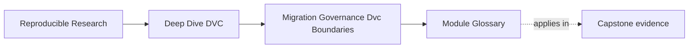
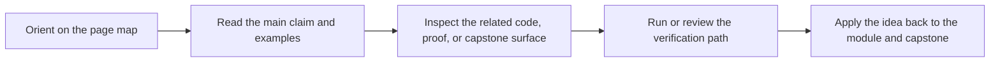

# Module Glossary

<!-- page-maps:start -->
## Page Maps

<!-- page-maps:end -->

This glossary belongs to **Module 10: Migration, Governance, and DVC Boundaries** in
**Deep Dive DVC**.

Use it to keep the module language stable while you move between the core lessons, the
worked example, the exercises, and final capstone review.

## How to use this glossary

Read the directory index first. Return here when a stewardship review, migration plan,
governance rule, anti-pattern discussion, or tool-boundary recommendation starts to feel
vague.

The goal is not extra theory. The goal is shared language for the final course skill:
reviewing and changing a DVC repository without breaking trust.

## Terms in this directory

| Term | Meaning in this directory |
| --- | --- |
| stewardship | Ongoing responsibility for preserving and improving repository state contracts. |
| evidence-first review | A review method that starts from recorded DVC state, release evidence, and recovery checks. |
| state contract | A promise about identity, pipeline truth, metrics, promotion, retention, or recovery. |
| state boundary | The line between internal, promoted, recoverable, or externally owned state. |
| migration plan | A controlled plan for moving one state boundary while preserving proof and rollback. |
| proof route | A command sequence that verifies a state contract before or after change. |
| governance rule | A small durable rule that protects a high-risk state change. |
| review intervention | A review comment that names a shortcut and gives a repair path. |
| anti-pattern | A recurring shortcut that damages reproducibility, auditability, comparability, or recovery. |
| tool boundary | The point where DVC authority should hand off to CI, registry, deployment, monitoring, or governance systems. |
| ownership map | A clear statement of which system owns which responsibility. |
| hybrid ownership | A design where DVC owns artifact lineage while other systems own lifecycle, rollout, or policy concerns. |
| consumer lifecycle | The registry or platform concern of how downstream users discover, approve, use, and retire promoted artifacts. |
| rollout | Deployment-layer responsibility for introducing a promoted artifact into runtime use. |
| stewardship finding | A review finding that names evidence, risk, and repair. |

## Stable review questions

Use these questions when the module feels abstract:

- Which evidence proves the current state?
- Which state contract is broken or underspecified?
- Which boundary is being moved?
- What proof route passes before and after the change?
- Which governance rule should survive this review?
- Is this a real anti-pattern or only a style preference?
- Which system should own this concern?
- What recommendation would another maintainer be able to act on?
