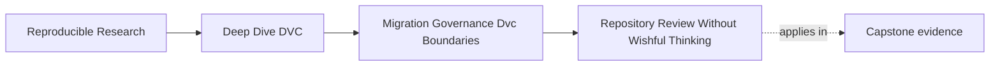
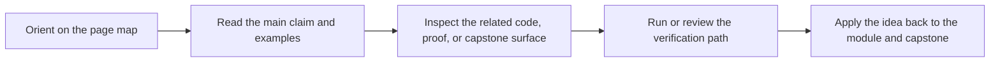

# Repository Review Without Wishful Thinking

<!-- page-maps:start -->
## Page Maps

<!-- page-maps:end -->

A mature DVC review starts with evidence.

Do not begin by asking whether the repository "looks organized." Ask whether it can still
explain and restore the state it claims.

## Review the state story first

A strong review asks:

- what state is authoritative?
- what state is only local convenience?
- which data and output identities are recorded?
- which pipeline stages have truthful dependencies?
- which parameters and metrics support comparison?
- which release surface is safe for consumers?
- which recovery route has been rehearsed?

This order prevents style preferences from hiding correctness gaps.

## Read related files together

Useful pairings:

| Surface | Review beside |
| --- | --- |
| `dvc.yaml` | `dvc.lock` and command code |
| `params.yaml` | metrics and experiment notes |
| metric files | metric definitions and baseline comparison |
| `publish/v1/` | manifest, params, metrics, review note |
| remote config | recovery route and retention policy |
| CI route | lock evidence and remote pull behavior |

The review question is not "does this file exist?" It is "does this file agree with the
rest of the state story?"

## Write findings as contracts

Weak finding:

> The DVC setup is messy.

Stronger finding:

> The release bundle contains metrics and parameters, but no manifest names the supported
> files. Downstream consumers must infer the release surface from directory contents.

Weak:

> Recovery needs improvement.

Stronger:

> The current documentation claims recovery is supported, but no clean-checkout route
> verifies that promoted artifacts can be restored from the shared remote.

Specific findings are repairable.

## A final review shape

A useful final course review can use five sections:

- identity and state layers
- pipeline and experiment truth
- metrics, promotion, and release surfaces
- remote, retention, and recovery
- tool-boundary recommendations

Each section should include evidence, risk, and a repair recommendation.

## Review checkpoint

You understand this core when you can:

- review by evidence instead of repository appearance
- read DVC files as related state claims
- write findings as broken or underspecified contracts
- separate correctness risks from style preferences
- produce a review another maintainer can act on

Stewardship starts when review becomes specific enough to repair.
