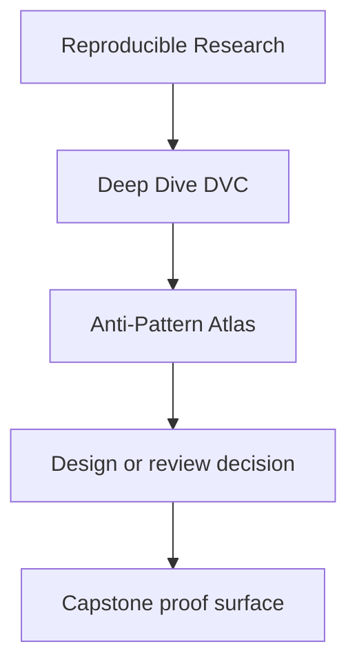
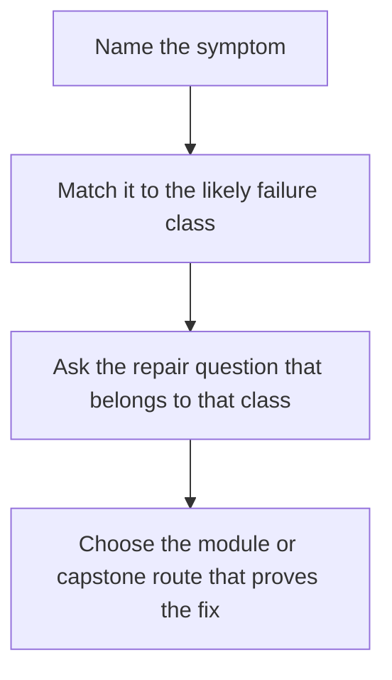

# Anti-Pattern Atlas

<!-- page-maps:start -->
## Reference Position

<!-- page-maps:end -->

Use this page when you recognize the smell before you remember the module. A useful
atlas turns "this DVC repository feels wrong" into a smaller statement about identity,
state truth, comparability, promotion, recovery, or ownership drift.

---

## Symptom-led lookup

| Symptom | Likely failure class | Ask this next | First route |
| --- | --- | --- | --- |
| the path is stable, so people assume the data identity is stable too | path is standing in for identity | which content-addressed state actually proves the claim | `make verify` |
| the pipeline reran, so people assume the result is trustworthy | rerun is standing in for state truth | which declared inputs, params, and recorded state were actually captured | `make verify` |
| a metric changed, but no one knows whether it still means the same thing | semantic comparability drifted | what stayed comparable across runs and what changed in the control surface | `make verify-report` |
| experiments pile up without a clear baseline story | changed runs are muddying the state story | which parameter changes are being compared and which candidate is promotion-worthy | `make experiment-review` |
| the repo works here, but no one can say what survives elsewhere | local cache and remote durability were never separated | which layer is authoritative after local loss | `make recovery-review` |
| the published bundle exists, but downstream trust still feels vague | promoted state is larger or blurrier than it should be | what smaller contract is actually safe for downstream use | `make release-review` |

---

## Recurring failure classes

| Failure class | Why it matters | Where the course or capstone teaches the repair |
| --- | --- | --- |
| path names treated as identity | location is mistaken for recoverable truth | modules 01-02, `AUTHORITY_MAP`, `verify` |
| environments treated as background luck | runtime drift is excluded from the state model | module 03, version support and verification routes |
| `dvc.yaml` and `dvc.lock` telling different stories | declared and recorded execution drift apart | module 04, `stage-summary`, `verify` |
| metrics compared after their meaning changed | comparisons turn decorative instead of trustworthy | module 05, control-surface guides and verify reports |
| experiments treated as freedom without baseline discipline | changed runs muddy the state story | module 06, `experiment-review` |
| collaboration that depends on private cache state | another person cannot trust or restore the repository | modules 07-08, `recovery-review` |
| release surfaces that mirror internal repository complexity | downstream trust becomes too large and too vague | module 09, `release-review` |
| DVC kept as owner after its boundary is exceeded | governance and migration drift become chronic | module 10, stewardship and change-placement routes |

---

## Repair order

When you identify a likely anti-pattern:

1. name the failure class in one sentence
2. point to the layer or evidence surface that is lying
3. choose the smallest capstone route that demonstrates the same defect or claim
4. repair the contract before polishing the implementation

---

## Companion pages

- [`review-checklist.md`](review-checklist.md)
- [`boundary-review-prompts.md`](boundary-review-prompts.md)
- [`practice-map.md`](practice-map.md)
