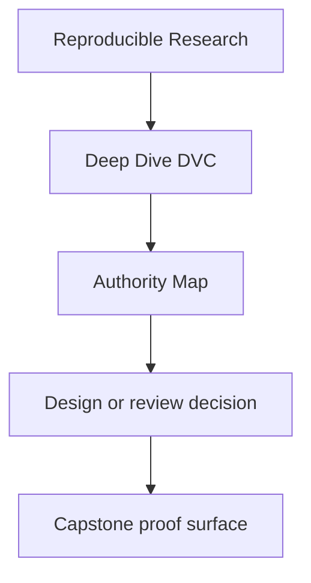
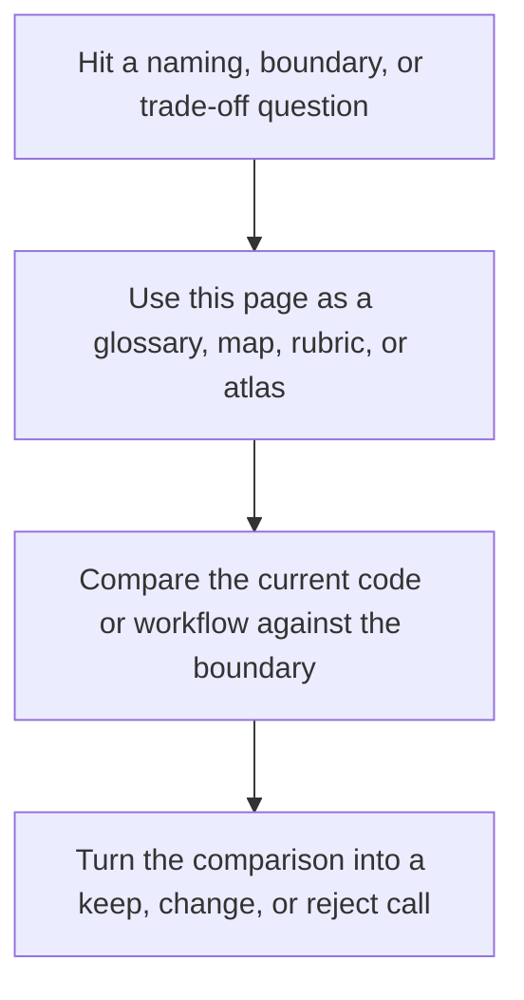

# Authority Map

<!-- page-maps:start -->
## Reference Position

<!-- page-maps:end -->

Read the first diagram as a lookup map: this page is part of the review shelf, not a first-read narrative. Read the second diagram as the reference rhythm: arrive with a concrete ambiguity, compare the current work against the boundary on the page, then turn that comparison into a decision.

Deep Dive DVC repeatedly asks which layer of state is authoritative. This page answers
that question directly.

Use it when the repository contains many kinds of files but you need to know which one is
supposed to settle a trust question.

---

## State Layers And Their Jobs

| Layer | What it is authoritative for | What it is not authoritative for |
| --- | --- | --- |
| workspace files | the current visible checkout | long-term identity or durable recovery |
| `dvc.yaml` | the declared pipeline contract | proof that a stage actually ran with a specific state |
| `dvc.lock` | recorded execution state and dependency hashes | downstream release policy by itself |
| DVC cache | content-addressed local materialization of tracked data | durable off-machine survival |
| DVC remote | durable recovery source when local cache is lost | human-readable release meaning |
| `publish/v1/` | downstream contract another person may trust | the full internal state story |

## Review Order

When a trust question is ambiguous, inspect the layers in this order:

1. `dvc.yaml` for declared responsibility
2. `dvc.lock` for recorded execution state
3. DVC remote or recovery drills for durability
4. `publish/v1/` for downstream release trust

That order prevents one common DVC mistake: jumping from a visible file straight to a
trust claim without checking what authority that file actually has.

[Back to top](#top)

---

## Which Layer Answers Which Question

| Question | Start with |
| --- | --- |
| what does this pipeline claim it will do | `dvc.yaml` |
| what exact state did it record after execution | `dvc.lock` |
| can this repository restore tracked data after local loss | the DVC remote plus `dvc pull` |
| what may downstream users rely on | `publish/v1/` plus its manifest |
| what is merely visible today in the working tree | workspace files |
| what changed meaningfully between comparable runs | `params.yaml`, `metrics/metrics.json`, and experiment metadata |

[Back to top](#top)

---

## Common Authority Mistakes

| Mistake | Why it fails |
| --- | --- |
| treating a workspace path as stable identity | the bytes may change while the path stays the same |
| treating `dvc.yaml` as proof of execution | declaration is not the same as recorded state |
| treating the local cache as durable recovery | it disappears with the machine or cleanup |
| treating the publish bundle as the whole repository truth | promoted state is intentionally smaller than the internal state story |
| treating a successful restore as proof of semantic comparability | durability does not guarantee that params or metrics still mean the same thing |

[Back to top](#top)

---

## Best Companion Pages

The most useful companion pages for this map are:

* [`state-glossary.md`](state-glossary.md)
* [`module-02.md`](../module-02-data-identity-content-addressing/index.md)
* [`module-08.md`](../module-08-recovery-scale-incident-survival/index.md)
* [`capstone-map.md`](../guides/capstone-map.md)

[Back to top](#top)
