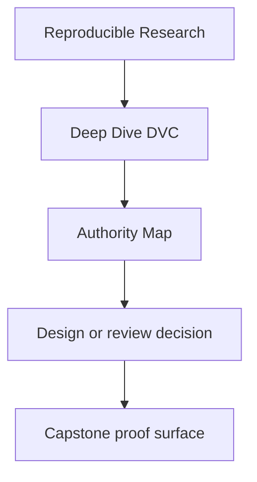
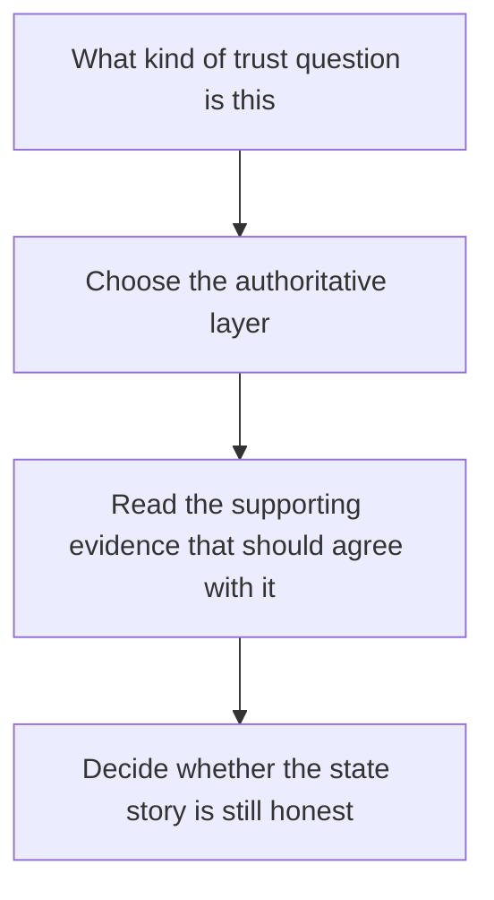

# Authority Map

<!-- page-maps:start -->
## Reference Position

<!-- page-maps:end -->

Deep Dive DVC only stays reviewable if each kind of state question has a clear owner.
Use this page when the repository contains many plausible answers, but you need to know
which surface is actually allowed to settle the question.

---

## Which layer settles which question

| Question | Authoritative layer | Supporting evidence |
| --- | --- | --- |
| what the repository claims should happen | `dvc.yaml` and `params.yaml` | stage summaries and stage guides |
| what exact state was recorded after execution | `dvc.lock` | metrics, publish summaries, and recorded outputs |
| what survives machine loss and local cleanup | DVC remote plus `dvc pull` and `dvc checkout` | recovery drills and recovery bundles |
| what another person may trust downstream | `publish/v1/` plus its manifest | verification reports and release reviews |
| what is merely visible in the workspace today | workspace files | none; visibility is not authority |
| what changed comparably across runs | params, metrics, and experiment records | experiment review routes |

[Back to top](#top)

---

## Common authority mistakes

| Mistake | Why it lowers trust |
| --- | --- |
| treating a workspace path as stable identity | a path can stay the same while the bytes and meaning change |
| treating `dvc.yaml` as proof of execution | declaration is not the same as recorded state |
| treating the local DVC cache as durable recovery | it disappears with cleanup or machine loss |
| treating `publish/v1/` as the whole repository story | promoted trust is intentionally smaller than internal state |
| treating restore success as proof of semantic comparability | durability does not guarantee that params and metrics still mean the same thing |

[Back to top](#top)

---

## Review order when the question is ambiguous

1. read `dvc.yaml` for declared responsibility
2. read `dvc.lock` for recorded execution state
3. read the relevant comparison or release surface
4. read recovery evidence only if the question is about survival after loss

That order stops one common DVC mistake: jumping from a visible file straight to a trust
claim without checking what kind of authority that file actually has.

[Back to top](#top)

---

## Companion pages

- [`evidence-boundary-guide.md`](evidence-boundary-guide.md)
- [`verification-route-guide.md`](verification-route-guide.md)
- [`glossary.md`](glossary.md)

[Back to top](#top)
