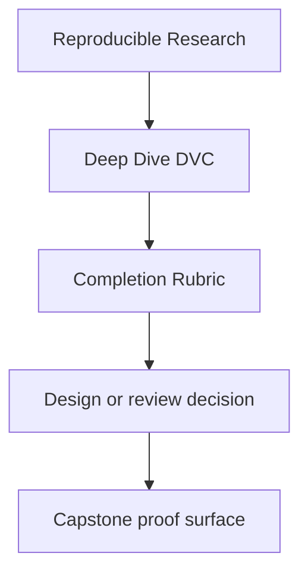
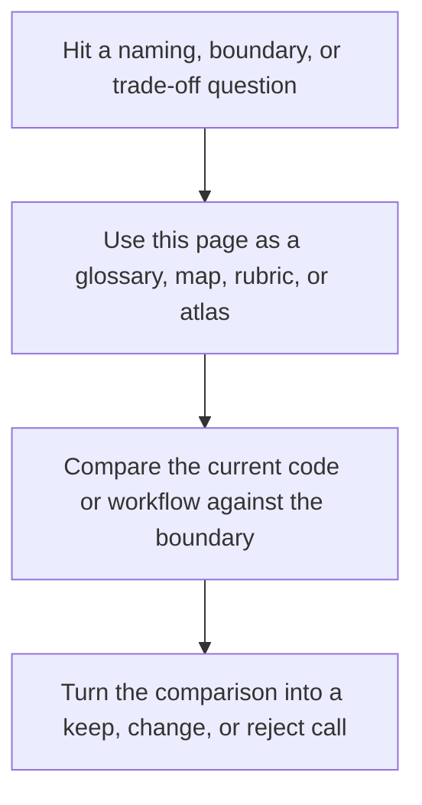

# Completion Rubric

<!-- page-maps:start -->
## Reference Position

<!-- page-maps:end -->

Read the first diagram as a lookup map: this page is part of the review shelf, not a first-read narrative. Read the second diagram as the reference rhythm: arrive with a concrete ambiguity, compare the current work against the boundary on the page, then turn that comparison into a decision.

Deep Dive DVC should finish with more than command familiarity.

Use this rubric to judge whether the learner can reason about state, evidence, recovery,
and promotion without hand-waving.

---

## Completion Standard

You should be able to do all of the following:

* explain which state layer is authoritative for a given trust question
* read `dvc.yaml` and `dvc.lock` together without confusing declaration and recorded state
* explain which params and metrics remain semantically comparable across runs
* identify which artifacts belong to the downstream publish contract
* describe how the repository restores tracked state after local cache loss

---

## Course Outcomes

| Area | Completion signal |
| --- | --- |
| state identity | you can distinguish path, content identity, cache, remote, and publish layers clearly |
| truthful pipelines | you can explain why a stage reruns and which dependency or param caused it |
| semantic comparison | you can say which metrics remain meaningful after a parameter change |
| experiments and promotion | you can explain baseline, deviation, and promoted contract without mixing them |
| recovery and stewardship | you can defend the repository's recovery story and review it for drift |

---

## Capstone Evidence

Use these proof routes as the minimum capstone evidence:

1. `make PROGRAM=reproducible-research/deep-dive-dvc capstone-walkthrough`
2. `make PROGRAM=reproducible-research/deep-dive-dvc capstone-verify`
3. `make PROGRAM=reproducible-research/deep-dive-dvc capstone-recovery-drill`
4. `make PROGRAM=reproducible-research/deep-dive-dvc capstone-confirm`

You are not done if you ran them mechanically but cannot explain what each one proved.

---

## Reviewer Questions

A reviewer should be able to ask:

* which state is authoritative here
* what makes these metrics comparable
* what exactly is promoted for downstream users
* what survives cache loss
* what would you inspect before changing this repository

If those answers stay vague, the learner is not done yet.

