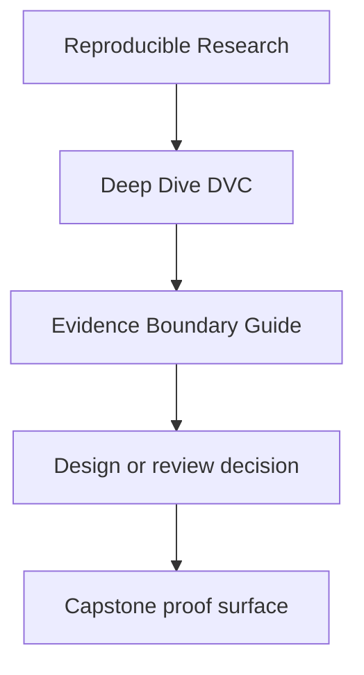
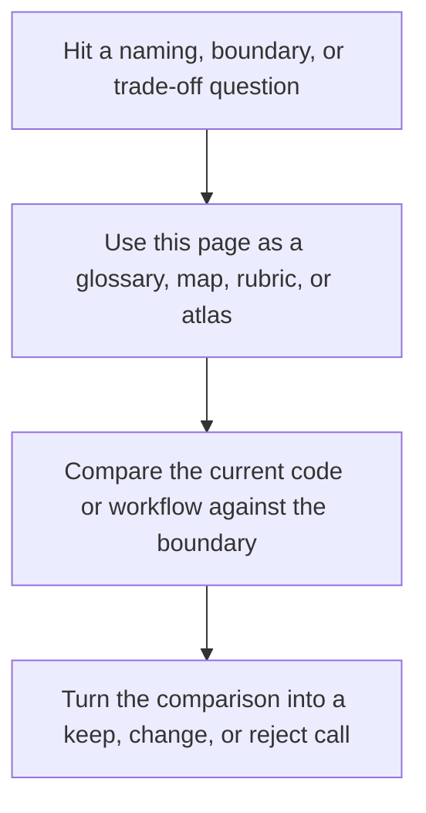

# Evidence Boundary Guide

<!-- page-maps:start -->
## Reference Position

<!-- page-maps:end -->

Read the first diagram as a lookup map: this page is part of the review shelf, not a first-read narrative. Read the second diagram as the reference rhythm: arrive with a concrete ambiguity, compare the current work against the boundary on the page, then turn that comparison into a decision.

Deep Dive DVC asks learners to compare several kinds of evidence that sound similar but
settle different questions.

Use this guide when you need to know which artifact proves declaration, execution,
comparison, promotion, or recovery.

---

## Evidence Types

| Evidence type | Main surfaces | What it proves | What it does not prove |
| --- | --- | --- | --- |
| declared workflow evidence | `capstone/dvc.yaml`, `capstone/params.yaml` | what the repository claims should influence execution | that the declared workflow has already run |
| recorded execution evidence | `capstone/dvc.lock` | the dependency and output state captured after execution | the downstream release contract by itself |
| tracked comparison evidence | `capstone/metrics/metrics.json`, `capstone/params.yaml` | what comparisons are meant to remain semantically stable | that a downstream consumer should trust every internal artifact |
| promoted release evidence | `capstone/publish/v1/manifest.json`, `capstone/publish/v1/metrics.json`, `capstone/publish/v1/params.yaml` | what the repository intentionally exports for downstream trust | the full internal training or experimentation story |
| recovery evidence | `make -C capstone recovery-drill`, DVC remote state | that tracked artifacts can be restored after local loss | that the repository is pedagogically clear or well-governed |
| experiment evidence | experiment params, metrics, and comparison summaries | which declared deviations are being compared to the baseline | whether the candidate should be promoted downstream |

[Back to top](#top)

---

## Which Evidence To Reach For First

| Question | Start with |
| --- | --- |
| what does this repository say should matter | declared workflow evidence |
| what exact state did the pipeline record | recorded execution evidence |
| are these params and metrics safe to compare | tracked comparison evidence |
| what can a downstream reviewer rely on | promoted release evidence |
| what survives when local material is deleted | recovery evidence |
| whether an experiment is a meaningful candidate rather than random variance | experiment evidence |

[Back to top](#top)

---

## Evidence Progression

Read the evidence in this order:

1. declaration
2. recorded execution
3. comparison surfaces
4. experiment comparison, if a candidate run exists
5. promoted contract
6. recovery proof

That sequence mirrors the course: first understand what the repository claims, then what
it recorded, then what remains comparable, then what gets promoted, then what survives
time and loss.

[Back to top](#top)

---

## Common Evidence Mistakes

| Mistake | Why it fails |
| --- | --- |
| treating `dvc.yaml` as sufficient proof | declaration is not recorded execution |
| treating `metrics/metrics.json` as the publish contract | internal comparison surfaces are not the same as promoted trust surfaces |
| treating `publish/v1/` as the whole repository story | release evidence is intentionally smaller than internal evidence |
| treating recovery success as proof that comparisons remain meaningful | durability alone does not preserve semantic clarity |
| treating one improved metric as enough for promotion | comparison evidence is not the same as release evidence |

[Back to top](#top)

---

## Best Companion Pages

The most useful companion pages for this guide are:

* [`authority-map.md`](authority-map.md)
* [`proof-matrix.md`](../guides/proof-matrix.md)
* [`capstone-map.md`](../capstone/capstone-map.md)
* [`repository-layer-guide.md`](../capstone/repository-layer-guide.md)

[Back to top](#top)
