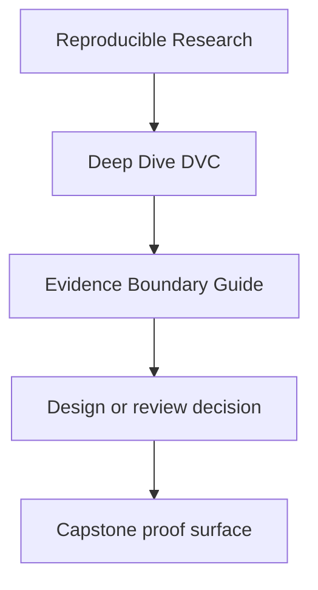
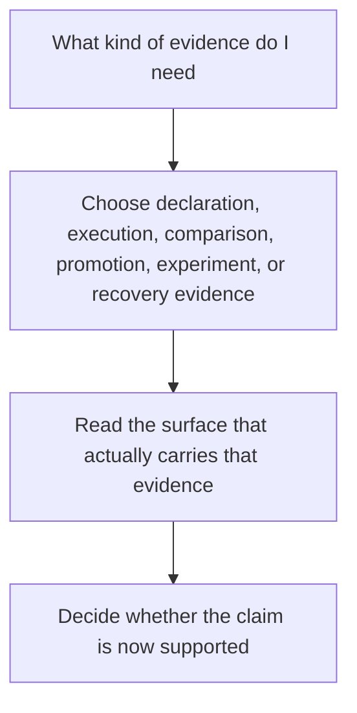

# Evidence Boundary Guide

<!-- page-maps:start -->
## Reference Position

<!-- page-maps:end -->

Deep Dive DVC asks learners to compare several kinds of evidence that sound similar but
settle different questions. Use this guide when you need to know which artifact proves
declaration, recorded execution, comparability, promotion, experiment value, or recovery.

---

## Evidence types

| Evidence type | Main surfaces | What it proves | What it does not prove |
| --- | --- | --- | --- |
| declared workflow evidence | `dvc.yaml`, `params.yaml` | what the repository claims should influence execution | that the declared pipeline already ran |
| recorded execution evidence | `dvc.lock` | the dependency and output state captured after execution | downstream release trust by itself |
| comparison evidence | `metrics/metrics.json`, `params.yaml`, experiment summaries | what comparisons are meant to remain semantically stable | that a downstream consumer should trust every internal artifact |
| promoted release evidence | `publish/v1/*` and its manifest | what the repository intentionally exports for downstream trust | the whole internal training or experimentation story |
| recovery evidence | DVC remote state, `dvc pull`, `dvc checkout`, recovery bundles | that tracked artifacts can be restored after local loss | that the repository is automatically clear or well-governed |
| experiment evidence | experiment params, metrics, and comparison surfaces | which declared deviations are being compared to the baseline | whether the candidate should already be promoted downstream |

---

## Which evidence to reach for first

| Question | Start with |
| --- | --- |
| what does this repository say should matter | declared workflow evidence |
| what exact state did the pipeline record | recorded execution evidence |
| are these params and metrics still safe to compare | comparison evidence |
| what may a downstream reviewer rely on | promoted release evidence |
| what survives when local material is deleted | recovery evidence |
| whether an experiment is a meaningful candidate rather than random variance | experiment evidence |

---

## Good reading order

1. declaration
2. recorded execution
3. comparison surfaces
4. experiment comparison, if a candidate run exists
5. promoted contract
6. recovery proof

That sequence mirrors the course: understand what the repository claims, then what it
recorded, then what remains comparable, then what gets promoted, then what survives time
and loss.

---

## Companion pages

- [`authority-map.md`](authority-map.md)
- [`verification-route-guide.md`](verification-route-guide.md)
- [`anti-pattern-atlas.md`](anti-pattern-atlas.md)

