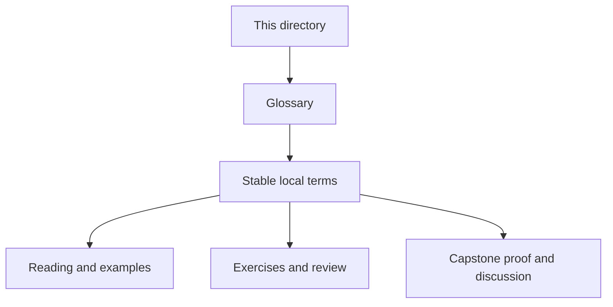
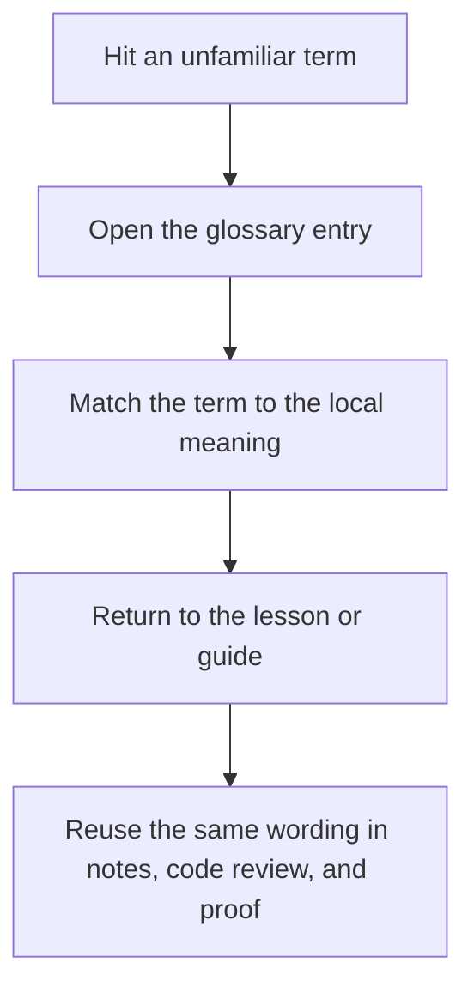

# Reference Glossary

<!-- page-maps:start -->
## Glossary Fit

<!-- page-maps:end -->

This glossary keeps Deep Dive DVC's recurring terms stable across modules, reference
pages, and capstone review routes. Use it when the repository is concrete enough to
inspect, but the local meaning of a word still needs to be pinned down.

## How to use this glossary

Open it when a term matters for a decision: which state layer is authoritative, what kind
of evidence settles the question, or which verification route should answer it. Do not
read it as a list to memorize.

## Terms in this directory

| Term | Meaning in Deep Dive DVC |
| --- | --- |
| Anti-Pattern Atlas | A symptom-led catalog of recurring DVC and reproducibility mistakes, used when you recognize the smell before you remember the lesson. |
| Authority Map | The page that distinguishes workspace state, pipeline declaration, recorded execution, cache, remote recovery, and promoted release surfaces. |
| Completion Rubric | The review standard for deciding whether someone can explain DVC behavior with evidence rather than command folklore. |
| Evidence Boundary Guide | The guide that separates declaration, recorded execution, comparison, promotion, experiment, and recovery evidence. |
| Module Dependency Map | The reading-order map that shows which modules support later ones and which ideas should come first. |
| Practice Map | The crosswalk from modules to capstone routes that corroborate the same concept. |
| Topic Boundaries | The page that distinguishes core course material from supporting context and out-of-scope extensions. |
| Verification Route Guide | The route-selection guide for choosing the smallest honest command or bundle for a state question. |
| Version Support Guide | The guide that defines the supported Python, Git, and DVC toolchain boundary for this course. |
