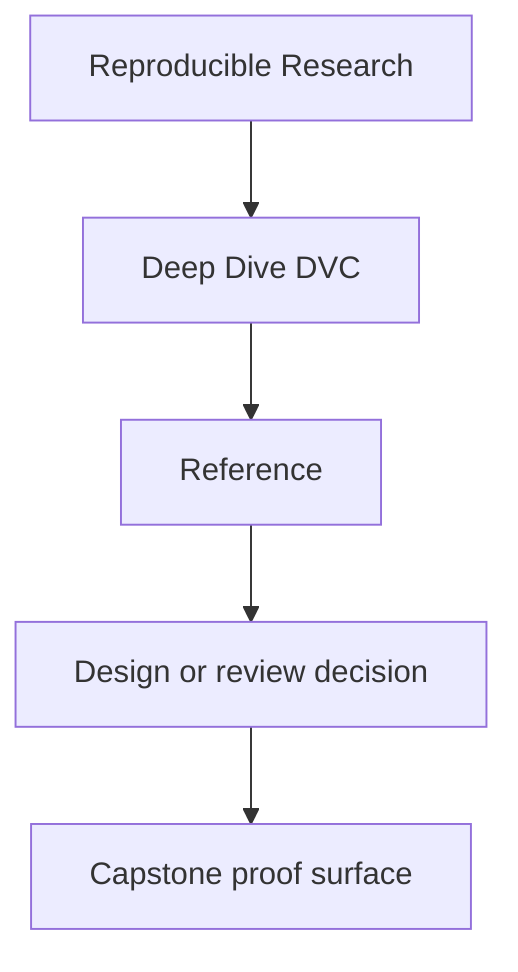
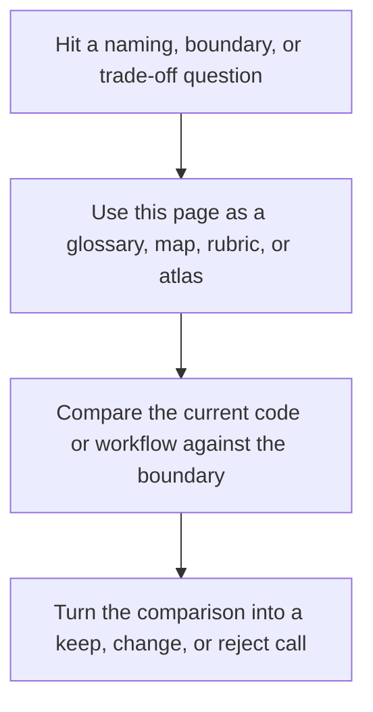

# Reference

<!-- page-maps:start -->
## Reference Position

<!-- page-maps:end -->

Read the first diagram as a lookup map: this page is part of the review shelf, not a first-read narrative. Read the second diagram as the reference rhythm: arrive with a concrete ambiguity, compare the current work against the boundary on the page, then turn that comparison into a decision.

The reference surface holds the durable reading aids for Deep Dive DVC. These pages are
for questions that recur across modules: state authority, evidence boundaries, learning
order, comparison routes, and course completion standards.

## Use This Section When

- you need the right vocabulary before reading a module again
- you want to know which state layer settles a trust question
- you need the right proof route rather than the strongest one
- you are reviewing whether the course promise is being met

## Reference Pages

- [Module Dependency Map](module-dependency-map.md) for concept order and prerequisite shape
- [Authority Map](authority-map.md) for deciding which layer is authoritative
- [Evidence Boundary Guide](evidence-boundary-guide.md) for separating declaration, execution, promotion, and recovery proof
- [State Glossary](state-glossary.md) for durable language
- [Version Support Guide](version-support-guide.md) for the supported toolchain contract and the commands that prove you are still inside it
- [Topic Boundaries](topic-boundaries.md) for what the course treats as core, supporting, and boundary material
- [Practice Map](practice-map.md) for module-to-proof routing
- [Anti-Pattern Atlas](anti-pattern-atlas.md) for routing common reproducibility smells to the right repair path
- [Verification Route Guide](verification-route-guide.md) for picking the right command
- [Completion Rubric](completion-rubric.md) for course and repository review
