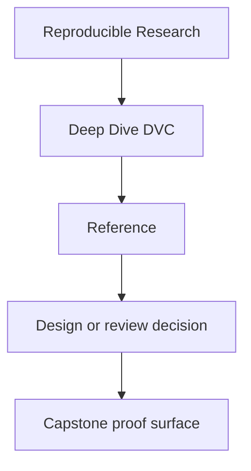
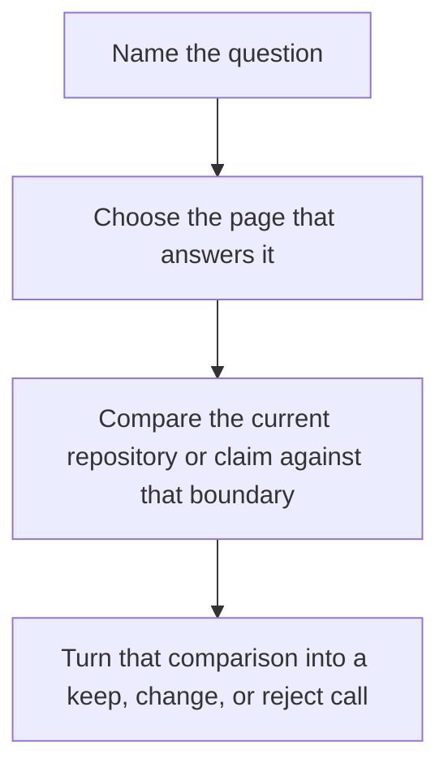

# Reference

<!-- page-maps:start -->
## Reference Position

<!-- page-maps:end -->

This shelf is for recurring DVC questions, not first exposure. Use it when you already
know roughly what the course is teaching and need a durable answer about state authority,
evidence boundaries, or route selection.

## Start here by question

| If the question is... | Start here | Then read |
| --- | --- | --- |
| what does this term mean locally | [Glossary](glossary.md) | the page or module that used it |
| which state layer is allowed to settle this question | [Authority Map](authority-map.md) | [Evidence Boundary Guide](evidence-boundary-guide.md) |
| what kind of reproducibility mistake am I seeing | [Anti-Pattern Atlas](anti-pattern-atlas.md) | the matching module or capstone guide |
| which command or bundle should I use first | [Verification Route Guide](verification-route-guide.md) | the matching capstone route |
| what should count as finished understanding | [Completion Rubric](completion-rubric.md) | the capstone route that corroborates it |

## What these pages are for

- vocabulary that stays stable across modules and capstone review
- authority maps for declaration, execution, promotion, and recovery
- symptom-led routes into common DVC mistakes
- standards for deciding whether learning or review work is actually complete

## What this shelf is not for

Do not use these pages as a substitute for the modules when the underlying concept is
still new. These pages compress boundaries and decisions. They work best after at least
one full read of the relevant lesson or capstone guide.

## Reference pages

- [Module Dependency Map](module-dependency-map.md)
- [Authority Map](authority-map.md)
- [Evidence Boundary Guide](evidence-boundary-guide.md)
- [Glossary](glossary.md)
- [Topic Boundaries](topic-boundaries.md)
- [Practice Map](practice-map.md)
- [Anti-Pattern Atlas](anti-pattern-atlas.md)
- [Verification Route Guide](verification-route-guide.md)
- [Completion Rubric](completion-rubric.md)
