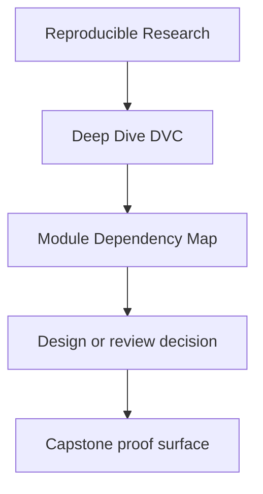
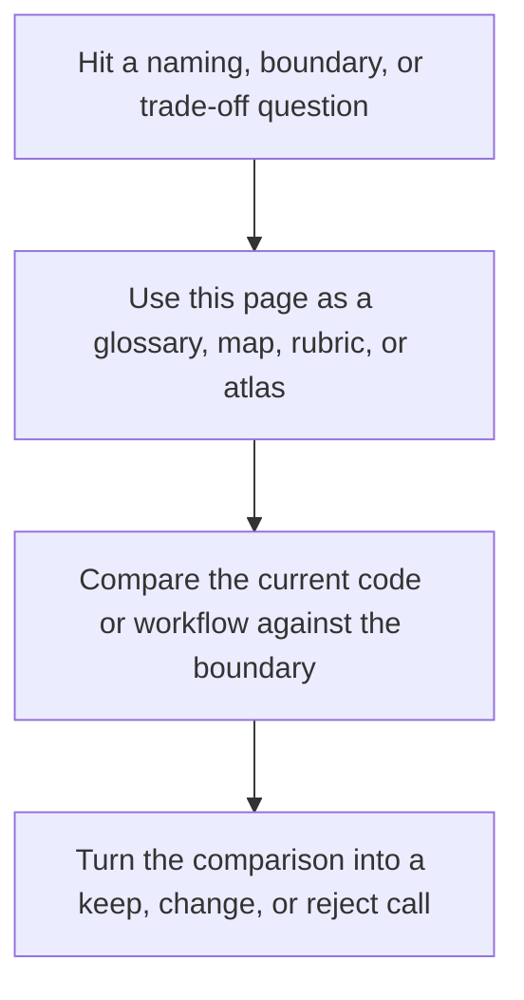
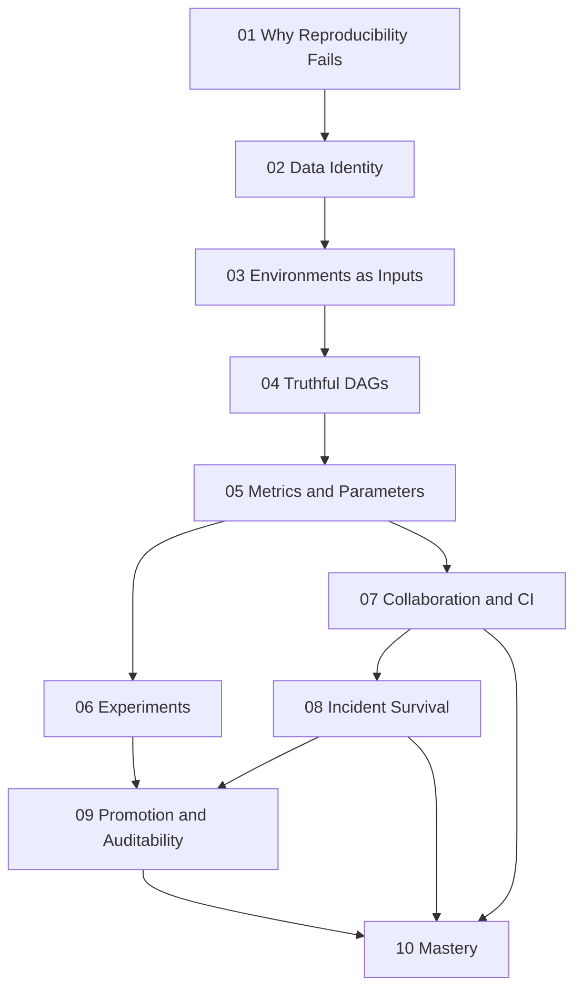

# Module Dependency Map

<!-- page-maps:start -->
## Reference Position

<!-- page-maps:end -->

Read the first diagram as a lookup map: this page is part of the review shelf, not a first-read narrative. Read the second diagram as the reference rhythm: arrive with a concrete ambiguity, compare the current work against the boundary on the page, then turn that comparison into a decision.

Deep Dive DVC is not ten independent essays. Later modules assume earlier state concepts,
and the course becomes much easier when that dependency shape is explicit.

---

## The Main Sequence

---

## Why The Sequence Looks Like This

| Module | Depends most on | Reason |
| --- | --- | --- |
| 01 | none | it defines the reproducibility problem precisely |
| 02 | 01 | state identity is the first real repair boundary |
| 03 | 01-02 | environments only make sense once data identity is stable |
| 04 | 02-03 | truthful pipelines require stable inputs and explicit environment boundaries |
| 05 | 04 | params and metrics only matter if the pipeline contract is honest |
| 06 | 04-05 | experiments depend on a trustworthy baseline and comparison surface |
| 07 | 04-06 | social rules need a technical contract worth defending |
| 08 | 02-07 | durability depends on state identity, remotes, and human process |
| 09 | 05-08 | promotion requires comparable state plus long-lived trust |
| 10 | all earlier modules | stewardship judgment requires the whole model |

---

## Fastest Safe Paths

### First pass through the course

Read Modules 01 through 10 in order.

### Working maintainer

Start with Modules 04, 07, 08, and 09, then backfill earlier modules when you find a gap
in your state model.

### Reproducibility steward

Start with Modules 05, 08, 09, and 10, then revisit earlier modules when a boundary
question points back to fundamentals.

---

## Where The Capstone Helps Most

| Stage | Best capstone use |
| --- | --- |
| after 02 | inspect state layers, lockfiles, and publish boundaries |
| after 04-05 | inspect truthful stages, params, and metrics |
| after 06-08 | inspect experiment, collaboration, and recovery surfaces |
| after 09-10 | review the repository as a stewardship specimen |
