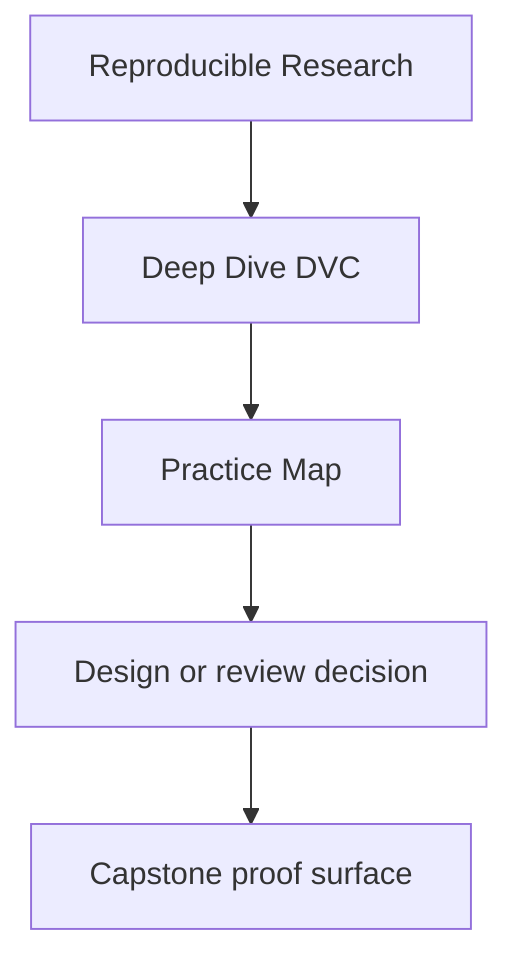
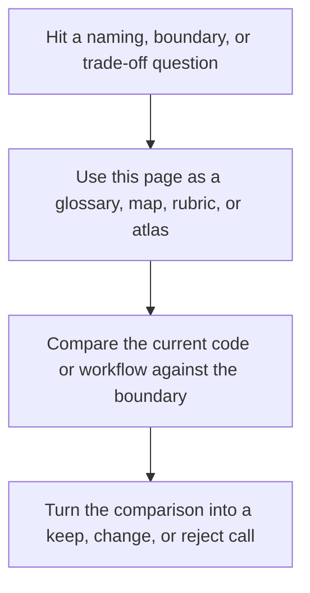

# Practice Map


<!-- page-maps:start -->
## Reference Position




<!-- page-maps:end -->

Read the first diagram as a lookup map: this page is part of the review shelf, not a first-read narrative. Read the second diagram as the reference rhythm: arrive with a concrete ambiguity, compare the current work against the boundary on the page, then turn that comparison into a decision.

The course should make it obvious what to inspect, what to run, and what success looks
like at each stage.

This page collects that information in one place.

---

## Module Practice Surfaces

| Module | Primary practice surface | Main proof loop | Best capstone follow-up |
| --- | --- | --- | --- |
| 01 | thought experiments and failure analysis | identify hidden inputs and missing evidence | inspect `README.md` and `TOUR.md` as a contract specimen |
| 02 | state-layer inspection | compare workspace, Git, lock, cache, and remote roles | inspect `dvc.lock` and promoted outputs |
| 03 | environment declaration choices | compare lockfiles, containers, and CI authority | inspect `pyproject.toml` and repository execution targets |
| 04 | pipeline declaration review | inspect `dvc.yaml`, rerun behavior, and `dvc.lock` | inspect stage edges in the capstone |
| 05 | params and metrics review | compare declared controls and tracked outcomes | inspect `params.yaml`, tracked metrics, and publish evidence |
| 06 | experiment discipline | vary params without corrupting baseline state | run or inspect experiment-oriented surfaces |
| 07 | collaboration and CI expectations | compare human process to verification commands | inspect `confirm`, `push`, and `recovery-drill` |
| 08 | recovery and retention thinking | rehearse loss and restoration logic | inspect remote-backed recovery and promoted bundles |
| 09 | promotion boundary review | inspect publish contract and evidence bundle | inspect `publish/v1/` and verify it |
| 10 | repository review | write a short stewardship review | use the capstone as the review specimen |

---

## Three Reusable Proof Loops

### State truth loop

Use when you want to inspect whether the repository is saying what changed honestly.

```bash
dvc status
dvc repro -n
```

### Comparison loop

Use when you want to inspect whether params and metrics remain meaningful across runs.

```bash
dvc params diff
dvc metrics diff
```

### Recovery loop

Use when you want to inspect whether durability claims survive local loss.

```bash
make PROGRAM=reproducible-research/deep-dive-dvc capstone-recovery-drill
make PROGRAM=reproducible-research/deep-dive-dvc capstone-recovery-review
```

---

## Best Study Habit

For each module:

1. name the state boundary the module is teaching
2. identify the proof command before you run it
3. inspect the capstone only after the smaller concept is legible
4. write down what would break if the contract were false

That keeps the course centered on comprehension instead of command accumulation.

